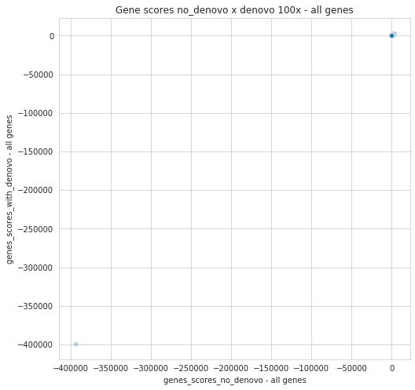
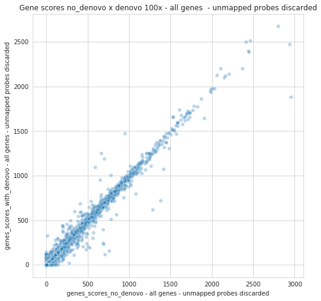
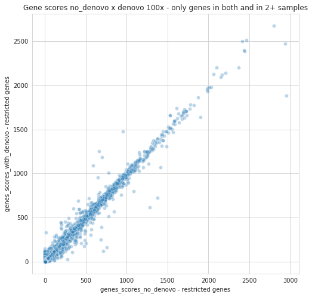
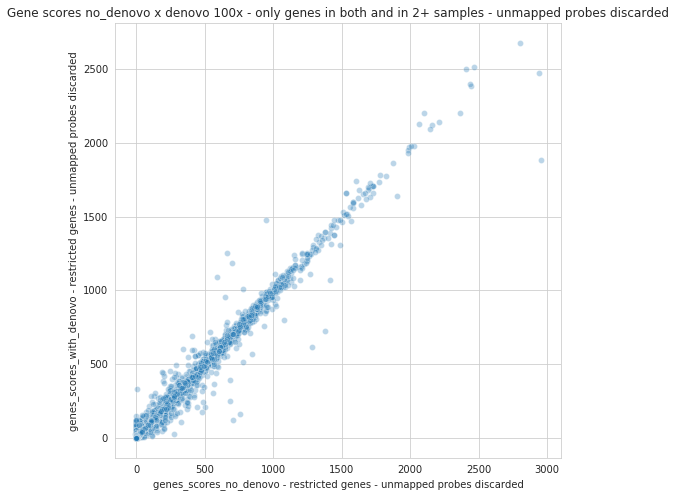

```python
import pandas as pd
from collections import defaultdict
from pathlib import Path
import seaborn as sns
import matplotlib.pyplot as plt
import numpy as np
from collections import namedtuple

```

We first setup some paths


```python
path_to_recall_reports = Path("../cluster/analysis/hps/nobackup/research/zi/leandro/pandora1_paper/analysis/recall/reports")
path_to_pandora_no_denovo_results = Path("../cluster/pandora/hps/nobackup/research/zi/projects/pandora_paper_leandro/old_analysis/100x/filter/compare_no_denovo")
path_to_pandora_with_denovo_results = Path("../cluster/pandora/hps/nobackup/research/zi/projects/pandora_paper_leandro/old_analysis/100x/filter/compare_with_denovo")

```

We now load all the data:

1. get all the recall reports (note: just working with 100x now)

2. get the samples each gene is present in both methods


```python
# get all reports
all_100x_with_denovo_recall_reports = list(path_to_recall_reports.glob("*/100x/*with_denovo*/*.tsv"))
all_100x_no_denovo_recall_reports = list(path_to_recall_reports.glob("*/100x/*no_denovo*/*.tsv"))

def get_genes_present_in_two_or_more_samples(pandora_matrix_filepath):
    genes_present_in_two_or_more_samples = set()
    with open(pandora_matrix_filepath) as fin:
        for index, line in enumerate(fin):
            if index == 0:
                continue
            line_split = line.strip().split()
            gene = line_split[0]
            presence_list = [int(x) for x in line_split[1:]]
            is_present_in_two_or_more_samples = sum(presence_list) >= 2
            if is_present_in_two_or_more_samples:
                genes_present_in_two_or_more_samples.add(gene)
    return genes_present_in_two_or_more_samples
            
    
genes_present_in_two_or_more_samples_100x_no_denovo = get_genes_present_in_two_or_more_samples(path_to_pandora_no_denovo_results / "pandora_multisample.matrix")
genes_present_in_two_or_more_samples_100x_with_denovo = get_genes_present_in_two_or_more_samples(path_to_pandora_with_denovo_results / "pandora_multisample.matrix")
genes_present_in_both_methods_and_are_also_in_two_or_more_samples = genes_present_in_two_or_more_samples_100x_no_denovo.intersection(genes_present_in_two_or_more_samples_100x_with_denovo)

print(f"nb of genes_present_in_two_or_more_samples_100x_no_denovo: {len(genes_present_in_two_or_more_samples_100x_no_denovo)}")
print(f"nb of genes_present_in_two_or_more_samples_100x_with_denovo: {len(genes_present_in_two_or_more_samples_100x_with_denovo)}")
print(f"nb of genes_present_in_both_methods_and_are_also_in_two_or_more_samples: {len(genes_present_in_both_methods_and_are_also_in_two_or_more_samples)}")

```

    nb of genes_present_in_two_or_more_samples_100x_no_denovo: 7145
    nb of genes_present_in_two_or_more_samples_100x_with_denovo: 7137
    nb of genes_present_in_both_methods_and_are_also_in_two_or_more_samples: 7075


We get the classification of the mapping of each truth probe to each gene 


```python
# declare functions to transform classifications to scores
def get_gene_classification_df(report_file):
    recall_report = pd.read_csv(report_file, sep="\t", dtype={"ref_probe_header": str, "classification": str}, keep_default_na=False)
    recall_report["gene"] = recall_report["ref_probe_header"].apply(lambda line: line.split(";")[0].split("=")[-1])
    gene_classification = pd.DataFrame(data=recall_report, columns=["gene", "classification"])

    return gene_classification

def get_gene_classification_df_for_several_files(report_files):
    dfs_from_report_files = [get_gene_classification_df(report_file) for report_file in report_files]
    return pd.concat(dfs_from_report_files)

gene_classification_df_100x_with_denovo = get_gene_classification_df_for_several_files(all_100x_with_denovo_recall_reports)
gene_classification_df_100x_no_denovo = get_gene_classification_df_for_several_files(all_100x_no_denovo_recall_reports)


```


We define the score of a gene with respect to the mappings of truth probes to this gene.

Let $m$ be a mapping. If a truth probe maps correctly to a gene (i.e. $m$ = primary_correct, $m$ = secondary_correct, $m$ =supplementary_correct), then $score(m) = 1$.
Otherwise, $score(m) = -1$.

Let $g$ be a gene and $M(g)$ be all mappings of truth probes to $g$. Then $score(g) = \sum_{m \in M(g)} score(m)$  


We get $score(g)$ for each gene $g$ without denovo and with denovo.

 


```python
# get the scores 
def get_score(classification):
    if classification in ["unmapped", "partially_mapped", "primary_incorrect", "secondary_incorrect", "supplementary_incorrect"]:
        return -1
    elif classification in ["primary_correct", "secondary_correct", "supplementary_correct"]:
        return 1
    else:
        raise ValueError(f"Unknown classification: {classification}")

def get_gene_to_score(gene_classification):
    gene_to_score = defaultdict(int)
    for index, line in gene_classification.iterrows():
        gene = line["gene"]
        classification = line["classification"]
        score = get_score(classification)
        gene_to_score[gene]+=score
    return gene_to_score

gene_to_score_100x_with_denovo = get_gene_to_score(gene_classification_df_100x_with_denovo)
gene_to_score_100x_no_denovo = get_gene_to_score(gene_classification_df_100x_no_denovo)

```

In order to take into account genes present in only one method, we add absent genes with score being 0.


```python
def add_absent_genes_to_gene_to_score(gene_to_score, gene_list):
    for gene in gene_list:
        if gene not in gene_to_score:
            gene_to_score[gene] = 0
add_absent_genes_to_gene_to_score(gene_to_score_100x_with_denovo, gene_to_score_100x_no_denovo.keys())
add_absent_genes_to_gene_to_score(gene_to_score_100x_no_denovo, gene_to_score_100x_with_denovo.keys())
assert gene_to_score_100x_with_denovo.keys() == gene_to_score_100x_no_denovo.keys()

```

Now we do raw score and log score plotting (note that log score plotting we lose some negative scores)


```python
def remove_unmapped_gene(gene_list):
    if '' in gene_list:
        gene_list.remove('')

# get a list of scores to be given to scatter plot
genes_with_denovo = gene_to_score_100x_with_denovo.keys()
genes_no_denovo = gene_to_score_100x_no_denovo.keys()
order_of_all_genes = list(genes_with_denovo)
order_of_all_genes_without_unmapped_gene = list(order_of_all_genes)
remove_unmapped_gene(order_of_all_genes_without_unmapped_gene)
order_of_restricted_genes = [gene for gene in genes_with_denovo if gene in genes_present_in_both_methods_and_are_also_in_two_or_more_samples]
order_of_restricted_genes_without_unmapped_gene = list(order_of_restricted_genes)
remove_unmapped_gene(order_of_restricted_genes_without_unmapped_gene)

def get_scores_as_array_in_order(gene_order):
    scores_for_no_denovo_as_array_in_order = [gene_to_score_100x_no_denovo[gene] for gene in gene_order]
    scores_for_denovo_as_array_in_order = [gene_to_score_100x_with_denovo[gene] for gene in gene_order]
    
    return scores_for_no_denovo_as_array_in_order, scores_for_denovo_as_array_in_order

scores_for_no_denovo_as_array_in_order_all_genes, scores_for_denovo_as_array_in_order_all_genes =\
    get_scores_as_array_in_order(order_of_all_genes)
scores_for_no_denovo_as_array_in_order_all_genes_without_unmapped_gene, scores_for_denovo_as_array_in_order_all_genes_without_unmapped_gene =\
    get_scores_as_array_in_order(order_of_all_genes_without_unmapped_gene)
scores_for_no_denovo_as_array_in_order_restricted_genes, scores_for_denovo_as_array_in_order_restricted_genes =\
    get_scores_as_array_in_order(order_of_restricted_genes)
scores_for_no_denovo_as_array_in_order_restricted_genes_without_unmapped_gene, scores_for_denovo_as_array_in_order_restricted_genes_without_unmapped_gene =\
    get_scores_as_array_in_order(order_of_restricted_genes_without_unmapped_gene)


```


```python
# produce scatterplot with raw scores 
def produce_scatterplot(scores_for_no_denovo, scores_for_denovo, xlabel, ylabel, title, filename, apply_log):
    # TODO : how to deal with the issue of 0 or negative valued scores?
    sns.set_style("whitegrid")
    fig, ax = plt.subplots(figsize=(8,8))
    
    sns.scatterplot(x=scores_for_no_denovo if not apply_log else np.log10(scores_for_no_denovo),
                    y=scores_for_denovo  if not apply_log else np.log10(scores_for_denovo),
                    alpha=0.3, ax=ax)
    
    ax.set_xlabel(xlabel)
    ax.set_ylabel(ylabel)
    ax.set_title(title)
    fig.savefig(filename)

produce_scatterplot(scores_for_no_denovo=scores_for_no_denovo_as_array_in_order_all_genes,
                    scores_for_denovo=scores_for_denovo_as_array_in_order_all_genes,
                    xlabel="genes_scores_no_denovo - all genes",
                    ylabel="genes_scores_with_denovo - all genes",
                    title="Gene scores no_denovo x denovo 100x - all genes",
                    filename="genes_scores_100x.all_genes.pdf",
                    apply_log=False)

produce_scatterplot(scores_for_no_denovo=scores_for_no_denovo_as_array_in_order_all_genes_without_unmapped_gene,
                    scores_for_denovo=scores_for_denovo_as_array_in_order_all_genes_without_unmapped_gene,
                    xlabel="genes_scores_no_denovo - all genes - unmapped probes discarded",
                    ylabel="genes_scores_with_denovo - all genes - unmapped probes discarded",
                    title="Gene scores no_denovo x denovo 100x - all genes  - unmapped probes discarded",
                    filename="genes_scores_100x.all_genes_without_unmapped_gene.pdf",
                    apply_log=False)

produce_scatterplot(scores_for_no_denovo=scores_for_no_denovo_as_array_in_order_restricted_genes,
                    scores_for_denovo=scores_for_denovo_as_array_in_order_restricted_genes,
                    xlabel="genes_scores_no_denovo - restricted genes",
                    ylabel="genes_scores_with_denovo - restricted genes",
                    title="Gene scores no_denovo x denovo 100x - only genes in both and in 2+ samples",
                    filename="genes_scores_100x.restricted_genes.pdf",
                    apply_log=False)


produce_scatterplot(scores_for_no_denovo=scores_for_no_denovo_as_array_in_order_restricted_genes_without_unmapped_gene,
                    scores_for_denovo=scores_for_denovo_as_array_in_order_restricted_genes_without_unmapped_gene,
                    xlabel="genes_scores_no_denovo - restricted genes - unmapped probes discarded",
                    ylabel="genes_scores_with_denovo - restricted genes - unmapped probes discarded",
                    title="Gene scores no_denovo x denovo 100x - only genes in both and in 2+ samples - unmapped probes discarded",
                    filename="genes_scores_100x.restricted_genes_without_unmapped_gene.pdf",
                    apply_log=False)


# produce_scatterplot(scores_for_no_denovo=scores_for_no_denovo_as_array_in_order_all_genes,
#                     scores_for_denovo=scores_for_denovo_as_array_in_order_all_genes,
#                     xlabel="genes_scores_no_denovo - all genes - log scale",
#                     ylabel="genes_scores_with_denovo - all genes - log scale",
#                     title="Gene scores no_denovo x denovo 100x - all genes - log scale",
#                     filename="genes_scores_100x.all_genes_log_scale.pdf",
#                     apply_log=True)

# produce_scatterplot(scores_for_no_denovo=scores_for_no_denovo_as_array_in_order_restricted_genes,
#                     scores_for_denovo=scores_for_denovo_as_array_in_order_restricted_genes,
#                     xlabel="genes_scores_no_denovo - restricted genes - log scale",
#                     ylabel="genes_scores_with_denovo - restricted genes - log scale",
#                     title="Gene scores no_denovo x denovo 100x - only genes in both and in 2+ samples - log scale",
#                     filename="genes_scores_100x.restricted_genes_log_scale.pdf",
#                     apply_log=True)


```














```python
#[(list(order_of_all_genes)[index], score) for index, score in enumerate(scores_for_no_denovo_as_array_in_order_all_genes) if score < 0] 


```


```python
# get genes that no_denovo does well and denovo does bad
Gene_scoreWithDeNovo_scoreNoDeNovo = namedtuple("Gene_scoreWithDeNovo_scoreNoDeNovo", "gene scoreWithDeNovo scoreWithNoDenovo delta")
def get_Gene_scoreWithDeNovo_scoreNoDeNovo(order_of_genes_to_process, scores_for_no_denovo, scores_for_denovo):
    gene_scoreWithDeNovo_scoreNoDenovo_list = []
    for index, gene in enumerate(order_of_genes_to_process):
        no_denovo_score = scores_for_no_denovo[index]
        denovo_score = scores_for_denovo[index]
        delta = no_denovo_score - denovo_score
        gene_scoreWithDeNovo_scoreNoDenovo_list.append(Gene_scoreWithDeNovo_scoreNoDeNovo(gene=gene, scoreWithDeNovo=denovo_score, scoreWithNoDenovo=no_denovo_score, delta=delta))
    
    return sorted(gene_scoreWithDeNovo_scoreNoDenovo_list, key= lambda x : x.delta, reverse=True)

        
gene_scoreWithDeNovo_scoreNoDenovo_list_all_genes_without_unmapped_gene = \
    get_Gene_scoreWithDeNovo_scoreNoDeNovo(order_of_all_genes_without_unmapped_gene, \
                                          scores_for_no_denovo_as_array_in_order_all_genes_without_unmapped_gene,
                                          scores_for_denovo_as_array_in_order_all_genes_without_unmapped_gene)

output_path = Path("genes_that_nodenovo_does_well_and_denovo_does_bad.all_genes_without_unmapped_gene.txt")
output_path.write_text("\n".join([str(_) for _ in gene_scoreWithDeNovo_scoreNoDenovo_list_all_genes_without_unmapped_gene]))

gene_scoreWithDeNovo_scoreNoDenovo_list_all_genes_without_unmapped_gene
```


    [Gene_scoreWithDeNovo_scoreNoDeNovo(gene='GC00000191_6', scoreWithDeNovo=1881, scoreWithNoDenovo=2957, delta=1076),
     Gene_scoreWithDeNovo_scoreNoDeNovo(gene='GC00000558_1', scoreWithDeNovo=618, scoreWithNoDenovo=1284, delta=666),
     Gene_scoreWithDeNovo_scoreNoDeNovo(gene='GC00000027_7', scoreWithDeNovo=724, scoreWithNoDenovo=1378, delta=654),
     Gene_scoreWithDeNovo_scoreNoDeNovo(gene='GC00004551_4', scoreWithDeNovo=157, scoreWithNoDenovo=759, delta=602),
     Gene_scoreWithDeNovo_scoreNoDeNovo(gene='GC00003150', scoreWithDeNovo=117, scoreWithNoDenovo=710, delta=593),
     Gene_scoreWithDeNovo_scoreNoDeNovo(gene='GC00003295_10', scoreWithDeNovo=2476, scoreWithNoDenovo=2942, delta=466),
     Gene_scoreWithDeNovo_scoreNoDeNovo(gene='GC00000061_6', scoreWithDeNovo=231, scoreWithNoDenovo=691, delta=460),
     Gene_scoreWithDeNovo_scoreNoDeNovo(gene='GC00003175', scoreWithDeNovo=247, scoreWithNoDenovo=686, delta=439),
     Gene_scoreWithDeNovo_scoreNoDeNovo(gene='GC00001424', scoreWithDeNovo=1072, scoreWithNoDenovo=1416, delta=344),
     Gene_scoreWithDeNovo_scoreNoDeNovo(gene='GC00002805', scoreWithDeNovo=192, scoreWithNoDenovo=526, delta=334),
     Gene_scoreWithDeNovo_scoreNoDeNovo(gene='GC00000024_14', scoreWithDeNovo=172, scoreWithNoDenovo=482, delta=310),
     Gene_scoreWithDeNovo_scoreNoDeNovo(gene='GC00000691_2', scoreWithDeNovo=204, scoreWithNoDenovo=502, delta=298),
     Gene_scoreWithDeNovo_scoreNoDeNovo(gene='GC00000193_4', scoreWithDeNovo=394, scoreWithNoDenovo=688, delta=294),
     Gene_scoreWithDeNovo_scoreNoDeNovo(gene='GC00000032_5', scoreWithDeNovo=795, scoreWithNoDenovo=1081, delta=286),
     Gene_scoreWithDeNovo_scoreNoDeNovo(gene='GC00001048_2', scoreWithDeNovo=568, scoreWithNoDenovo=846, delta=278),
     Gene_scoreWithDeNovo_scoreNoDeNovo(gene='GC00000184_2', scoreWithDeNovo=514, scoreWithNoDenovo=778, delta=264),
     Gene_scoreWithDeNovo_scoreNoDeNovo(gene='GC00000291_2', scoreWithDeNovo=1643, scoreWithNoDenovo=1904, delta=261),
     Gene_scoreWithDeNovo_scoreNoDeNovo(gene='GC00000073_5', scoreWithDeNovo=300, scoreWithNoDenovo=558, delta=258),
     Gene_scoreWithDeNovo_scoreNoDeNovo(gene='GC00000573_2', scoreWithDeNovo=24, scoreWithNoDenovo=275, delta=251),
     Gene_scoreWithDeNovo_scoreNoDeNovo(gene='GC00000781_3', scoreWithDeNovo=242, scoreWithNoDenovo=488, delta=246),
     Gene_scoreWithDeNovo_scoreNoDeNovo(gene='GC00000165_8', scoreWithDeNovo=204, scoreWithNoDenovo=442, delta=238),
     Gene_scoreWithDeNovo_scoreNoDeNovo(gene='GC00000630_2', scoreWithDeNovo=108, scoreWithNoDenovo=331, delta=223),
     Gene_scoreWithDeNovo_scoreNoDeNovo(gene='GC00000292_4', scoreWithDeNovo=364, scoreWithNoDenovo=566, delta=202),
     Gene_scoreWithDeNovo_scoreNoDeNovo(gene='GC00003120_r1_r1_1_p2', scoreWithDeNovo=194, scoreWithNoDenovo=372, delta=178),
     Gene_scoreWithDeNovo_scoreNoDeNovo(gene='GC00002396', scoreWithDeNovo=1308, scoreWithNoDenovo=1485, delta=177),
     Gene_scoreWithDeNovo_scoreNoDeNovo(gene='GC00000735_2', scoreWithDeNovo=757, scoreWithNoDenovo=931, delta=174),
     Gene_scoreWithDeNovo_scoreNoDeNovo(gene='GC00000315_2_p2', scoreWithDeNovo=211, scoreWithNoDenovo=382, delta=171),
     Gene_scoreWithDeNovo_scoreNoDeNovo(gene='GC00000016_41', scoreWithDeNovo=316, scoreWithNoDenovo=483, delta=167),
     Gene_scoreWithDeNovo_scoreNoDeNovo(gene='GC00002487', scoreWithDeNovo=2203, scoreWithNoDenovo=2367, delta=164),
     Gene_scoreWithDeNovo_scoreNoDeNovo(gene='GC00000565_2', scoreWithDeNovo=1110, scoreWithNoDenovo=1266, delta=156),
     Gene_scoreWithDeNovo_scoreNoDeNovo(gene='GC00000162_5', scoreWithDeNovo=273, scoreWithNoDenovo=426, delta=153),
     Gene_scoreWithDeNovo_scoreNoDeNovo(gene='GC00000795_r1_r1_1', scoreWithDeNovo=233, scoreWithNoDenovo=382, delta=149),
     Gene_scoreWithDeNovo_scoreNoDeNovo(gene='GC00000008_6', scoreWithDeNovo=170, scoreWithNoDenovo=318, delta=148),
     Gene_scoreWithDeNovo_scoreNoDeNovo(gene='GC00003812_6', scoreWithDeNovo=345, scoreWithNoDenovo=493, delta=148),
     Gene_scoreWithDeNovo_scoreNoDeNovo(gene='Cluster_5176', scoreWithDeNovo=0, scoreWithNoDenovo=147, delta=147),
     Gene_scoreWithDeNovo_scoreNoDeNovo(gene='GC00000103_3', scoreWithDeNovo=436, scoreWithNoDenovo=580, delta=144),
     Gene_scoreWithDeNovo_scoreNoDeNovo(gene='GC00000487_1', scoreWithDeNovo=43, scoreWithNoDenovo=186, delta=143),
     Gene_scoreWithDeNovo_scoreNoDeNovo(gene='GC00000736_5', scoreWithDeNovo=61, scoreWithNoDenovo=202, delta=141),
     Gene_scoreWithDeNovo_scoreNoDeNovo(gene='GC00003741_7', scoreWithDeNovo=64, scoreWithNoDenovo=204, delta=140),
     Gene_scoreWithDeNovo_scoreNoDeNovo(gene='GC00002240', scoreWithDeNovo=232, scoreWithNoDenovo=370, delta=138),
     Gene_scoreWithDeNovo_scoreNoDeNovo(gene='GC00003412', scoreWithDeNovo=147, scoreWithNoDenovo=283, delta=136),
     Gene_scoreWithDeNovo_scoreNoDeNovo(gene='GC00000213_3', scoreWithDeNovo=292, scoreWithNoDenovo=426, delta=134),
     Gene_scoreWithDeNovo_scoreNoDeNovo(gene='GC00002969', scoreWithDeNovo=224, scoreWithNoDenovo=356, delta=132),
     Gene_scoreWithDeNovo_scoreNoDeNovo(gene='GC00003758_6', scoreWithDeNovo=164, scoreWithNoDenovo=296, delta=132),
     Gene_scoreWithDeNovo_scoreNoDeNovo(gene='Cluster_3206', scoreWithDeNovo=119, scoreWithNoDenovo=249, delta=130),
     Gene_scoreWithDeNovo_scoreNoDeNovo(gene='GC00002914', scoreWithDeNovo=1070, scoreWithNoDenovo=1200, delta=130),
     Gene_scoreWithDeNovo_scoreNoDeNovo(gene='GC00000617_2', scoreWithDeNovo=158, scoreWithNoDenovo=286, delta=128),
     Gene_scoreWithDeNovo_scoreNoDeNovo(gene='GC00000872_2', scoreWithDeNovo=243, scoreWithNoDenovo=370, delta=127),
     Gene_scoreWithDeNovo_scoreNoDeNovo(gene='GC00001891', scoreWithDeNovo=893, scoreWithNoDenovo=1019, delta=126),
     Gene_scoreWithDeNovo_scoreNoDeNovo(gene='GC00000191_4', scoreWithDeNovo=358, scoreWithNoDenovo=484, delta=126),
     Gene_scoreWithDeNovo_scoreNoDeNovo(gene='Cluster_4184', scoreWithDeNovo=0, scoreWithNoDenovo=124, delta=124),
     Gene_scoreWithDeNovo_scoreNoDeNovo(gene='GC00002249', scoreWithDeNovo=2680, scoreWithNoDenovo=2801, delta=121),
     Gene_scoreWithDeNovo_scoreNoDeNovo(gene='GC00000625_5', scoreWithDeNovo=1030, scoreWithNoDenovo=1151, delta=121),
     Gene_scoreWithDeNovo_scoreNoDeNovo(gene='GC00000180_1', scoreWithDeNovo=478, scoreWithNoDenovo=598, delta=120),
     Gene_scoreWithDeNovo_scoreNoDeNovo(gene='GC00002884_2', scoreWithDeNovo=611, scoreWithNoDenovo=730, delta=119),
     Gene_scoreWithDeNovo_scoreNoDeNovo(gene='GC00002982', scoreWithDeNovo=632, scoreWithNoDenovo=750, delta=118),
     Gene_scoreWithDeNovo_scoreNoDeNovo(gene='GC00000174_7', scoreWithDeNovo=106, scoreWithNoDenovo=224, delta=118),
     Gene_scoreWithDeNovo_scoreNoDeNovo(gene='GC00000215_3', scoreWithDeNovo=273, scoreWithNoDenovo=390, delta=117),
     Gene_scoreWithDeNovo_scoreNoDeNovo(gene='GC00003212', scoreWithDeNovo=36, scoreWithNoDenovo=153, delta=117),
     Gene_scoreWithDeNovo_scoreNoDeNovo(gene='GC00000220_5', scoreWithDeNovo=875, scoreWithNoDenovo=991, delta=116),
     Gene_scoreWithDeNovo_scoreNoDeNovo(gene='GC00001416_2', scoreWithDeNovo=712, scoreWithNoDenovo=828, delta=116),
     Gene_scoreWithDeNovo_scoreNoDeNovo(gene='GC00000269_5_p2', scoreWithDeNovo=91, scoreWithNoDenovo=206, delta=115),
     Gene_scoreWithDeNovo_scoreNoDeNovo(gene='GC00003203_7', scoreWithDeNovo=142, scoreWithNoDenovo=256, delta=114),
     Gene_scoreWithDeNovo_scoreNoDeNovo(gene='GC00000706_1', scoreWithDeNovo=0, scoreWithNoDenovo=110, delta=110),
     Gene_scoreWithDeNovo_scoreNoDeNovo(gene='GC00002765', scoreWithDeNovo=261, scoreWithNoDenovo=370, delta=109),
     Gene_scoreWithDeNovo_scoreNoDeNovo(gene='GC00000214_5', scoreWithDeNovo=551, scoreWithNoDenovo=660, delta=109),
     Gene_scoreWithDeNovo_scoreNoDeNovo(gene='GC00002987', scoreWithDeNovo=1317, scoreWithNoDenovo=1426, delta=109),
     Gene_scoreWithDeNovo_scoreNoDeNovo(gene='GC00000131_2', scoreWithDeNovo=484, scoreWithNoDenovo=592, delta=108),
     Gene_scoreWithDeNovo_scoreNoDeNovo(gene='GC00000692_4', scoreWithDeNovo=321, scoreWithNoDenovo=428, delta=107),
     Gene_scoreWithDeNovo_scoreNoDeNovo(gene='GC00002946_2', scoreWithDeNovo=93, scoreWithNoDenovo=197, delta=104),
     Gene_scoreWithDeNovo_scoreNoDeNovo(gene='GC00000201_4', scoreWithDeNovo=444, scoreWithNoDenovo=548, delta=104),
     Gene_scoreWithDeNovo_scoreNoDeNovo(gene='GC00000629_1', scoreWithDeNovo=280, scoreWithNoDenovo=384, delta=104),
     Gene_scoreWithDeNovo_scoreNoDeNovo(gene='GC00000695_7', scoreWithDeNovo=12, scoreWithNoDenovo=116, delta=104),
     Gene_scoreWithDeNovo_scoreNoDeNovo(gene='GC00002820_2', scoreWithDeNovo=909, scoreWithNoDenovo=1012, delta=103),
     Gene_scoreWithDeNovo_scoreNoDeNovo(gene='Cluster_1124', scoreWithDeNovo=0, scoreWithNoDenovo=102, delta=102),
     Gene_scoreWithDeNovo_scoreNoDeNovo(gene='GC00000379_3', scoreWithDeNovo=1471, scoreWithNoDenovo=1570, delta=99),
     Gene_scoreWithDeNovo_scoreNoDeNovo(gene='GC00000580_2', scoreWithDeNovo=151, scoreWithNoDenovo=250, delta=99),
     Gene_scoreWithDeNovo_scoreNoDeNovo(gene='GC00000226_10', scoreWithDeNovo=545, scoreWithNoDenovo=644, delta=99),
     Gene_scoreWithDeNovo_scoreNoDeNovo(gene='Cluster_3878', scoreWithDeNovo=52, scoreWithNoDenovo=150, delta=98),
     Gene_scoreWithDeNovo_scoreNoDeNovo(gene='Cluster_803', scoreWithDeNovo=19, scoreWithNoDenovo=116, delta=97),
     Gene_scoreWithDeNovo_scoreNoDeNovo(gene='GC00003012', scoreWithDeNovo=844, scoreWithNoDenovo=940, delta=96),
     Gene_scoreWithDeNovo_scoreNoDeNovo(gene='GC00000247_2', scoreWithDeNovo=86, scoreWithNoDenovo=182, delta=96),
     Gene_scoreWithDeNovo_scoreNoDeNovo(gene='GC00000554_4', scoreWithDeNovo=418, scoreWithNoDenovo=514, delta=96),
     Gene_scoreWithDeNovo_scoreNoDeNovo(gene='GC00003472_r1_1', scoreWithDeNovo=117, scoreWithNoDenovo=208, delta=91),
     Gene_scoreWithDeNovo_scoreNoDeNovo(gene='GC00000536_1', scoreWithDeNovo=94, scoreWithNoDenovo=184, delta=90),
     Gene_scoreWithDeNovo_scoreNoDeNovo(gene='GC00000026_9', scoreWithDeNovo=356, scoreWithNoDenovo=444, delta=88),
     Gene_scoreWithDeNovo_scoreNoDeNovo(gene='GC00003167_2', scoreWithDeNovo=166, scoreWithNoDenovo=254, delta=88),
     Gene_scoreWithDeNovo_scoreNoDeNovo(gene='GC00000024_9', scoreWithDeNovo=191, scoreWithNoDenovo=278, delta=87),
     Gene_scoreWithDeNovo_scoreNoDeNovo(gene='GC00002721', scoreWithDeNovo=252, scoreWithNoDenovo=338, delta=86),
     Gene_scoreWithDeNovo_scoreNoDeNovo(gene='GC00000005_4', scoreWithDeNovo=860, scoreWithNoDenovo=945, delta=85),
     Gene_scoreWithDeNovo_scoreNoDeNovo(gene='GC00002936', scoreWithDeNovo=866, scoreWithNoDenovo=950, delta=84),
     Gene_scoreWithDeNovo_scoreNoDeNovo(gene='GC00000043_7', scoreWithDeNovo=62, scoreWithNoDenovo=146, delta=84),
     Gene_scoreWithDeNovo_scoreNoDeNovo(gene='GC00001268', scoreWithDeNovo=945, scoreWithNoDenovo=1028, delta=83),
     Gene_scoreWithDeNovo_scoreNoDeNovo(gene='GC00000529_3', scoreWithDeNovo=309, scoreWithNoDenovo=392, delta=83),
     Gene_scoreWithDeNovo_scoreNoDeNovo(gene='GC00000126_2', scoreWithDeNovo=155, scoreWithNoDenovo=236, delta=81),
     Gene_scoreWithDeNovo_scoreNoDeNovo(gene='GC00003216', scoreWithDeNovo=225, scoreWithNoDenovo=306, delta=81),
     Gene_scoreWithDeNovo_scoreNoDeNovo(gene='GC00000136_3', scoreWithDeNovo=489, scoreWithNoDenovo=570, delta=81),
     Gene_scoreWithDeNovo_scoreNoDeNovo(gene='GC00001782', scoreWithDeNovo=518, scoreWithNoDenovo=599, delta=81),
     Gene_scoreWithDeNovo_scoreNoDeNovo(gene='GC00001229', scoreWithDeNovo=320, scoreWithNoDenovo=400, delta=80),
     Gene_scoreWithDeNovo_scoreNoDeNovo(gene='Cluster_946', scoreWithDeNovo=106, scoreWithNoDenovo=186, delta=80),
     Gene_scoreWithDeNovo_scoreNoDeNovo(gene='GC00002745', scoreWithDeNovo=359, scoreWithNoDenovo=438, delta=79),
     Gene_scoreWithDeNovo_scoreNoDeNovo(gene='GC00002864_2', scoreWithDeNovo=36, scoreWithNoDenovo=114, delta=78),
     Gene_scoreWithDeNovo_scoreNoDeNovo(gene='GC00003456', scoreWithDeNovo=136, scoreWithNoDenovo=214, delta=78),
     Gene_scoreWithDeNovo_scoreNoDeNovo(gene='GC00001422', scoreWithDeNovo=484, scoreWithNoDenovo=560, delta=76),
     Gene_scoreWithDeNovo_scoreNoDeNovo(gene='GC00002691', scoreWithDeNovo=886, scoreWithNoDenovo=961, delta=75),
     Gene_scoreWithDeNovo_scoreNoDeNovo(gene='GC00000121_16', scoreWithDeNovo=137, scoreWithNoDenovo=212, delta=75),
     Gene_scoreWithDeNovo_scoreNoDeNovo(gene='GC00000866_2', scoreWithDeNovo=194, scoreWithNoDenovo=269, delta=75),
     Gene_scoreWithDeNovo_scoreNoDeNovo(gene='Cluster_5378', scoreWithDeNovo=0, scoreWithNoDenovo=75, delta=75),
     Gene_scoreWithDeNovo_scoreNoDeNovo(gene='GC00000273_4', scoreWithDeNovo=1056, scoreWithNoDenovo=1130, delta=74),
     Gene_scoreWithDeNovo_scoreNoDeNovo(gene='GC00000148_1', scoreWithDeNovo=1035, scoreWithNoDenovo=1109, delta=74),
     Gene_scoreWithDeNovo_scoreNoDeNovo(gene='GC00003219', scoreWithDeNovo=114, scoreWithNoDenovo=188, delta=74),
     Gene_scoreWithDeNovo_scoreNoDeNovo(gene='GC00000295_1', scoreWithDeNovo=1634, scoreWithNoDenovo=1708, delta=74),
     Gene_scoreWithDeNovo_scoreNoDeNovo(gene='Cluster_2971', scoreWithDeNovo=0, scoreWithNoDenovo=74, delta=74),
     Gene_scoreWithDeNovo_scoreNoDeNovo(gene='GC00001169_2', scoreWithDeNovo=1660, scoreWithNoDenovo=1733, delta=73),
     Gene_scoreWithDeNovo_scoreNoDeNovo(gene='GC00000769_4', scoreWithDeNovo=301, scoreWithNoDenovo=374, delta=73),
     Gene_scoreWithDeNovo_scoreNoDeNovo(gene='GC00002199', scoreWithDeNovo=731, scoreWithNoDenovo=803, delta=72),
     Gene_scoreWithDeNovo_scoreNoDeNovo(gene='GC00002213', scoreWithDeNovo=740, scoreWithNoDenovo=812, delta=72),
     Gene_scoreWithDeNovo_scoreNoDeNovo(gene='GC00000274_4', scoreWithDeNovo=716, scoreWithNoDenovo=788, delta=72),
     Gene_scoreWithDeNovo_scoreNoDeNovo(gene='GC00000010_17', scoreWithDeNovo=672, scoreWithNoDenovo=744, delta=72),
     Gene_scoreWithDeNovo_scoreNoDeNovo(gene='GC00001985', scoreWithDeNovo=790, scoreWithNoDenovo=861, delta=71),
     Gene_scoreWithDeNovo_scoreNoDeNovo(gene='GC00002431', scoreWithDeNovo=931, scoreWithNoDenovo=1002, delta=71),
     Gene_scoreWithDeNovo_scoreNoDeNovo(gene='GC00002495', scoreWithDeNovo=1374, scoreWithNoDenovo=1445, delta=71),
     Gene_scoreWithDeNovo_scoreNoDeNovo(gene='GC00000117_3', scoreWithDeNovo=1373, scoreWithNoDenovo=1443, delta=70),
     Gene_scoreWithDeNovo_scoreNoDeNovo(gene='GC00000531_2', scoreWithDeNovo=718, scoreWithNoDenovo=788, delta=70),
     Gene_scoreWithDeNovo_scoreNoDeNovo(gene='GC00001000_3', scoreWithDeNovo=649, scoreWithNoDenovo=719, delta=70),
     Gene_scoreWithDeNovo_scoreNoDeNovo(gene='GC00000499_4', scoreWithDeNovo=232, scoreWithNoDenovo=301, delta=69),
     Gene_scoreWithDeNovo_scoreNoDeNovo(gene='GC00000952_2', scoreWithDeNovo=235, scoreWithNoDenovo=304, delta=69),
     Gene_scoreWithDeNovo_scoreNoDeNovo(gene='GC00000756_4', scoreWithDeNovo=498, scoreWithNoDenovo=567, delta=69),
     Gene_scoreWithDeNovo_scoreNoDeNovo(gene='GC00000071_3', scoreWithDeNovo=75, scoreWithNoDenovo=144, delta=69),
     Gene_scoreWithDeNovo_scoreNoDeNovo(gene='GC00000604_4', scoreWithDeNovo=750, scoreWithNoDenovo=818, delta=68),
     Gene_scoreWithDeNovo_scoreNoDeNovo(gene='GC00002417', scoreWithDeNovo=132, scoreWithNoDenovo=200, delta=68),
     Gene_scoreWithDeNovo_scoreNoDeNovo(gene='GC00000045_3', scoreWithDeNovo=889, scoreWithNoDenovo=957, delta=68),
     Gene_scoreWithDeNovo_scoreNoDeNovo(gene='GC00002720', scoreWithDeNovo=806, scoreWithNoDenovo=872, delta=66),
     Gene_scoreWithDeNovo_scoreNoDeNovo(gene='GC00000168_2', scoreWithDeNovo=54, scoreWithNoDenovo=120, delta=66),
     Gene_scoreWithDeNovo_scoreNoDeNovo(gene='Cluster_4383', scoreWithDeNovo=0, scoreWithNoDenovo=66, delta=66),
     Gene_scoreWithDeNovo_scoreNoDeNovo(gene='GC00001187', scoreWithDeNovo=1024, scoreWithNoDenovo=1089, delta=65),
     Gene_scoreWithDeNovo_scoreNoDeNovo(gene='GC00000485_1', scoreWithDeNovo=1080, scoreWithNoDenovo=1144, delta=64),
     Gene_scoreWithDeNovo_scoreNoDeNovo(gene='GC00000984', scoreWithDeNovo=2145, scoreWithNoDenovo=2209, delta=64),
     Gene_scoreWithDeNovo_scoreNoDeNovo(gene='GC00002056', scoreWithDeNovo=1578, scoreWithNoDenovo=1641, delta=63),
     Gene_scoreWithDeNovo_scoreNoDeNovo(gene='GC00002471', scoreWithDeNovo=263, scoreWithNoDenovo=326, delta=63),
     Gene_scoreWithDeNovo_scoreNoDeNovo(gene='GC00000641_2', scoreWithDeNovo=108, scoreWithNoDenovo=170, delta=62),
     Gene_scoreWithDeNovo_scoreNoDeNovo(gene='GC00000479_2', scoreWithDeNovo=2384, scoreWithNoDenovo=2446, delta=62),
     Gene_scoreWithDeNovo_scoreNoDeNovo(gene='GC00000214_3', scoreWithDeNovo=271, scoreWithNoDenovo=333, delta=62),
     Gene_scoreWithDeNovo_scoreNoDeNovo(gene='GC00000625_4', scoreWithDeNovo=376, scoreWithNoDenovo=438, delta=62),
     Gene_scoreWithDeNovo_scoreNoDeNovo(gene='GC00002029', scoreWithDeNovo=248, scoreWithNoDenovo=309, delta=61),
     Gene_scoreWithDeNovo_scoreNoDeNovo(gene='GC00002928', scoreWithDeNovo=656, scoreWithNoDenovo=717, delta=61),
     Gene_scoreWithDeNovo_scoreNoDeNovo(gene='GC00000473_1', scoreWithDeNovo=847, scoreWithNoDenovo=908, delta=61),
     Gene_scoreWithDeNovo_scoreNoDeNovo(gene='GC00000785_2', scoreWithDeNovo=572, scoreWithNoDenovo=633, delta=61),
     Gene_scoreWithDeNovo_scoreNoDeNovo(gene='GC00000706_2', scoreWithDeNovo=555, scoreWithNoDenovo=615, delta=60),
     Gene_scoreWithDeNovo_scoreNoDeNovo(gene='GC00003428', scoreWithDeNovo=238, scoreWithNoDenovo=298, delta=60),
     Gene_scoreWithDeNovo_scoreNoDeNovo(gene='Cluster_4440', scoreWithDeNovo=50, scoreWithNoDenovo=110, delta=60),
     Gene_scoreWithDeNovo_scoreNoDeNovo(gene='GC00000163_3_p1', scoreWithDeNovo=334, scoreWithNoDenovo=394, delta=60),
     Gene_scoreWithDeNovo_scoreNoDeNovo(gene='GC00000346_2', scoreWithDeNovo=783, scoreWithNoDenovo=843, delta=60),
     Gene_scoreWithDeNovo_scoreNoDeNovo(gene='Cluster_4386', scoreWithDeNovo=52, scoreWithNoDenovo=112, delta=60),
     Gene_scoreWithDeNovo_scoreNoDeNovo(gene='GC00000137_4', scoreWithDeNovo=38, scoreWithNoDenovo=98, delta=60),
     Gene_scoreWithDeNovo_scoreNoDeNovo(gene='GC00001125', scoreWithDeNovo=1150, scoreWithNoDenovo=1209, delta=59),
     Gene_scoreWithDeNovo_scoreNoDeNovo(gene='GC00000566_2', scoreWithDeNovo=84, scoreWithNoDenovo=142, delta=58),
     Gene_scoreWithDeNovo_scoreNoDeNovo(gene='GC00000283_15', scoreWithDeNovo=18, scoreWithNoDenovo=76, delta=58),
     Gene_scoreWithDeNovo_scoreNoDeNovo(gene='Cluster_7248', scoreWithDeNovo=0, scoreWithNoDenovo=58, delta=58),
     Gene_scoreWithDeNovo_scoreNoDeNovo(gene='Cluster_1065', scoreWithDeNovo=64, scoreWithNoDenovo=121, delta=57),
     Gene_scoreWithDeNovo_scoreNoDeNovo(gene='GC00000584_1', scoreWithDeNovo=856, scoreWithNoDenovo=912, delta=56),
     Gene_scoreWithDeNovo_scoreNoDeNovo(gene='GC00000437_3', scoreWithDeNovo=388, scoreWithNoDenovo=444, delta=56),
     Gene_scoreWithDeNovo_scoreNoDeNovo(gene='Cluster_7855', scoreWithDeNovo=84, scoreWithNoDenovo=140, delta=56),
     Gene_scoreWithDeNovo_scoreNoDeNovo(gene='GC00002849', scoreWithDeNovo=1033, scoreWithNoDenovo=1089, delta=56),
     Gene_scoreWithDeNovo_scoreNoDeNovo(gene='GC00000867_30', scoreWithDeNovo=180, scoreWithNoDenovo=236, delta=56),
     Gene_scoreWithDeNovo_scoreNoDeNovo(gene='GC00000372_1', scoreWithDeNovo=1273, scoreWithNoDenovo=1329, delta=56),
     Gene_scoreWithDeNovo_scoreNoDeNovo(gene='GC00000698_2', scoreWithDeNovo=87, scoreWithNoDenovo=142, delta=55),
     Gene_scoreWithDeNovo_scoreNoDeNovo(gene='GC00000488_2', scoreWithDeNovo=387, scoreWithNoDenovo=442, delta=55),
     Gene_scoreWithDeNovo_scoreNoDeNovo(gene='GC00002308', scoreWithDeNovo=1139, scoreWithNoDenovo=1194, delta=55),
     Gene_scoreWithDeNovo_scoreNoDeNovo(gene='GC00000524_2', scoreWithDeNovo=1620, scoreWithNoDenovo=1675, delta=55),
     Gene_scoreWithDeNovo_scoreNoDeNovo(gene='GC00000781_5', scoreWithDeNovo=299, scoreWithNoDenovo=354, delta=55),
     Gene_scoreWithDeNovo_scoreNoDeNovo(gene='Cluster_305', scoreWithDeNovo=27, scoreWithNoDenovo=82, delta=55),
     Gene_scoreWithDeNovo_scoreNoDeNovo(gene='GC00000845_2', scoreWithDeNovo=746, scoreWithNoDenovo=800, delta=54),
     Gene_scoreWithDeNovo_scoreNoDeNovo(gene='GC00000092_7', scoreWithDeNovo=426, scoreWithNoDenovo=480, delta=54),
     Gene_scoreWithDeNovo_scoreNoDeNovo(gene='GC00000304_2', scoreWithDeNovo=1186, scoreWithNoDenovo=1240, delta=54),
     Gene_scoreWithDeNovo_scoreNoDeNovo(gene='GC00002596', scoreWithDeNovo=322, scoreWithNoDenovo=376, delta=54),
     Gene_scoreWithDeNovo_scoreNoDeNovo(gene='GC00000772_2', scoreWithDeNovo=402, scoreWithNoDenovo=456, delta=54),
     Gene_scoreWithDeNovo_scoreNoDeNovo(gene='GC00000259_r1_1', scoreWithDeNovo=199, scoreWithNoDenovo=253, delta=54),
     Gene_scoreWithDeNovo_scoreNoDeNovo(gene='GC00000634_2', scoreWithDeNovo=32, scoreWithNoDenovo=86, delta=54),
     Gene_scoreWithDeNovo_scoreNoDeNovo(gene='GC00002910', scoreWithDeNovo=609, scoreWithNoDenovo=662, delta=53),
     Gene_scoreWithDeNovo_scoreNoDeNovo(gene='Cluster_1163', scoreWithDeNovo=113, scoreWithNoDenovo=166, delta=53),
     Gene_scoreWithDeNovo_scoreNoDeNovo(gene='GC00000137_2', scoreWithDeNovo=804, scoreWithNoDenovo=857, delta=53),
     Gene_scoreWithDeNovo_scoreNoDeNovo(gene='GC00000114_3', scoreWithDeNovo=1979, scoreWithNoDenovo=2031, delta=52),
     Gene_scoreWithDeNovo_scoreNoDeNovo(gene='GC00000284_4', scoreWithDeNovo=817, scoreWithNoDenovo=869, delta=52),
     Gene_scoreWithDeNovo_scoreNoDeNovo(gene='GC00001524', scoreWithDeNovo=632, scoreWithNoDenovo=684, delta=52),
     Gene_scoreWithDeNovo_scoreNoDeNovo(gene='GC00001570', scoreWithDeNovo=443, scoreWithNoDenovo=495, delta=52),
     Gene_scoreWithDeNovo_scoreNoDeNovo(gene='GC00002866', scoreWithDeNovo=169, scoreWithNoDenovo=221, delta=52),
     Gene_scoreWithDeNovo_scoreNoDeNovo(gene='GC00002663', scoreWithDeNovo=1935, scoreWithNoDenovo=1987, delta=52),
     Gene_scoreWithDeNovo_scoreNoDeNovo(gene='GC00002264', scoreWithDeNovo=511, scoreWithNoDenovo=563, delta=52),
     Gene_scoreWithDeNovo_scoreNoDeNovo(gene='GC00000909_8', scoreWithDeNovo=531, scoreWithNoDenovo=583, delta=52),
     Gene_scoreWithDeNovo_scoreNoDeNovo(gene='GC00002695', scoreWithDeNovo=749, scoreWithNoDenovo=801, delta=52),
     Gene_scoreWithDeNovo_scoreNoDeNovo(gene='GC00000713_8', scoreWithDeNovo=212, scoreWithNoDenovo=264, delta=52),
     Gene_scoreWithDeNovo_scoreNoDeNovo(gene='GC00000776_5', scoreWithDeNovo=156, scoreWithNoDenovo=208, delta=52),
     Gene_scoreWithDeNovo_scoreNoDeNovo(gene='GC00000282_16', scoreWithDeNovo=1023, scoreWithNoDenovo=1074, delta=51),
     Gene_scoreWithDeNovo_scoreNoDeNovo(gene='GC00002514', scoreWithDeNovo=588, scoreWithNoDenovo=639, delta=51),
     Gene_scoreWithDeNovo_scoreNoDeNovo(gene='GC00002386', scoreWithDeNovo=492, scoreWithNoDenovo=543, delta=51),
     Gene_scoreWithDeNovo_scoreNoDeNovo(gene='GC00000397_1', scoreWithDeNovo=1198, scoreWithNoDenovo=1249, delta=51),
     Gene_scoreWithDeNovo_scoreNoDeNovo(gene='GC00000939', scoreWithDeNovo=249, scoreWithNoDenovo=300, delta=51),
     Gene_scoreWithDeNovo_scoreNoDeNovo(gene='GC00000328_2', scoreWithDeNovo=136, scoreWithNoDenovo=186, delta=50),
     Gene_scoreWithDeNovo_scoreNoDeNovo(gene='GC00000514_1', scoreWithDeNovo=580, scoreWithNoDenovo=630, delta=50),
     Gene_scoreWithDeNovo_scoreNoDeNovo(gene='Cluster_5351', scoreWithDeNovo=176, scoreWithNoDenovo=226, delta=50),
     Gene_scoreWithDeNovo_scoreNoDeNovo(gene='GC00000072_8', scoreWithDeNovo=420, scoreWithNoDenovo=470, delta=50),
     Gene_scoreWithDeNovo_scoreNoDeNovo(gene='GC00001710', scoreWithDeNovo=778, scoreWithNoDenovo=828, delta=50),
     Gene_scoreWithDeNovo_scoreNoDeNovo(gene='GC00002478', scoreWithDeNovo=324, scoreWithNoDenovo=374, delta=50),
     Gene_scoreWithDeNovo_scoreNoDeNovo(gene='GC00000157_r1_1', scoreWithDeNovo=6, scoreWithNoDenovo=56, delta=50),
     Gene_scoreWithDeNovo_scoreNoDeNovo(gene='Cluster_3093', scoreWithDeNovo=0, scoreWithNoDenovo=50, delta=50),
     Gene_scoreWithDeNovo_scoreNoDeNovo(gene='GC00002737', scoreWithDeNovo=2098, scoreWithNoDenovo=2147, delta=49),
     Gene_scoreWithDeNovo_scoreNoDeNovo(gene='Cluster_4716', scoreWithDeNovo=0, scoreWithNoDenovo=49, delta=49),
     Gene_scoreWithDeNovo_scoreNoDeNovo(gene='GC00001195', scoreWithDeNovo=121, scoreWithNoDenovo=169, delta=48),
     Gene_scoreWithDeNovo_scoreNoDeNovo(gene='GC00002791', scoreWithDeNovo=1180, scoreWithNoDenovo=1228, delta=48),
     Gene_scoreWithDeNovo_scoreNoDeNovo(gene='GC00000899_8', scoreWithDeNovo=452, scoreWithNoDenovo=500, delta=48),
     Gene_scoreWithDeNovo_scoreNoDeNovo(gene='GC00002476', scoreWithDeNovo=1502, scoreWithNoDenovo=1550, delta=48),
     Gene_scoreWithDeNovo_scoreNoDeNovo(gene='Cluster_7866', scoreWithDeNovo=0, scoreWithNoDenovo=48, delta=48),
     Gene_scoreWithDeNovo_scoreNoDeNovo(gene='GC00002227', scoreWithDeNovo=737, scoreWithNoDenovo=784, delta=47),
     Gene_scoreWithDeNovo_scoreNoDeNovo(gene='GC00000654_3', scoreWithDeNovo=573, scoreWithNoDenovo=620, delta=47),
     Gene_scoreWithDeNovo_scoreNoDeNovo(gene='GC00003756_r1_1', scoreWithDeNovo=11, scoreWithNoDenovo=58, delta=47),
     Gene_scoreWithDeNovo_scoreNoDeNovo(gene='GC00001420', scoreWithDeNovo=224, scoreWithNoDenovo=270, delta=46),
     Gene_scoreWithDeNovo_scoreNoDeNovo(gene='GC00002350', scoreWithDeNovo=1778, scoreWithNoDenovo=1824, delta=46),
     Gene_scoreWithDeNovo_scoreNoDeNovo(gene='GC00001999', scoreWithDeNovo=1158, scoreWithNoDenovo=1204, delta=46),
     Gene_scoreWithDeNovo_scoreNoDeNovo(gene='GC00000560_1', scoreWithDeNovo=634, scoreWithNoDenovo=680, delta=46),
     Gene_scoreWithDeNovo_scoreNoDeNovo(gene='GC00001287', scoreWithDeNovo=903, scoreWithNoDenovo=949, delta=46),
     Gene_scoreWithDeNovo_scoreNoDeNovo(gene='GC00000177_4', scoreWithDeNovo=475, scoreWithNoDenovo=521, delta=46),
     Gene_scoreWithDeNovo_scoreNoDeNovo(gene='GC00002794', scoreWithDeNovo=78, scoreWithNoDenovo=124, delta=46),
     Gene_scoreWithDeNovo_scoreNoDeNovo(gene='GC00002218', scoreWithDeNovo=454, scoreWithNoDenovo=500, delta=46),
     Gene_scoreWithDeNovo_scoreNoDeNovo(gene='GC00001061_2', scoreWithDeNovo=519, scoreWithNoDenovo=565, delta=46),
     Gene_scoreWithDeNovo_scoreNoDeNovo(gene='GC00000207_3', scoreWithDeNovo=757, scoreWithNoDenovo=803, delta=46),
     Gene_scoreWithDeNovo_scoreNoDeNovo(gene='GC00001083_2', scoreWithDeNovo=394, scoreWithNoDenovo=440, delta=46),
     Gene_scoreWithDeNovo_scoreNoDeNovo(gene='GC00001342', scoreWithDeNovo=601, scoreWithNoDenovo=647, delta=46),
     Gene_scoreWithDeNovo_scoreNoDeNovo(gene='GC00001839', scoreWithDeNovo=592, scoreWithNoDenovo=638, delta=46),
     Gene_scoreWithDeNovo_scoreNoDeNovo(gene='GC00000597_2', scoreWithDeNovo=320, scoreWithNoDenovo=366, delta=46),
     Gene_scoreWithDeNovo_scoreNoDeNovo(gene='GC00003107', scoreWithDeNovo=68, scoreWithNoDenovo=114, delta=46),
     Gene_scoreWithDeNovo_scoreNoDeNovo(gene='GC00000367_2', scoreWithDeNovo=380, scoreWithNoDenovo=425, delta=45),
     Gene_scoreWithDeNovo_scoreNoDeNovo(gene='GC00003116', scoreWithDeNovo=283, scoreWithNoDenovo=328, delta=45),
     Gene_scoreWithDeNovo_scoreNoDeNovo(gene='GC00002789_2', scoreWithDeNovo=233, scoreWithNoDenovo=278, delta=45),
     Gene_scoreWithDeNovo_scoreNoDeNovo(gene='GC00002588', scoreWithDeNovo=544, scoreWithNoDenovo=589, delta=45),
     Gene_scoreWithDeNovo_scoreNoDeNovo(gene='GC00002682_2', scoreWithDeNovo=286, scoreWithNoDenovo=331, delta=45),
     Gene_scoreWithDeNovo_scoreNoDeNovo(gene='GC00002680', scoreWithDeNovo=445, scoreWithNoDenovo=490, delta=45),
     Gene_scoreWithDeNovo_scoreNoDeNovo(gene='GC00002500', scoreWithDeNovo=1259, scoreWithNoDenovo=1304, delta=45),
     Gene_scoreWithDeNovo_scoreNoDeNovo(gene='Cluster_9344', scoreWithDeNovo=15, scoreWithNoDenovo=60, delta=45),
     Gene_scoreWithDeNovo_scoreNoDeNovo(gene='GC00000029_3', scoreWithDeNovo=763, scoreWithNoDenovo=807, delta=44),
     Gene_scoreWithDeNovo_scoreNoDeNovo(gene='GC00000805_2', scoreWithDeNovo=569, scoreWithNoDenovo=613, delta=44),
     Gene_scoreWithDeNovo_scoreNoDeNovo(gene='GC00000299_2', scoreWithDeNovo=544, scoreWithNoDenovo=588, delta=44),
     Gene_scoreWithDeNovo_scoreNoDeNovo(gene='GC00001171_2', scoreWithDeNovo=68, scoreWithNoDenovo=112, delta=44),
     Gene_scoreWithDeNovo_scoreNoDeNovo(gene='GC00000834_2', scoreWithDeNovo=377, scoreWithNoDenovo=421, delta=44),
     Gene_scoreWithDeNovo_scoreNoDeNovo(gene='GC00000340_3', scoreWithDeNovo=202, scoreWithNoDenovo=246, delta=44),
     Gene_scoreWithDeNovo_scoreNoDeNovo(gene='GC00000496_2', scoreWithDeNovo=162, scoreWithNoDenovo=206, delta=44),
     Gene_scoreWithDeNovo_scoreNoDeNovo(gene='GC00000343_1', scoreWithDeNovo=583, scoreWithNoDenovo=627, delta=44),
     Gene_scoreWithDeNovo_scoreNoDeNovo(gene='GC00000366_1', scoreWithDeNovo=1003, scoreWithNoDenovo=1047, delta=44),
     Gene_scoreWithDeNovo_scoreNoDeNovo(gene='GC00003183', scoreWithDeNovo=164, scoreWithNoDenovo=208, delta=44),
     Gene_scoreWithDeNovo_scoreNoDeNovo(gene='Cluster_1508', scoreWithDeNovo=42, scoreWithNoDenovo=86, delta=44),
     Gene_scoreWithDeNovo_scoreNoDeNovo(gene='GC00002355', scoreWithDeNovo=46, scoreWithNoDenovo=90, delta=44),
     Gene_scoreWithDeNovo_scoreNoDeNovo(gene='Cluster_5721', scoreWithDeNovo=0, scoreWithNoDenovo=44, delta=44),
     Gene_scoreWithDeNovo_scoreNoDeNovo(gene='GC00002091', scoreWithDeNovo=754, scoreWithNoDenovo=797, delta=43),
     Gene_scoreWithDeNovo_scoreNoDeNovo(gene='GC00001200', scoreWithDeNovo=467, scoreWithNoDenovo=510, delta=43),
     Gene_scoreWithDeNovo_scoreNoDeNovo(gene='Cluster_776', scoreWithDeNovo=122, scoreWithNoDenovo=165, delta=43),
     Gene_scoreWithDeNovo_scoreNoDeNovo(gene='GC00001911_2', scoreWithDeNovo=410, scoreWithNoDenovo=453, delta=43),
     Gene_scoreWithDeNovo_scoreNoDeNovo(gene='GC00002333', scoreWithDeNovo=190, scoreWithNoDenovo=232, delta=42),
     Gene_scoreWithDeNovo_scoreNoDeNovo(gene='Cluster_5039', scoreWithDeNovo=70, scoreWithNoDenovo=112, delta=42),
     Gene_scoreWithDeNovo_scoreNoDeNovo(gene='GC00002534', scoreWithDeNovo=1464, scoreWithNoDenovo=1506, delta=42),
     Gene_scoreWithDeNovo_scoreNoDeNovo(gene='GC00000271_4', scoreWithDeNovo=416, scoreWithNoDenovo=458, delta=42),
     Gene_scoreWithDeNovo_scoreNoDeNovo(gene='Cluster_4309', scoreWithDeNovo=34, scoreWithNoDenovo=76, delta=42),
     Gene_scoreWithDeNovo_scoreNoDeNovo(gene='GC00000106_5', scoreWithDeNovo=1356, scoreWithNoDenovo=1398, delta=42),
     Gene_scoreWithDeNovo_scoreNoDeNovo(gene='GC00000519_2', scoreWithDeNovo=1208, scoreWithNoDenovo=1250, delta=42),
     Gene_scoreWithDeNovo_scoreNoDeNovo(gene='GC00000222_5', scoreWithDeNovo=990, scoreWithNoDenovo=1032, delta=42),
     Gene_scoreWithDeNovo_scoreNoDeNovo(gene='GC00001064_2', scoreWithDeNovo=166, scoreWithNoDenovo=208, delta=42),
     Gene_scoreWithDeNovo_scoreNoDeNovo(gene='Cluster_952', scoreWithDeNovo=204, scoreWithNoDenovo=246, delta=42),
     Gene_scoreWithDeNovo_scoreNoDeNovo(gene='GC00000628_2', scoreWithDeNovo=256, scoreWithNoDenovo=298, delta=42),
     Gene_scoreWithDeNovo_scoreNoDeNovo(gene='GC00000507_1', scoreWithDeNovo=168, scoreWithNoDenovo=210, delta=42),
     Gene_scoreWithDeNovo_scoreNoDeNovo(gene='GC00002986', scoreWithDeNovo=372, scoreWithNoDenovo=414, delta=42),
     Gene_scoreWithDeNovo_scoreNoDeNovo(gene='GC00000224_5', scoreWithDeNovo=386, scoreWithNoDenovo=428, delta=42),
     Gene_scoreWithDeNovo_scoreNoDeNovo(gene='GC00000950_r1_1', scoreWithDeNovo=26, scoreWithNoDenovo=68, delta=42),
     Gene_scoreWithDeNovo_scoreNoDeNovo(gene='GC00000631_3', scoreWithDeNovo=60, scoreWithNoDenovo=102, delta=42),
     Gene_scoreWithDeNovo_scoreNoDeNovo(gene='Cluster_4302', scoreWithDeNovo=0, scoreWithNoDenovo=42, delta=42),
     Gene_scoreWithDeNovo_scoreNoDeNovo(gene='Cluster_4882', scoreWithDeNovo=0, scoreWithNoDenovo=42, delta=42),
     Gene_scoreWithDeNovo_scoreNoDeNovo(gene='GC00003633', scoreWithDeNovo=58, scoreWithNoDenovo=99, delta=41),
     Gene_scoreWithDeNovo_scoreNoDeNovo(gene='GC00000916', scoreWithDeNovo=125, scoreWithNoDenovo=166, delta=41),
     Gene_scoreWithDeNovo_scoreNoDeNovo(gene='GC00000973_2', scoreWithDeNovo=199, scoreWithNoDenovo=240, delta=41),
     Gene_scoreWithDeNovo_scoreNoDeNovo(gene='GC00002302', scoreWithDeNovo=703, scoreWithNoDenovo=744, delta=41),
     Gene_scoreWithDeNovo_scoreNoDeNovo(gene='GC00002311', scoreWithDeNovo=1306, scoreWithNoDenovo=1347, delta=41),
     Gene_scoreWithDeNovo_scoreNoDeNovo(gene='GC00001924', scoreWithDeNovo=496, scoreWithNoDenovo=536, delta=40),
     Gene_scoreWithDeNovo_scoreNoDeNovo(gene='GC00002334', scoreWithDeNovo=1030, scoreWithNoDenovo=1070, delta=40),
     Gene_scoreWithDeNovo_scoreNoDeNovo(gene='GC00001978', scoreWithDeNovo=188, scoreWithNoDenovo=228, delta=40),
     Gene_scoreWithDeNovo_scoreNoDeNovo(gene='Cluster_7105', scoreWithDeNovo=24, scoreWithNoDenovo=64, delta=40),
     Gene_scoreWithDeNovo_scoreNoDeNovo(gene='GC00000496_1', scoreWithDeNovo=344, scoreWithNoDenovo=384, delta=40),
     Gene_scoreWithDeNovo_scoreNoDeNovo(gene='GC00001150', scoreWithDeNovo=1163, scoreWithNoDenovo=1203, delta=40),
     Gene_scoreWithDeNovo_scoreNoDeNovo(gene='GC00002573', scoreWithDeNovo=472, scoreWithNoDenovo=512, delta=40),
     Gene_scoreWithDeNovo_scoreNoDeNovo(gene='GC00002669', scoreWithDeNovo=154, scoreWithNoDenovo=194, delta=40),
     Gene_scoreWithDeNovo_scoreNoDeNovo(gene='GC00002748', scoreWithDeNovo=148, scoreWithNoDenovo=188, delta=40),
     Gene_scoreWithDeNovo_scoreNoDeNovo(gene='GC00001587', scoreWithDeNovo=378, scoreWithNoDenovo=418, delta=40),
     Gene_scoreWithDeNovo_scoreNoDeNovo(gene='GC00000734_2', scoreWithDeNovo=412, scoreWithNoDenovo=452, delta=40),
     Gene_scoreWithDeNovo_scoreNoDeNovo(gene='GC00000010_9', scoreWithDeNovo=807, scoreWithNoDenovo=847, delta=40),
     Gene_scoreWithDeNovo_scoreNoDeNovo(gene='GC00000144_4', scoreWithDeNovo=830, scoreWithNoDenovo=870, delta=40),
     Gene_scoreWithDeNovo_scoreNoDeNovo(gene='GC00002300', scoreWithDeNovo=384, scoreWithNoDenovo=424, delta=40),
     Gene_scoreWithDeNovo_scoreNoDeNovo(gene='Cluster_6207', scoreWithDeNovo=0, scoreWithNoDenovo=40, delta=40),
     Gene_scoreWithDeNovo_scoreNoDeNovo(gene='GC00002901', scoreWithDeNovo=0, scoreWithNoDenovo=40, delta=40),
     Gene_scoreWithDeNovo_scoreNoDeNovo(gene='GC00000736_6', scoreWithDeNovo=1054, scoreWithNoDenovo=1093, delta=39),
     Gene_scoreWithDeNovo_scoreNoDeNovo(gene='GC00002347', scoreWithDeNovo=2123, scoreWithNoDenovo=2162, delta=39),
     Gene_scoreWithDeNovo_scoreNoDeNovo(gene='GC00000360_2', scoreWithDeNovo=583, scoreWithNoDenovo=622, delta=39),
     Gene_scoreWithDeNovo_scoreNoDeNovo(gene='GC00000434_1', scoreWithDeNovo=645, scoreWithNoDenovo=684, delta=39),
     Gene_scoreWithDeNovo_scoreNoDeNovo(gene='GC00000094_4', scoreWithDeNovo=733, scoreWithNoDenovo=771, delta=38),
     Gene_scoreWithDeNovo_scoreNoDeNovo(gene='GC00001438', scoreWithDeNovo=840, scoreWithNoDenovo=878, delta=38),
     Gene_scoreWithDeNovo_scoreNoDeNovo(gene='GC00000187_2', scoreWithDeNovo=565, scoreWithNoDenovo=603, delta=38),
     Gene_scoreWithDeNovo_scoreNoDeNovo(gene='GC00001482', scoreWithDeNovo=595, scoreWithNoDenovo=633, delta=38),
     Gene_scoreWithDeNovo_scoreNoDeNovo(gene='GC00000477_3', scoreWithDeNovo=655, scoreWithNoDenovo=693, delta=38),
     Gene_scoreWithDeNovo_scoreNoDeNovo(gene='GC00000088_5', scoreWithDeNovo=467, scoreWithNoDenovo=505, delta=38),
     Gene_scoreWithDeNovo_scoreNoDeNovo(gene='GC00000809_3', scoreWithDeNovo=263, scoreWithNoDenovo=301, delta=38),
     Gene_scoreWithDeNovo_scoreNoDeNovo(gene='GC00000047_3', scoreWithDeNovo=302, scoreWithNoDenovo=340, delta=38),
     Gene_scoreWithDeNovo_scoreNoDeNovo(gene='GC00003018_2', scoreWithDeNovo=100, scoreWithNoDenovo=138, delta=38),
     Gene_scoreWithDeNovo_scoreNoDeNovo(gene='GC00000127_2', scoreWithDeNovo=443, scoreWithNoDenovo=481, delta=38),
     Gene_scoreWithDeNovo_scoreNoDeNovo(gene='GC00000066_3', scoreWithDeNovo=512, scoreWithNoDenovo=550, delta=38),
     Gene_scoreWithDeNovo_scoreNoDeNovo(gene='GC00002479', scoreWithDeNovo=2400, scoreWithNoDenovo=2438, delta=38),
     Gene_scoreWithDeNovo_scoreNoDeNovo(gene='GC00000345_2', scoreWithDeNovo=592, scoreWithNoDenovo=630, delta=38),
     Gene_scoreWithDeNovo_scoreNoDeNovo(gene='GC00001315', scoreWithDeNovo=650, scoreWithNoDenovo=688, delta=38),
     Gene_scoreWithDeNovo_scoreNoDeNovo(gene='GC00000072_4', scoreWithDeNovo=532, scoreWithNoDenovo=570, delta=38),
     Gene_scoreWithDeNovo_scoreNoDeNovo(gene='GC00003601_5', scoreWithDeNovo=82, scoreWithNoDenovo=120, delta=38),
     Gene_scoreWithDeNovo_scoreNoDeNovo(gene='GC00002450', scoreWithDeNovo=6, scoreWithNoDenovo=44, delta=38),
     Gene_scoreWithDeNovo_scoreNoDeNovo(gene='Cluster_5333', scoreWithDeNovo=0, scoreWithNoDenovo=38, delta=38),
     Gene_scoreWithDeNovo_scoreNoDeNovo(gene='Cluster_522', scoreWithDeNovo=184, scoreWithNoDenovo=221, delta=37),
     Gene_scoreWithDeNovo_scoreNoDeNovo(gene='GC00002416', scoreWithDeNovo=358, scoreWithNoDenovo=395, delta=37),
     Gene_scoreWithDeNovo_scoreNoDeNovo(gene='GC00000465_1', scoreWithDeNovo=950, scoreWithNoDenovo=987, delta=37),
     Gene_scoreWithDeNovo_scoreNoDeNovo(gene='GC00000073_3', scoreWithDeNovo=363, scoreWithNoDenovo=400, delta=37),
     Gene_scoreWithDeNovo_scoreNoDeNovo(gene='GC00000345_1', scoreWithDeNovo=328, scoreWithNoDenovo=365, delta=37),
     Gene_scoreWithDeNovo_scoreNoDeNovo(gene='GC00000029_1', scoreWithDeNovo=954, scoreWithNoDenovo=991, delta=37),
     Gene_scoreWithDeNovo_scoreNoDeNovo(gene='GC00000078_7', scoreWithDeNovo=955, scoreWithNoDenovo=992, delta=37),
     Gene_scoreWithDeNovo_scoreNoDeNovo(gene='GC00002895', scoreWithDeNovo=474, scoreWithNoDenovo=511, delta=37),
     Gene_scoreWithDeNovo_scoreNoDeNovo(gene='Cluster_3040', scoreWithDeNovo=39, scoreWithNoDenovo=76, delta=37),
     Gene_scoreWithDeNovo_scoreNoDeNovo(gene='GC00001968', scoreWithDeNovo=556, scoreWithNoDenovo=592, delta=36),
     Gene_scoreWithDeNovo_scoreNoDeNovo(gene='Cluster_1841', scoreWithDeNovo=138, scoreWithNoDenovo=174, delta=36),
     Gene_scoreWithDeNovo_scoreNoDeNovo(gene='GC00000717_r1_1', scoreWithDeNovo=154, scoreWithNoDenovo=190, delta=36),
     Gene_scoreWithDeNovo_scoreNoDeNovo(gene='GC00002037', scoreWithDeNovo=254, scoreWithNoDenovo=290, delta=36),
     Gene_scoreWithDeNovo_scoreNoDeNovo(gene='GC00002646', scoreWithDeNovo=715, scoreWithNoDenovo=751, delta=36),
     Gene_scoreWithDeNovo_scoreNoDeNovo(gene='GC00000519_1', scoreWithDeNovo=786, scoreWithNoDenovo=822, delta=36),
     Gene_scoreWithDeNovo_scoreNoDeNovo(gene='GC00000188_3', scoreWithDeNovo=651, scoreWithNoDenovo=687, delta=36),
     Gene_scoreWithDeNovo_scoreNoDeNovo(gene='GC00002846', scoreWithDeNovo=292, scoreWithNoDenovo=328, delta=36),
     Gene_scoreWithDeNovo_scoreNoDeNovo(gene='GC00000968_3', scoreWithDeNovo=93, scoreWithNoDenovo=129, delta=36),
     Gene_scoreWithDeNovo_scoreNoDeNovo(gene='GC00002434', scoreWithDeNovo=48, scoreWithNoDenovo=84, delta=36),
     Gene_scoreWithDeNovo_scoreNoDeNovo(gene='GC00002954', scoreWithDeNovo=188, scoreWithNoDenovo=224, delta=36),
     Gene_scoreWithDeNovo_scoreNoDeNovo(gene='GC00000719_9', scoreWithDeNovo=256, scoreWithNoDenovo=292, delta=36),
     Gene_scoreWithDeNovo_scoreNoDeNovo(gene='GC00002799', scoreWithDeNovo=789, scoreWithNoDenovo=825, delta=36),
     Gene_scoreWithDeNovo_scoreNoDeNovo(gene='Cluster_949', scoreWithDeNovo=218, scoreWithNoDenovo=254, delta=36),
     Gene_scoreWithDeNovo_scoreNoDeNovo(gene='GC00001865', scoreWithDeNovo=417, scoreWithNoDenovo=453, delta=36),
     Gene_scoreWithDeNovo_scoreNoDeNovo(gene='GC00000094_1', scoreWithDeNovo=698, scoreWithNoDenovo=734, delta=36),
     Gene_scoreWithDeNovo_scoreNoDeNovo(gene='GC00000717_4', scoreWithDeNovo=52, scoreWithNoDenovo=88, delta=36),
     Gene_scoreWithDeNovo_scoreNoDeNovo(gene='GC00000727_2', scoreWithDeNovo=56, scoreWithNoDenovo=92, delta=36),
     Gene_scoreWithDeNovo_scoreNoDeNovo(gene='Cluster_5124', scoreWithDeNovo=36, scoreWithNoDenovo=72, delta=36),
     Gene_scoreWithDeNovo_scoreNoDeNovo(gene='GC00003309', scoreWithDeNovo=0, scoreWithNoDenovo=36, delta=36),
     Gene_scoreWithDeNovo_scoreNoDeNovo(gene='Cluster_9288', scoreWithDeNovo=0, scoreWithNoDenovo=36, delta=36),
     Gene_scoreWithDeNovo_scoreNoDeNovo(gene='GC00001941', scoreWithDeNovo=345, scoreWithNoDenovo=380, delta=35),
     Gene_scoreWithDeNovo_scoreNoDeNovo(gene='GC00000282_15', scoreWithDeNovo=1737, scoreWithNoDenovo=1772, delta=35),
     Gene_scoreWithDeNovo_scoreNoDeNovo(gene='GC00000518_2', scoreWithDeNovo=297, scoreWithNoDenovo=332, delta=35),
     Gene_scoreWithDeNovo_scoreNoDeNovo(gene='GC00000970_2', scoreWithDeNovo=1086, scoreWithNoDenovo=1121, delta=35),
     Gene_scoreWithDeNovo_scoreNoDeNovo(gene='Cluster_407', scoreWithDeNovo=10, scoreWithNoDenovo=45, delta=35),
     Gene_scoreWithDeNovo_scoreNoDeNovo(gene='GC00000061_3', scoreWithDeNovo=579, scoreWithNoDenovo=614, delta=35),
     Gene_scoreWithDeNovo_scoreNoDeNovo(gene='GC00001380', scoreWithDeNovo=195, scoreWithNoDenovo=230, delta=35),
     Gene_scoreWithDeNovo_scoreNoDeNovo(gene='GC00000043_10', scoreWithDeNovo=697, scoreWithNoDenovo=732, delta=35),
     Gene_scoreWithDeNovo_scoreNoDeNovo(gene='GC00001139', scoreWithDeNovo=584, scoreWithNoDenovo=618, delta=34),
     Gene_scoreWithDeNovo_scoreNoDeNovo(gene='GC00000298_4', scoreWithDeNovo=686, scoreWithNoDenovo=720, delta=34),
     Gene_scoreWithDeNovo_scoreNoDeNovo(gene='GC00000413_2', scoreWithDeNovo=871, scoreWithNoDenovo=905, delta=34),
     Gene_scoreWithDeNovo_scoreNoDeNovo(gene='GC00002839', scoreWithDeNovo=678, scoreWithNoDenovo=712, delta=34),
     Gene_scoreWithDeNovo_scoreNoDeNovo(gene='GC00000971_2', scoreWithDeNovo=1278, scoreWithNoDenovo=1312, delta=34),
     Gene_scoreWithDeNovo_scoreNoDeNovo(gene='GC00000289_2', scoreWithDeNovo=565, scoreWithNoDenovo=599, delta=34),
     Gene_scoreWithDeNovo_scoreNoDeNovo(gene='GC00000946_4', scoreWithDeNovo=344, scoreWithNoDenovo=378, delta=34),
     Gene_scoreWithDeNovo_scoreNoDeNovo(gene='Cluster_3181', scoreWithDeNovo=116, scoreWithNoDenovo=150, delta=34),
     Gene_scoreWithDeNovo_scoreNoDeNovo(gene='GC00003277', scoreWithDeNovo=24, scoreWithNoDenovo=58, delta=34),
     Gene_scoreWithDeNovo_scoreNoDeNovo(gene='Cluster_3733', scoreWithDeNovo=170, scoreWithNoDenovo=204, delta=34),
     Gene_scoreWithDeNovo_scoreNoDeNovo(gene='GC00000900_3', scoreWithDeNovo=468, scoreWithNoDenovo=502, delta=34),
     Gene_scoreWithDeNovo_scoreNoDeNovo(gene='GC00002441', scoreWithDeNovo=368, scoreWithNoDenovo=402, delta=34),
     Gene_scoreWithDeNovo_scoreNoDeNovo(gene='GC00001793', scoreWithDeNovo=384, scoreWithNoDenovo=418, delta=34),
     Gene_scoreWithDeNovo_scoreNoDeNovo(gene='GC00001813', scoreWithDeNovo=170, scoreWithNoDenovo=204, delta=34),
     Gene_scoreWithDeNovo_scoreNoDeNovo(gene='GC00000188_2', scoreWithDeNovo=560, scoreWithNoDenovo=594, delta=34),
     Gene_scoreWithDeNovo_scoreNoDeNovo(gene='GC00000208_7', scoreWithDeNovo=426, scoreWithNoDenovo=460, delta=34),
     Gene_scoreWithDeNovo_scoreNoDeNovo(gene='Cluster_2502', scoreWithDeNovo=12, scoreWithNoDenovo=46, delta=34),
     Gene_scoreWithDeNovo_scoreNoDeNovo(gene='GC00003051_5', scoreWithDeNovo=197, scoreWithNoDenovo=231, delta=34),
     Gene_scoreWithDeNovo_scoreNoDeNovo(gene='GC00000813_26', scoreWithDeNovo=12, scoreWithNoDenovo=46, delta=34),
     Gene_scoreWithDeNovo_scoreNoDeNovo(gene='GC00004065_2', scoreWithDeNovo=0, scoreWithNoDenovo=34, delta=34),
     Gene_scoreWithDeNovo_scoreNoDeNovo(gene='GC00003624', scoreWithDeNovo=0, scoreWithNoDenovo=34, delta=34),
     Gene_scoreWithDeNovo_scoreNoDeNovo(gene='GC00001502', scoreWithDeNovo=784, scoreWithNoDenovo=817, delta=33),
     Gene_scoreWithDeNovo_scoreNoDeNovo(gene='Cluster_1581', scoreWithDeNovo=180, scoreWithNoDenovo=213, delta=33),
     Gene_scoreWithDeNovo_scoreNoDeNovo(gene='GC00002725', scoreWithDeNovo=419, scoreWithNoDenovo=452, delta=33),
     Gene_scoreWithDeNovo_scoreNoDeNovo(gene='GC00001294', scoreWithDeNovo=1950, scoreWithNoDenovo=1983, delta=33),
     Gene_scoreWithDeNovo_scoreNoDeNovo(gene='GC00003231', scoreWithDeNovo=933, scoreWithNoDenovo=966, delta=33),
     Gene_scoreWithDeNovo_scoreNoDeNovo(gene='GC00001927', scoreWithDeNovo=436, scoreWithNoDenovo=468, delta=32),
     Gene_scoreWithDeNovo_scoreNoDeNovo(gene='GC00000362_1', scoreWithDeNovo=850, scoreWithNoDenovo=882, delta=32),
     Gene_scoreWithDeNovo_scoreNoDeNovo(gene='GC00001987', scoreWithDeNovo=1244, scoreWithNoDenovo=1276, delta=32),
     Gene_scoreWithDeNovo_scoreNoDeNovo(gene='GC00000545_4', scoreWithDeNovo=304, scoreWithNoDenovo=336, delta=32),
     Gene_scoreWithDeNovo_scoreNoDeNovo(gene='GC00000120_1', scoreWithDeNovo=816, scoreWithNoDenovo=848, delta=32),
     Gene_scoreWithDeNovo_scoreNoDeNovo(gene='GC00001442', scoreWithDeNovo=1066, scoreWithNoDenovo=1098, delta=32),
     Gene_scoreWithDeNovo_scoreNoDeNovo(gene='Cluster_1447', scoreWithDeNovo=20, scoreWithNoDenovo=52, delta=32),
     Gene_scoreWithDeNovo_scoreNoDeNovo(gene='GC00001274', scoreWithDeNovo=376, scoreWithNoDenovo=408, delta=32),
     Gene_scoreWithDeNovo_scoreNoDeNovo(gene='GC00002883', scoreWithDeNovo=426, scoreWithNoDenovo=458, delta=32),
     Gene_scoreWithDeNovo_scoreNoDeNovo(gene='GC00001607', scoreWithDeNovo=494, scoreWithNoDenovo=526, delta=32),
     Gene_scoreWithDeNovo_scoreNoDeNovo(gene='GC00002250', scoreWithDeNovo=396, scoreWithNoDenovo=428, delta=32),
     Gene_scoreWithDeNovo_scoreNoDeNovo(gene='GC00000125_1', scoreWithDeNovo=504, scoreWithNoDenovo=536, delta=32),
     Gene_scoreWithDeNovo_scoreNoDeNovo(gene='GC00000587_2', scoreWithDeNovo=796, scoreWithNoDenovo=828, delta=32),
     Gene_scoreWithDeNovo_scoreNoDeNovo(gene='Cluster_2185', scoreWithDeNovo=124, scoreWithNoDenovo=156, delta=32),
     Gene_scoreWithDeNovo_scoreNoDeNovo(gene='GC00001142', scoreWithDeNovo=618, scoreWithNoDenovo=650, delta=32),
     Gene_scoreWithDeNovo_scoreNoDeNovo(gene='GC00000209_2', scoreWithDeNovo=1978, scoreWithNoDenovo=2010, delta=32),
     Gene_scoreWithDeNovo_scoreNoDeNovo(gene='GC00001833', scoreWithDeNovo=476, scoreWithNoDenovo=508, delta=32),
     Gene_scoreWithDeNovo_scoreNoDeNovo(gene='GC00001368', scoreWithDeNovo=176, scoreWithNoDenovo=208, delta=32),
     Gene_scoreWithDeNovo_scoreNoDeNovo(gene='GC00000701_7', scoreWithDeNovo=289, scoreWithNoDenovo=321, delta=32),
     Gene_scoreWithDeNovo_scoreNoDeNovo(gene='GC00002395', scoreWithDeNovo=1218, scoreWithNoDenovo=1250, delta=32),
     Gene_scoreWithDeNovo_scoreNoDeNovo(gene='GC00001907', scoreWithDeNovo=276, scoreWithNoDenovo=308, delta=32),
     Gene_scoreWithDeNovo_scoreNoDeNovo(gene='Cluster_5871', scoreWithDeNovo=0, scoreWithNoDenovo=32, delta=32),
     Gene_scoreWithDeNovo_scoreNoDeNovo(gene='GC00000749_2', scoreWithDeNovo=905, scoreWithNoDenovo=936, delta=31),
     Gene_scoreWithDeNovo_scoreNoDeNovo(gene='GC00002631', scoreWithDeNovo=212, scoreWithNoDenovo=243, delta=31),
     Gene_scoreWithDeNovo_scoreNoDeNovo(gene='Cluster_483', scoreWithDeNovo=174, scoreWithNoDenovo=205, delta=31),
     Gene_scoreWithDeNovo_scoreNoDeNovo(gene='GC00002729', scoreWithDeNovo=487, scoreWithNoDenovo=518, delta=31),
     Gene_scoreWithDeNovo_scoreNoDeNovo(gene='GC00000190_5', scoreWithDeNovo=1285, scoreWithNoDenovo=1316, delta=31),
     Gene_scoreWithDeNovo_scoreNoDeNovo(gene='GC00000542_1', scoreWithDeNovo=1025, scoreWithNoDenovo=1056, delta=31),
     Gene_scoreWithDeNovo_scoreNoDeNovo(gene='GC00000321_4', scoreWithDeNovo=511, scoreWithNoDenovo=542, delta=31),
     Gene_scoreWithDeNovo_scoreNoDeNovo(gene='GC00000137_5', scoreWithDeNovo=492, scoreWithNoDenovo=523, delta=31),
     Gene_scoreWithDeNovo_scoreNoDeNovo(gene='GC00002777', scoreWithDeNovo=495, scoreWithNoDenovo=526, delta=31),
     Gene_scoreWithDeNovo_scoreNoDeNovo(gene='GC00000382_2', scoreWithDeNovo=312, scoreWithNoDenovo=343, delta=31),
     Gene_scoreWithDeNovo_scoreNoDeNovo(gene='GC00000999_2', scoreWithDeNovo=258, scoreWithNoDenovo=289, delta=31),
     Gene_scoreWithDeNovo_scoreNoDeNovo(gene='GC00000621_2', scoreWithDeNovo=299, scoreWithNoDenovo=330, delta=31),
     Gene_scoreWithDeNovo_scoreNoDeNovo(gene='GC00002967', scoreWithDeNovo=0, scoreWithNoDenovo=31, delta=31),
     Gene_scoreWithDeNovo_scoreNoDeNovo(gene='GC00001034_2', scoreWithDeNovo=194, scoreWithNoDenovo=224, delta=30),
     Gene_scoreWithDeNovo_scoreNoDeNovo(gene='GC00002937_3', scoreWithDeNovo=290, scoreWithNoDenovo=320, delta=30),
     Gene_scoreWithDeNovo_scoreNoDeNovo(gene='GC00002042', scoreWithDeNovo=546, scoreWithNoDenovo=576, delta=30),
     Gene_scoreWithDeNovo_scoreNoDeNovo(gene='GC00002375', scoreWithDeNovo=1045, scoreWithNoDenovo=1075, delta=30),
     Gene_scoreWithDeNovo_scoreNoDeNovo(gene='GC00000083_2', scoreWithDeNovo=324, scoreWithNoDenovo=354, delta=30),
     Gene_scoreWithDeNovo_scoreNoDeNovo(gene='GC00000515_1', scoreWithDeNovo=250, scoreWithNoDenovo=280, delta=30),
     Gene_scoreWithDeNovo_scoreNoDeNovo(gene='GC00001276', scoreWithDeNovo=712, scoreWithNoDenovo=742, delta=30),
     Gene_scoreWithDeNovo_scoreNoDeNovo(gene='GC00000806_4', scoreWithDeNovo=114, scoreWithNoDenovo=144, delta=30),
     Gene_scoreWithDeNovo_scoreNoDeNovo(gene='GC00001572', scoreWithDeNovo=320, scoreWithNoDenovo=350, delta=30),
     Gene_scoreWithDeNovo_scoreNoDeNovo(gene='GC00000859_2', scoreWithDeNovo=464, scoreWithNoDenovo=494, delta=30),
     Gene_scoreWithDeNovo_scoreNoDeNovo(gene='GC00000171_2', scoreWithDeNovo=346, scoreWithNoDenovo=376, delta=30),
     Gene_scoreWithDeNovo_scoreNoDeNovo(gene='GC00000130_3', scoreWithDeNovo=208, scoreWithNoDenovo=238, delta=30),
     Gene_scoreWithDeNovo_scoreNoDeNovo(gene='GC00000513_2', scoreWithDeNovo=551, scoreWithNoDenovo=581, delta=30),
     Gene_scoreWithDeNovo_scoreNoDeNovo(gene='GC00000504_1', scoreWithDeNovo=244, scoreWithNoDenovo=274, delta=30),
     Gene_scoreWithDeNovo_scoreNoDeNovo(gene='Cluster_5785', scoreWithDeNovo=105, scoreWithNoDenovo=135, delta=30),
     Gene_scoreWithDeNovo_scoreNoDeNovo(gene='GC00001319', scoreWithDeNovo=462, scoreWithNoDenovo=492, delta=30),
     Gene_scoreWithDeNovo_scoreNoDeNovo(gene='GC00002446', scoreWithDeNovo=216, scoreWithNoDenovo=246, delta=30),
     Gene_scoreWithDeNovo_scoreNoDeNovo(gene='GC00000025_7', scoreWithDeNovo=500, scoreWithNoDenovo=530, delta=30),
     Gene_scoreWithDeNovo_scoreNoDeNovo(gene='Cluster_4725', scoreWithDeNovo=41, scoreWithNoDenovo=71, delta=30),
     Gene_scoreWithDeNovo_scoreNoDeNovo(gene='GC00002599', scoreWithDeNovo=382, scoreWithNoDenovo=412, delta=30),
     Gene_scoreWithDeNovo_scoreNoDeNovo(gene='GC00001749', scoreWithDeNovo=430, scoreWithNoDenovo=460, delta=30),
     Gene_scoreWithDeNovo_scoreNoDeNovo(gene='GC00002283', scoreWithDeNovo=470, scoreWithNoDenovo=500, delta=30),
     Gene_scoreWithDeNovo_scoreNoDeNovo(gene='GC00002620', scoreWithDeNovo=221, scoreWithNoDenovo=251, delta=30),
     Gene_scoreWithDeNovo_scoreNoDeNovo(gene='GC00000013_9', scoreWithDeNovo=418, scoreWithNoDenovo=448, delta=30),
     Gene_scoreWithDeNovo_scoreNoDeNovo(gene='GC00000601_2', scoreWithDeNovo=648, scoreWithNoDenovo=678, delta=30),
     Gene_scoreWithDeNovo_scoreNoDeNovo(gene='Cluster_7507', scoreWithDeNovo=34, scoreWithNoDenovo=64, delta=30),
     Gene_scoreWithDeNovo_scoreNoDeNovo(gene='Cluster_4400', scoreWithDeNovo=20, scoreWithNoDenovo=50, delta=30),
     Gene_scoreWithDeNovo_scoreNoDeNovo(gene='Cluster_4382', scoreWithDeNovo=59, scoreWithNoDenovo=89, delta=30),
     Gene_scoreWithDeNovo_scoreNoDeNovo(gene='GC00003494_11', scoreWithDeNovo=32, scoreWithNoDenovo=62, delta=30),
     Gene_scoreWithDeNovo_scoreNoDeNovo(gene='Cluster_4782', scoreWithDeNovo=0, scoreWithNoDenovo=30, delta=30),
     Gene_scoreWithDeNovo_scoreNoDeNovo(gene='GC00009599', scoreWithDeNovo=0, scoreWithNoDenovo=30, delta=30),
     Gene_scoreWithDeNovo_scoreNoDeNovo(gene='GC00000190_4', scoreWithDeNovo=898, scoreWithNoDenovo=927, delta=29),
     Gene_scoreWithDeNovo_scoreNoDeNovo(gene='GC00000002_4', scoreWithDeNovo=895, scoreWithNoDenovo=924, delta=29),
     Gene_scoreWithDeNovo_scoreNoDeNovo(gene='GC00003506_r1_1', scoreWithDeNovo=123, scoreWithNoDenovo=152, delta=29),
     Gene_scoreWithDeNovo_scoreNoDeNovo(gene='Cluster_4407', scoreWithDeNovo=159, scoreWithNoDenovo=188, delta=29),
     Gene_scoreWithDeNovo_scoreNoDeNovo(gene='GC00000399_1', scoreWithDeNovo=1072, scoreWithNoDenovo=1101, delta=29),
     Gene_scoreWithDeNovo_scoreNoDeNovo(gene='GC00000084_2', scoreWithDeNovo=279, scoreWithNoDenovo=308, delta=29),
     Gene_scoreWithDeNovo_scoreNoDeNovo(gene='GC00000268_1', scoreWithDeNovo=745, scoreWithNoDenovo=774, delta=29),
     Gene_scoreWithDeNovo_scoreNoDeNovo(gene='GC00000008_8', scoreWithDeNovo=1018, scoreWithNoDenovo=1047, delta=29),
     Gene_scoreWithDeNovo_scoreNoDeNovo(gene='GC00001677', scoreWithDeNovo=641, scoreWithNoDenovo=670, delta=29),
     Gene_scoreWithDeNovo_scoreNoDeNovo(gene='Cluster_466', scoreWithDeNovo=149, scoreWithNoDenovo=178, delta=29),
     Gene_scoreWithDeNovo_scoreNoDeNovo(gene='GC00000537_2', scoreWithDeNovo=953, scoreWithNoDenovo=982, delta=29),
     Gene_scoreWithDeNovo_scoreNoDeNovo(gene='GC00002602', scoreWithDeNovo=217, scoreWithNoDenovo=246, delta=29),
     Gene_scoreWithDeNovo_scoreNoDeNovo(gene='GC00000253_4', scoreWithDeNovo=714, scoreWithNoDenovo=743, delta=29),
     Gene_scoreWithDeNovo_scoreNoDeNovo(gene='GC00000506_2', scoreWithDeNovo=664, scoreWithNoDenovo=693, delta=29),
     Gene_scoreWithDeNovo_scoreNoDeNovo(gene='GC00003017_4', scoreWithDeNovo=201, scoreWithNoDenovo=230, delta=29),
     Gene_scoreWithDeNovo_scoreNoDeNovo(gene='Cluster_940', scoreWithDeNovo=4, scoreWithNoDenovo=33, delta=29),
     Gene_scoreWithDeNovo_scoreNoDeNovo(gene='Cluster_517', scoreWithDeNovo=13, scoreWithNoDenovo=42, delta=29),
     Gene_scoreWithDeNovo_scoreNoDeNovo(gene='GC00002338', scoreWithDeNovo=180, scoreWithNoDenovo=208, delta=28),
     Gene_scoreWithDeNovo_scoreNoDeNovo(gene='GC00002630', scoreWithDeNovo=483, scoreWithNoDenovo=511, delta=28),
     Gene_scoreWithDeNovo_scoreNoDeNovo(gene='GC00000411_1', scoreWithDeNovo=188, scoreWithNoDenovo=216, delta=28),
     Gene_scoreWithDeNovo_scoreNoDeNovo(gene='Cluster_5652', scoreWithDeNovo=66, scoreWithNoDenovo=94, delta=28),
     Gene_scoreWithDeNovo_scoreNoDeNovo(gene='GC00000543_1', scoreWithDeNovo=664, scoreWithNoDenovo=692, delta=28),
     Gene_scoreWithDeNovo_scoreNoDeNovo(gene='GC00001278', scoreWithDeNovo=1431, scoreWithNoDenovo=1459, delta=28),
     Gene_scoreWithDeNovo_scoreNoDeNovo(gene='GC00001571', scoreWithDeNovo=400, scoreWithNoDenovo=428, delta=28),
     Gene_scoreWithDeNovo_scoreNoDeNovo(gene='GC00001179', scoreWithDeNovo=224, scoreWithNoDenovo=252, delta=28),
     Gene_scoreWithDeNovo_scoreNoDeNovo(gene='GC00002110', scoreWithDeNovo=455, scoreWithNoDenovo=483, delta=28),
     Gene_scoreWithDeNovo_scoreNoDeNovo(gene='GC00002142_2', scoreWithDeNovo=80, scoreWithNoDenovo=108, delta=28),
     Gene_scoreWithDeNovo_scoreNoDeNovo(gene='GC00001314_2', scoreWithDeNovo=146, scoreWithNoDenovo=174, delta=28),
     Gene_scoreWithDeNovo_scoreNoDeNovo(gene='GC00002094', scoreWithDeNovo=1235, scoreWithNoDenovo=1263, delta=28),
     Gene_scoreWithDeNovo_scoreNoDeNovo(gene='GC00000241_5', scoreWithDeNovo=372, scoreWithNoDenovo=400, delta=28),
     Gene_scoreWithDeNovo_scoreNoDeNovo(gene='GC00000903_7', scoreWithDeNovo=272, scoreWithNoDenovo=300, delta=28),
     Gene_scoreWithDeNovo_scoreNoDeNovo(gene='GC00001759', scoreWithDeNovo=688, scoreWithNoDenovo=716, delta=28),
     Gene_scoreWithDeNovo_scoreNoDeNovo(gene='GC00002606', scoreWithDeNovo=482, scoreWithNoDenovo=510, delta=28),
     Gene_scoreWithDeNovo_scoreNoDeNovo(gene='GC00001234', scoreWithDeNovo=306, scoreWithNoDenovo=334, delta=28),
     Gene_scoreWithDeNovo_scoreNoDeNovo(gene='GC00000441_2', scoreWithDeNovo=178, scoreWithNoDenovo=206, delta=28),
     Gene_scoreWithDeNovo_scoreNoDeNovo(gene='GC00001221_2', scoreWithDeNovo=371, scoreWithNoDenovo=399, delta=28),
     Gene_scoreWithDeNovo_scoreNoDeNovo(gene='Cluster_2973', scoreWithDeNovo=55, scoreWithNoDenovo=83, delta=28),
     Gene_scoreWithDeNovo_scoreNoDeNovo(gene='GC00000054_15', scoreWithDeNovo=35, scoreWithNoDenovo=63, delta=28),
     Gene_scoreWithDeNovo_scoreNoDeNovo(gene='Cluster_937', scoreWithDeNovo=32, scoreWithNoDenovo=60, delta=28),
     Gene_scoreWithDeNovo_scoreNoDeNovo(gene='GC00000898', scoreWithDeNovo=90, scoreWithNoDenovo=118, delta=28),
     Gene_scoreWithDeNovo_scoreNoDeNovo(gene='GC00003050', scoreWithDeNovo=180, scoreWithNoDenovo=208, delta=28),
     Gene_scoreWithDeNovo_scoreNoDeNovo(gene='GC00002320', scoreWithDeNovo=339, scoreWithNoDenovo=366, delta=27),
     Gene_scoreWithDeNovo_scoreNoDeNovo(gene='GC00002537', scoreWithDeNovo=623, scoreWithNoDenovo=650, delta=27),
     Gene_scoreWithDeNovo_scoreNoDeNovo(gene='GC00001509', scoreWithDeNovo=371, scoreWithNoDenovo=398, delta=27),
     Gene_scoreWithDeNovo_scoreNoDeNovo(gene='Cluster_1884', scoreWithDeNovo=45, scoreWithNoDenovo=72, delta=27),
     Gene_scoreWithDeNovo_scoreNoDeNovo(gene='GC00002559', scoreWithDeNovo=846, scoreWithNoDenovo=873, delta=27),
     Gene_scoreWithDeNovo_scoreNoDeNovo(gene='Cluster_1826', scoreWithDeNovo=22, scoreWithNoDenovo=49, delta=27),
     Gene_scoreWithDeNovo_scoreNoDeNovo(gene='Cluster_997', scoreWithDeNovo=117, scoreWithNoDenovo=144, delta=27),
     Gene_scoreWithDeNovo_scoreNoDeNovo(gene='GC00000416_2', scoreWithDeNovo=984, scoreWithNoDenovo=1011, delta=27),
     Gene_scoreWithDeNovo_scoreNoDeNovo(gene='GC00002624', scoreWithDeNovo=413, scoreWithNoDenovo=440, delta=27),
     Gene_scoreWithDeNovo_scoreNoDeNovo(gene='GC00001895', scoreWithDeNovo=177, scoreWithNoDenovo=204, delta=27),
     Gene_scoreWithDeNovo_scoreNoDeNovo(gene='GC00003435_3', scoreWithDeNovo=47, scoreWithNoDenovo=74, delta=27),
     Gene_scoreWithDeNovo_scoreNoDeNovo(gene='GC00003575', scoreWithDeNovo=196, scoreWithNoDenovo=223, delta=27),
     Gene_scoreWithDeNovo_scoreNoDeNovo(gene='GC00001963', scoreWithDeNovo=541, scoreWithNoDenovo=567, delta=26),
     Gene_scoreWithDeNovo_scoreNoDeNovo(gene='GC00000905_3', scoreWithDeNovo=770, scoreWithNoDenovo=796, delta=26),
     Gene_scoreWithDeNovo_scoreNoDeNovo(gene='GC00000830_3', scoreWithDeNovo=1560, scoreWithNoDenovo=1586, delta=26),
     Gene_scoreWithDeNovo_scoreNoDeNovo(gene='GC00000969_4', scoreWithDeNovo=472, scoreWithNoDenovo=498, delta=26),
     Gene_scoreWithDeNovo_scoreNoDeNovo(gene='Cluster_6129', scoreWithDeNovo=32, scoreWithNoDenovo=58, delta=26),
     Gene_scoreWithDeNovo_scoreNoDeNovo(gene='GC00002813', scoreWithDeNovo=452, scoreWithNoDenovo=478, delta=26),
     Gene_scoreWithDeNovo_scoreNoDeNovo(gene='GC00001518', scoreWithDeNovo=440, scoreWithNoDenovo=466, delta=26),
     Gene_scoreWithDeNovo_scoreNoDeNovo(gene='GC00000733_4', scoreWithDeNovo=509, scoreWithNoDenovo=535, delta=26),
     Gene_scoreWithDeNovo_scoreNoDeNovo(gene='GC00001163', scoreWithDeNovo=296, scoreWithNoDenovo=322, delta=26),
     Gene_scoreWithDeNovo_scoreNoDeNovo(gene='Cluster_5168', scoreWithDeNovo=78, scoreWithNoDenovo=104, delta=26),
     Gene_scoreWithDeNovo_scoreNoDeNovo(gene='GC00001114', scoreWithDeNovo=873, scoreWithNoDenovo=899, delta=26),
     Gene_scoreWithDeNovo_scoreNoDeNovo(gene='GC00001123', scoreWithDeNovo=128, scoreWithNoDenovo=154, delta=26),
     Gene_scoreWithDeNovo_scoreNoDeNovo(gene='GC00002747_2', scoreWithDeNovo=420, scoreWithNoDenovo=446, delta=26),
     Gene_scoreWithDeNovo_scoreNoDeNovo(gene='GC00002586', scoreWithDeNovo=570, scoreWithNoDenovo=596, delta=26),
     Gene_scoreWithDeNovo_scoreNoDeNovo(gene='GC00002179', scoreWithDeNovo=374, scoreWithNoDenovo=400, delta=26),
     Gene_scoreWithDeNovo_scoreNoDeNovo(gene='GC00000272_5', scoreWithDeNovo=626, scoreWithNoDenovo=652, delta=26),
     Gene_scoreWithDeNovo_scoreNoDeNovo(gene='GC00000133_3', scoreWithDeNovo=206, scoreWithNoDenovo=232, delta=26),
     Gene_scoreWithDeNovo_scoreNoDeNovo(gene='Cluster_2007', scoreWithDeNovo=110, scoreWithNoDenovo=136, delta=26),
     Gene_scoreWithDeNovo_scoreNoDeNovo(gene='GC00000574_3', scoreWithDeNovo=128, scoreWithNoDenovo=154, delta=26),
     Gene_scoreWithDeNovo_scoreNoDeNovo(gene='GC00002458', scoreWithDeNovo=66, scoreWithNoDenovo=92, delta=26),
     Gene_scoreWithDeNovo_scoreNoDeNovo(gene='GC00001032_2', scoreWithDeNovo=648, scoreWithNoDenovo=674, delta=26),
     Gene_scoreWithDeNovo_scoreNoDeNovo(gene='GC00002220', scoreWithDeNovo=440, scoreWithNoDenovo=466, delta=26),
     Gene_scoreWithDeNovo_scoreNoDeNovo(gene='Cluster_6550', scoreWithDeNovo=38, scoreWithNoDenovo=64, delta=26),
     Gene_scoreWithDeNovo_scoreNoDeNovo(gene='GC00001046_2', scoreWithDeNovo=126, scoreWithNoDenovo=152, delta=26),
     Gene_scoreWithDeNovo_scoreNoDeNovo(gene='GC00000449_2', scoreWithDeNovo=450, scoreWithNoDenovo=476, delta=26),
     Gene_scoreWithDeNovo_scoreNoDeNovo(gene='GC00001778', scoreWithDeNovo=318, scoreWithNoDenovo=344, delta=26),
     Gene_scoreWithDeNovo_scoreNoDeNovo(gene='GC00002274', scoreWithDeNovo=1245, scoreWithNoDenovo=1271, delta=26),
     Gene_scoreWithDeNovo_scoreNoDeNovo(gene='GC00001228', scoreWithDeNovo=452, scoreWithNoDenovo=478, delta=26),
     Gene_scoreWithDeNovo_scoreNoDeNovo(gene='GC00000081_1', scoreWithDeNovo=296, scoreWithNoDenovo=322, delta=26),
     Gene_scoreWithDeNovo_scoreNoDeNovo(gene='GC00001863', scoreWithDeNovo=708, scoreWithNoDenovo=734, delta=26),
     Gene_scoreWithDeNovo_scoreNoDeNovo(gene='GC00003046_2', scoreWithDeNovo=30, scoreWithNoDenovo=56, delta=26),
     Gene_scoreWithDeNovo_scoreNoDeNovo(gene='Cluster_614', scoreWithDeNovo=103, scoreWithNoDenovo=129, delta=26),
     Gene_scoreWithDeNovo_scoreNoDeNovo(gene='GC00000245_12', scoreWithDeNovo=388, scoreWithNoDenovo=414, delta=26),
     Gene_scoreWithDeNovo_scoreNoDeNovo(gene='Cluster_6797', scoreWithDeNovo=0, scoreWithNoDenovo=26, delta=26),
     Gene_scoreWithDeNovo_scoreNoDeNovo(gene='GC00004110_4', scoreWithDeNovo=0, scoreWithNoDenovo=26, delta=26),
     Gene_scoreWithDeNovo_scoreNoDeNovo(gene='GC00000108_2', scoreWithDeNovo=883, scoreWithNoDenovo=908, delta=25),
     Gene_scoreWithDeNovo_scoreNoDeNovo(gene='GC00000019_4', scoreWithDeNovo=762, scoreWithNoDenovo=787, delta=25),
     Gene_scoreWithDeNovo_scoreNoDeNovo(gene='GC00001561', scoreWithDeNovo=531, scoreWithNoDenovo=556, delta=25),
     Gene_scoreWithDeNovo_scoreNoDeNovo(gene='Cluster_6795', scoreWithDeNovo=30, scoreWithNoDenovo=55, delta=25),
     Gene_scoreWithDeNovo_scoreNoDeNovo(gene='GC00003327_2', scoreWithDeNovo=201, scoreWithNoDenovo=226, delta=25),
     Gene_scoreWithDeNovo_scoreNoDeNovo(gene='GC00002461', scoreWithDeNovo=45, scoreWithNoDenovo=70, delta=25),
     Gene_scoreWithDeNovo_scoreNoDeNovo(gene='GC00000022_6', scoreWithDeNovo=700, scoreWithNoDenovo=725, delta=25),
     Gene_scoreWithDeNovo_scoreNoDeNovo(gene='Cluster_5460', scoreWithDeNovo=83, scoreWithNoDenovo=108, delta=25),
     Gene_scoreWithDeNovo_scoreNoDeNovo(gene='GC00000116_4_p2', scoreWithDeNovo=501, scoreWithNoDenovo=526, delta=25),
     Gene_scoreWithDeNovo_scoreNoDeNovo(gene='GC00001222_2', scoreWithDeNovo=448, scoreWithNoDenovo=473, delta=25),
     Gene_scoreWithDeNovo_scoreNoDeNovo(gene='GC00000326_2', scoreWithDeNovo=277, scoreWithNoDenovo=302, delta=25),
     Gene_scoreWithDeNovo_scoreNoDeNovo(gene='GC00002301', scoreWithDeNovo=725, scoreWithNoDenovo=750, delta=25),
     Gene_scoreWithDeNovo_scoreNoDeNovo(gene='GC00002621', scoreWithDeNovo=993, scoreWithNoDenovo=1018, delta=25),
     Gene_scoreWithDeNovo_scoreNoDeNovo(gene='GC00000040_2', scoreWithDeNovo=155, scoreWithNoDenovo=179, delta=24),
     Gene_scoreWithDeNovo_scoreNoDeNovo(gene='GC00000075_6', scoreWithDeNovo=212, scoreWithNoDenovo=236, delta=24),
     Gene_scoreWithDeNovo_scoreNoDeNovo(gene='GC00000493_2', scoreWithDeNovo=545, scoreWithNoDenovo=569, delta=24),
     Gene_scoreWithDeNovo_scoreNoDeNovo(gene='GC00003698', scoreWithDeNovo=324, scoreWithNoDenovo=348, delta=24),
     Gene_scoreWithDeNovo_scoreNoDeNovo(gene='GC00000132_3', scoreWithDeNovo=1046, scoreWithNoDenovo=1070, delta=24),
     Gene_scoreWithDeNovo_scoreNoDeNovo(gene='Cluster_1609', scoreWithDeNovo=77, scoreWithNoDenovo=101, delta=24),
     Gene_scoreWithDeNovo_scoreNoDeNovo(gene='GC00001503', scoreWithDeNovo=208, scoreWithNoDenovo=232, delta=24),
     Gene_scoreWithDeNovo_scoreNoDeNovo(gene='GC00000429_1', scoreWithDeNovo=210, scoreWithNoDenovo=234, delta=24),
     Gene_scoreWithDeNovo_scoreNoDeNovo(gene='GC00000569_2', scoreWithDeNovo=698, scoreWithNoDenovo=722, delta=24),
     Gene_scoreWithDeNovo_scoreNoDeNovo(gene='GC00000614_3', scoreWithDeNovo=847, scoreWithNoDenovo=871, delta=24),
     Gene_scoreWithDeNovo_scoreNoDeNovo(gene='GC00002863', scoreWithDeNovo=187, scoreWithNoDenovo=211, delta=24),
     Gene_scoreWithDeNovo_scoreNoDeNovo(gene='GC00000550_2', scoreWithDeNovo=762, scoreWithNoDenovo=786, delta=24),
     Gene_scoreWithDeNovo_scoreNoDeNovo(gene='GC00000963_3', scoreWithDeNovo=232, scoreWithNoDenovo=256, delta=24),
     Gene_scoreWithDeNovo_scoreNoDeNovo(gene='GC00000807_4', scoreWithDeNovo=647, scoreWithNoDenovo=671, delta=24),
     Gene_scoreWithDeNovo_scoreNoDeNovo(gene='Cluster_1368', scoreWithDeNovo=308, scoreWithNoDenovo=332, delta=24),
     Gene_scoreWithDeNovo_scoreNoDeNovo(gene='GC00000398_2', scoreWithDeNovo=370, scoreWithNoDenovo=394, delta=24),
     Gene_scoreWithDeNovo_scoreNoDeNovo(gene='Cluster_1245', scoreWithDeNovo=164, scoreWithNoDenovo=188, delta=24),
     Gene_scoreWithDeNovo_scoreNoDeNovo(gene='GC00002164', scoreWithDeNovo=284, scoreWithNoDenovo=308, delta=24),
     Gene_scoreWithDeNovo_scoreNoDeNovo(gene='GC00001573', scoreWithDeNovo=500, scoreWithNoDenovo=524, delta=24),
     Gene_scoreWithDeNovo_scoreNoDeNovo(gene='GC00000014_4', scoreWithDeNovo=336, scoreWithNoDenovo=360, delta=24),
     Gene_scoreWithDeNovo_scoreNoDeNovo(gene='GC00000353_1', scoreWithDeNovo=316, scoreWithNoDenovo=340, delta=24),
     Gene_scoreWithDeNovo_scoreNoDeNovo(gene='GC00000123_2', scoreWithDeNovo=364, scoreWithNoDenovo=388, delta=24),
     Gene_scoreWithDeNovo_scoreNoDeNovo(gene='GC00002196', scoreWithDeNovo=512, scoreWithNoDenovo=536, delta=24),
     Gene_scoreWithDeNovo_scoreNoDeNovo(gene='GC00000139_3', scoreWithDeNovo=444, scoreWithNoDenovo=468, delta=24),
     Gene_scoreWithDeNovo_scoreNoDeNovo(gene='GC00002469', scoreWithDeNovo=419, scoreWithNoDenovo=443, delta=24),
     Gene_scoreWithDeNovo_scoreNoDeNovo(gene='GC00001696', scoreWithDeNovo=434, scoreWithNoDenovo=458, delta=24),
     Gene_scoreWithDeNovo_scoreNoDeNovo(gene='GC00000196_5', scoreWithDeNovo=779, scoreWithNoDenovo=803, delta=24),
     Gene_scoreWithDeNovo_scoreNoDeNovo(gene='GC00000019_3', scoreWithDeNovo=476, scoreWithNoDenovo=500, delta=24),
     Gene_scoreWithDeNovo_scoreNoDeNovo(gene='GC00000150_1', scoreWithDeNovo=817, scoreWithNoDenovo=841, delta=24),
     Gene_scoreWithDeNovo_scoreNoDeNovo(gene='GC00002270', scoreWithDeNovo=136, scoreWithNoDenovo=160, delta=24),
     Gene_scoreWithDeNovo_scoreNoDeNovo(gene='GC00000128_4', scoreWithDeNovo=308, scoreWithNoDenovo=332, delta=24),
     Gene_scoreWithDeNovo_scoreNoDeNovo(gene='GC00001838', scoreWithDeNovo=470, scoreWithNoDenovo=494, delta=24),
     Gene_scoreWithDeNovo_scoreNoDeNovo(gene='GC00001103_2', scoreWithDeNovo=76, scoreWithNoDenovo=100, delta=24),
     Gene_scoreWithDeNovo_scoreNoDeNovo(gene='GC00003941', scoreWithDeNovo=9, scoreWithNoDenovo=33, delta=24),
     Gene_scoreWithDeNovo_scoreNoDeNovo(gene='GC00000312_6_p2', scoreWithDeNovo=66, scoreWithNoDenovo=90, delta=24),
     Gene_scoreWithDeNovo_scoreNoDeNovo(gene='GC00000586_2', scoreWithDeNovo=208, scoreWithNoDenovo=232, delta=24),
     Gene_scoreWithDeNovo_scoreNoDeNovo(gene='GC00000758_2', scoreWithDeNovo=30, scoreWithNoDenovo=54, delta=24),
     Gene_scoreWithDeNovo_scoreNoDeNovo(gene='GC00003585_15', scoreWithDeNovo=196, scoreWithNoDenovo=220, delta=24),
     Gene_scoreWithDeNovo_scoreNoDeNovo(gene='Cluster_4593', scoreWithDeNovo=0, scoreWithNoDenovo=24, delta=24),
     Gene_scoreWithDeNovo_scoreNoDeNovo(gene='GC00002332', scoreWithDeNovo=1517, scoreWithNoDenovo=1540, delta=23),
     Gene_scoreWithDeNovo_scoreNoDeNovo(gene='Cluster_2311', scoreWithDeNovo=262, scoreWithNoDenovo=285, delta=23),
     Gene_scoreWithDeNovo_scoreNoDeNovo(gene='GC00000544_3', scoreWithDeNovo=1706, scoreWithNoDenovo=1729, delta=23),
     Gene_scoreWithDeNovo_scoreNoDeNovo(gene='GC00000463_2', scoreWithDeNovo=193, scoreWithNoDenovo=216, delta=23),
     Gene_scoreWithDeNovo_scoreNoDeNovo(gene='GC00002546', scoreWithDeNovo=304, scoreWithNoDenovo=327, delta=23),
     Gene_scoreWithDeNovo_scoreNoDeNovo(gene='GC00001124', scoreWithDeNovo=297, scoreWithNoDenovo=320, delta=23),
     Gene_scoreWithDeNovo_scoreNoDeNovo(gene='GC00000565_1', scoreWithDeNovo=1707, scoreWithNoDenovo=1730, delta=23),
     Gene_scoreWithDeNovo_scoreNoDeNovo(gene='GC00002793', scoreWithDeNovo=154, scoreWithNoDenovo=177, delta=23),
     Gene_scoreWithDeNovo_scoreNoDeNovo(gene='GC00002957', scoreWithDeNovo=360, scoreWithNoDenovo=383, delta=23),
     Gene_scoreWithDeNovo_scoreNoDeNovo(gene='GC00001130_2', scoreWithDeNovo=504, scoreWithNoDenovo=527, delta=23),
     Gene_scoreWithDeNovo_scoreNoDeNovo(gene='GC00001720', scoreWithDeNovo=767, scoreWithNoDenovo=790, delta=23),
     Gene_scoreWithDeNovo_scoreNoDeNovo(gene='GC00004530_r1_1', scoreWithDeNovo=90, scoreWithNoDenovo=113, delta=23),
     Gene_scoreWithDeNovo_scoreNoDeNovo(gene='GC00000212_10', scoreWithDeNovo=245, scoreWithNoDenovo=268, delta=23),
     Gene_scoreWithDeNovo_scoreNoDeNovo(gene='GC00000071_4', scoreWithDeNovo=17, scoreWithNoDenovo=40, delta=23),
     Gene_scoreWithDeNovo_scoreNoDeNovo(gene='GC00000239_22', scoreWithDeNovo=444, scoreWithNoDenovo=466, delta=22),
     Gene_scoreWithDeNovo_scoreNoDeNovo(gene='GC00001055_6', scoreWithDeNovo=456, scoreWithNoDenovo=478, delta=22),
     Gene_scoreWithDeNovo_scoreNoDeNovo(gene='GC00000761_3', scoreWithDeNovo=711, scoreWithNoDenovo=733, delta=22),
     Gene_scoreWithDeNovo_scoreNoDeNovo(gene='Cluster_2671', scoreWithDeNovo=72, scoreWithNoDenovo=94, delta=22),
     Gene_scoreWithDeNovo_scoreNoDeNovo(gene='Cluster_3500', scoreWithDeNovo=84, scoreWithNoDenovo=106, delta=22),
     Gene_scoreWithDeNovo_scoreNoDeNovo(gene='GC00000528_1', scoreWithDeNovo=342, scoreWithNoDenovo=364, delta=22),
     Gene_scoreWithDeNovo_scoreNoDeNovo(gene='GC00000350_3', scoreWithDeNovo=774, scoreWithNoDenovo=796, delta=22),
     Gene_scoreWithDeNovo_scoreNoDeNovo(gene='GC00002030', scoreWithDeNovo=833, scoreWithNoDenovo=855, delta=22),
     Gene_scoreWithDeNovo_scoreNoDeNovo(gene='GC00002540', scoreWithDeNovo=838, scoreWithNoDenovo=860, delta=22),
     Gene_scoreWithDeNovo_scoreNoDeNovo(gene='GC00002541', scoreWithDeNovo=744, scoreWithNoDenovo=766, delta=22),
     Gene_scoreWithDeNovo_scoreNoDeNovo(gene='GC00001511_2_p2', scoreWithDeNovo=350, scoreWithNoDenovo=372, delta=22),
     Gene_scoreWithDeNovo_scoreNoDeNovo(gene='Cluster_1618', scoreWithDeNovo=111, scoreWithNoDenovo=133, delta=22),
     Gene_scoreWithDeNovo_scoreNoDeNovo(gene='Cluster_4113', scoreWithDeNovo=34, scoreWithNoDenovo=56, delta=22),
     Gene_scoreWithDeNovo_scoreNoDeNovo(gene='GC00001260', scoreWithDeNovo=12, scoreWithNoDenovo=34, delta=22),
     Gene_scoreWithDeNovo_scoreNoDeNovo(gene='GC00000040_4', scoreWithDeNovo=222, scoreWithNoDenovo=244, delta=22),
     Gene_scoreWithDeNovo_scoreNoDeNovo(gene='Cluster_1145', scoreWithDeNovo=105, scoreWithNoDenovo=127, delta=22),
     Gene_scoreWithDeNovo_scoreNoDeNovo(gene='GC00002843', scoreWithDeNovo=345, scoreWithNoDenovo=367, delta=22),
     Gene_scoreWithDeNovo_scoreNoDeNovo(gene='Cluster_3849', scoreWithDeNovo=128, scoreWithNoDenovo=150, delta=22),
     Gene_scoreWithDeNovo_scoreNoDeNovo(gene='GC00002731', scoreWithDeNovo=843, scoreWithNoDenovo=865, delta=22),
     Gene_scoreWithDeNovo_scoreNoDeNovo(gene='GC00001059_2', scoreWithDeNovo=218, scoreWithNoDenovo=240, delta=22),
     Gene_scoreWithDeNovo_scoreNoDeNovo(gene='Cluster_2259', scoreWithDeNovo=134, scoreWithNoDenovo=156, delta=22),
     Gene_scoreWithDeNovo_scoreNoDeNovo(gene='GC00000687_3', scoreWithDeNovo=154, scoreWithNoDenovo=176, delta=22),
     Gene_scoreWithDeNovo_scoreNoDeNovo(gene='Cluster_853', scoreWithDeNovo=322, scoreWithNoDenovo=344, delta=22),
     Gene_scoreWithDeNovo_scoreNoDeNovo(gene='GC00001617', scoreWithDeNovo=358, scoreWithNoDenovo=380, delta=22),
     Gene_scoreWithDeNovo_scoreNoDeNovo(gene='GC00004716', scoreWithDeNovo=89, scoreWithNoDenovo=111, delta=22),
     Gene_scoreWithDeNovo_scoreNoDeNovo(gene='GC00002795', scoreWithDeNovo=240, scoreWithNoDenovo=262, delta=22),
     Gene_scoreWithDeNovo_scoreNoDeNovo(gene='GC00000929_5', scoreWithDeNovo=376, scoreWithNoDenovo=398, delta=22),
     Gene_scoreWithDeNovo_scoreNoDeNovo(gene='GC00000202_1', scoreWithDeNovo=488, scoreWithNoDenovo=510, delta=22),
     Gene_scoreWithDeNovo_scoreNoDeNovo(gene='GC00002597', scoreWithDeNovo=122, scoreWithNoDenovo=144, delta=22),
     Gene_scoreWithDeNovo_scoreNoDeNovo(gene='GC00001694', scoreWithDeNovo=190, scoreWithNoDenovo=212, delta=22),
     Gene_scoreWithDeNovo_scoreNoDeNovo(gene='Cluster_1480', scoreWithDeNovo=136, scoreWithNoDenovo=158, delta=22),
     Gene_scoreWithDeNovo_scoreNoDeNovo(gene='GC00000475_2', scoreWithDeNovo=396, scoreWithNoDenovo=418, delta=22),
     Gene_scoreWithDeNovo_scoreNoDeNovo(gene='GC00000333_1', scoreWithDeNovo=68, scoreWithNoDenovo=90, delta=22),
     Gene_scoreWithDeNovo_scoreNoDeNovo(gene='GC00000540_2', scoreWithDeNovo=424, scoreWithNoDenovo=446, delta=22),
     Gene_scoreWithDeNovo_scoreNoDeNovo(gene='GC00000170_3', scoreWithDeNovo=268, scoreWithNoDenovo=290, delta=22),
     Gene_scoreWithDeNovo_scoreNoDeNovo(gene='GC00001811', scoreWithDeNovo=165, scoreWithNoDenovo=187, delta=22),
     Gene_scoreWithDeNovo_scoreNoDeNovo(gene='GC00003220', scoreWithDeNovo=358, scoreWithNoDenovo=380, delta=22),
     Gene_scoreWithDeNovo_scoreNoDeNovo(gene='GC00000470_1', scoreWithDeNovo=1021, scoreWithNoDenovo=1043, delta=22),
     Gene_scoreWithDeNovo_scoreNoDeNovo(gene='Cluster_5085', scoreWithDeNovo=10, scoreWithNoDenovo=32, delta=22),
     Gene_scoreWithDeNovo_scoreNoDeNovo(gene='Cluster_156', scoreWithDeNovo=8, scoreWithNoDenovo=30, delta=22),
     Gene_scoreWithDeNovo_scoreNoDeNovo(gene='Cluster_4918', scoreWithDeNovo=8, scoreWithNoDenovo=30, delta=22),
     Gene_scoreWithDeNovo_scoreNoDeNovo(gene='GC00002985', scoreWithDeNovo=6, scoreWithNoDenovo=28, delta=22),
     Gene_scoreWithDeNovo_scoreNoDeNovo(gene='GC00003221', scoreWithDeNovo=154, scoreWithNoDenovo=176, delta=22),
     Gene_scoreWithDeNovo_scoreNoDeNovo(gene='GC00001052_2', scoreWithDeNovo=44, scoreWithNoDenovo=66, delta=22),
     Gene_scoreWithDeNovo_scoreNoDeNovo(gene='GC00003791_3', scoreWithDeNovo=120, scoreWithNoDenovo=142, delta=22),
     Gene_scoreWithDeNovo_scoreNoDeNovo(gene='GC00004289', scoreWithDeNovo=0, scoreWithNoDenovo=22, delta=22),
     Gene_scoreWithDeNovo_scoreNoDeNovo(gene='Cluster_7284', scoreWithDeNovo=0, scoreWithNoDenovo=22, delta=22),
     Gene_scoreWithDeNovo_scoreNoDeNovo(gene='GC00000067_r1_4', scoreWithDeNovo=0, scoreWithNoDenovo=22, delta=22),
     Gene_scoreWithDeNovo_scoreNoDeNovo(gene='GC00000011_4', scoreWithDeNovo=0, scoreWithNoDenovo=22, delta=22),
     Gene_scoreWithDeNovo_scoreNoDeNovo(gene='GC00002858', scoreWithDeNovo=0, scoreWithNoDenovo=22, delta=22),
     Gene_scoreWithDeNovo_scoreNoDeNovo(gene='Cluster_2688', scoreWithDeNovo=0, scoreWithNoDenovo=22, delta=22),
     Gene_scoreWithDeNovo_scoreNoDeNovo(gene='Cluster_7571', scoreWithDeNovo=0, scoreWithNoDenovo=22, delta=22),
     Gene_scoreWithDeNovo_scoreNoDeNovo(gene='GC00002628', scoreWithDeNovo=466, scoreWithNoDenovo=487, delta=21),
     Gene_scoreWithDeNovo_scoreNoDeNovo(gene='GC00001955', scoreWithDeNovo=299, scoreWithNoDenovo=320, delta=21),
     Gene_scoreWithDeNovo_scoreNoDeNovo(gene='GC00002705', scoreWithDeNovo=369, scoreWithNoDenovo=390, delta=21),
     Gene_scoreWithDeNovo_scoreNoDeNovo(gene='GC00000117_2', scoreWithDeNovo=1391, scoreWithNoDenovo=1412, delta=21),
     Gene_scoreWithDeNovo_scoreNoDeNovo(gene='GC00001452', scoreWithDeNovo=311, scoreWithNoDenovo=332, delta=21),
     Gene_scoreWithDeNovo_scoreNoDeNovo(gene='Cluster_2367', scoreWithDeNovo=99, scoreWithNoDenovo=120, delta=21),
     Gene_scoreWithDeNovo_scoreNoDeNovo(gene='GC00000038_3', scoreWithDeNovo=811, scoreWithNoDenovo=832, delta=21),
     Gene_scoreWithDeNovo_scoreNoDeNovo(gene='Cluster_1250', scoreWithDeNovo=42, scoreWithNoDenovo=63, delta=21),
     Gene_scoreWithDeNovo_scoreNoDeNovo(gene='GC00000238_3', scoreWithDeNovo=222, scoreWithNoDenovo=243, delta=21),
     Gene_scoreWithDeNovo_scoreNoDeNovo(gene='GC00002941', scoreWithDeNovo=772, scoreWithNoDenovo=793, delta=21),
     Gene_scoreWithDeNovo_scoreNoDeNovo(gene='GC00002674', scoreWithDeNovo=588, scoreWithNoDenovo=609, delta=21),
     Gene_scoreWithDeNovo_scoreNoDeNovo(gene='Cluster_1578', scoreWithDeNovo=69, scoreWithNoDenovo=90, delta=21),
     Gene_scoreWithDeNovo_scoreNoDeNovo(gene='GC00000010_11', scoreWithDeNovo=326, scoreWithNoDenovo=347, delta=21),
     Gene_scoreWithDeNovo_scoreNoDeNovo(gene='GC00002279', scoreWithDeNovo=380, scoreWithNoDenovo=401, delta=21),
     Gene_scoreWithDeNovo_scoreNoDeNovo(gene='GC00002531', scoreWithDeNovo=21, scoreWithNoDenovo=42, delta=21),
     Gene_scoreWithDeNovo_scoreNoDeNovo(gene='Cluster_5208', scoreWithDeNovo=16, scoreWithNoDenovo=37, delta=21),
     Gene_scoreWithDeNovo_scoreNoDeNovo(gene='Cluster_4162', scoreWithDeNovo=0, scoreWithNoDenovo=21, delta=21),
     Gene_scoreWithDeNovo_scoreNoDeNovo(gene='GC00000196_3', scoreWithDeNovo=146, scoreWithNoDenovo=166, delta=20),
     Gene_scoreWithDeNovo_scoreNoDeNovo(gene='GC00001591', scoreWithDeNovo=615, scoreWithNoDenovo=635, delta=20),
     Gene_scoreWithDeNovo_scoreNoDeNovo(gene='GC00002806', scoreWithDeNovo=365, scoreWithNoDenovo=385, delta=20),
     Gene_scoreWithDeNovo_scoreNoDeNovo(gene='Cluster_1378', scoreWithDeNovo=96, scoreWithNoDenovo=116, delta=20),
     Gene_scoreWithDeNovo_scoreNoDeNovo(gene='GC00000783_4', scoreWithDeNovo=804, scoreWithNoDenovo=824, delta=20),
     Gene_scoreWithDeNovo_scoreNoDeNovo(gene='GC00000584_2', scoreWithDeNovo=483, scoreWithNoDenovo=503, delta=20),
     Gene_scoreWithDeNovo_scoreNoDeNovo(gene='GC00000332_4', scoreWithDeNovo=112, scoreWithNoDenovo=132, delta=20),
     Gene_scoreWithDeNovo_scoreNoDeNovo(gene='GC00000474_2', scoreWithDeNovo=206, scoreWithNoDenovo=226, delta=20),
     Gene_scoreWithDeNovo_scoreNoDeNovo(gene='GC00001459', scoreWithDeNovo=309, scoreWithNoDenovo=329, delta=20),
     Gene_scoreWithDeNovo_scoreNoDeNovo(gene='GC00000498_2', scoreWithDeNovo=590, scoreWithNoDenovo=610, delta=20),
     Gene_scoreWithDeNovo_scoreNoDeNovo(gene='GC00000457_1', scoreWithDeNovo=44, scoreWithNoDenovo=64, delta=20),
     Gene_scoreWithDeNovo_scoreNoDeNovo(gene='GC00000076_3', scoreWithDeNovo=338, scoreWithNoDenovo=358, delta=20),
     Gene_scoreWithDeNovo_scoreNoDeNovo(gene='GC00000481_2', scoreWithDeNovo=556, scoreWithNoDenovo=576, delta=20),
     Gene_scoreWithDeNovo_scoreNoDeNovo(gene='GC00000153_1', scoreWithDeNovo=329, scoreWithNoDenovo=349, delta=20),
     Gene_scoreWithDeNovo_scoreNoDeNovo(gene='GC00000615_3', scoreWithDeNovo=370, scoreWithNoDenovo=390, delta=20),
     Gene_scoreWithDeNovo_scoreNoDeNovo(gene='GC00002556', scoreWithDeNovo=515, scoreWithNoDenovo=535, delta=20),
     Gene_scoreWithDeNovo_scoreNoDeNovo(gene='GC00000799_2', scoreWithDeNovo=392, scoreWithNoDenovo=412, delta=20),
     Gene_scoreWithDeNovo_scoreNoDeNovo(gene='GC00001190', scoreWithDeNovo=204, scoreWithNoDenovo=224, delta=20),
     Gene_scoreWithDeNovo_scoreNoDeNovo(gene='GC00001078_2', scoreWithDeNovo=386, scoreWithNoDenovo=406, delta=20),
     Gene_scoreWithDeNovo_scoreNoDeNovo(gene='GC00000848_2', scoreWithDeNovo=94, scoreWithNoDenovo=114, delta=20),
     Gene_scoreWithDeNovo_scoreNoDeNovo(gene='GC00002966', scoreWithDeNovo=230, scoreWithNoDenovo=250, delta=20),
     Gene_scoreWithDeNovo_scoreNoDeNovo(gene='GC00003057_2', scoreWithDeNovo=492, scoreWithNoDenovo=512, delta=20),
     Gene_scoreWithDeNovo_scoreNoDeNovo(gene='GC00002160', scoreWithDeNovo=92, scoreWithNoDenovo=112, delta=20),
     Gene_scoreWithDeNovo_scoreNoDeNovo(gene='GC00000827_3', scoreWithDeNovo=206, scoreWithNoDenovo=226, delta=20),
     Gene_scoreWithDeNovo_scoreNoDeNovo(gene='GC00000527_2', scoreWithDeNovo=307, scoreWithNoDenovo=327, delta=20),
     Gene_scoreWithDeNovo_scoreNoDeNovo(gene='GC00000050_7', scoreWithDeNovo=368, scoreWithNoDenovo=388, delta=20),
     Gene_scoreWithDeNovo_scoreNoDeNovo(gene='GC00000135_4', scoreWithDeNovo=293, scoreWithNoDenovo=313, delta=20),
     Gene_scoreWithDeNovo_scoreNoDeNovo(gene='Cluster_321', scoreWithDeNovo=26, scoreWithNoDenovo=46, delta=20),
     Gene_scoreWithDeNovo_scoreNoDeNovo(gene='Cluster_5949', scoreWithDeNovo=36, scoreWithNoDenovo=56, delta=20),
     Gene_scoreWithDeNovo_scoreNoDeNovo(gene='Cluster_918', scoreWithDeNovo=150, scoreWithNoDenovo=170, delta=20),
     Gene_scoreWithDeNovo_scoreNoDeNovo(gene='GC00002932_2', scoreWithDeNovo=196, scoreWithNoDenovo=216, delta=20),
     Gene_scoreWithDeNovo_scoreNoDeNovo(gene='GC00002424', scoreWithDeNovo=568, scoreWithNoDenovo=588, delta=20),
     Gene_scoreWithDeNovo_scoreNoDeNovo(gene='GC00001746', scoreWithDeNovo=136, scoreWithNoDenovo=156, delta=20),
     Gene_scoreWithDeNovo_scoreNoDeNovo(gene='GC00001748', scoreWithDeNovo=280, scoreWithNoDenovo=300, delta=20),
     Gene_scoreWithDeNovo_scoreNoDeNovo(gene='GC00001780', scoreWithDeNovo=721, scoreWithNoDenovo=741, delta=20),
     Gene_scoreWithDeNovo_scoreNoDeNovo(gene='GC00002280', scoreWithDeNovo=102, scoreWithNoDenovo=122, delta=20),
     Gene_scoreWithDeNovo_scoreNoDeNovo(gene='GC00001345', scoreWithDeNovo=352, scoreWithNoDenovo=372, delta=20),
     Gene_scoreWithDeNovo_scoreNoDeNovo(gene='GC00001097_2', scoreWithDeNovo=160, scoreWithNoDenovo=180, delta=20),
     Gene_scoreWithDeNovo_scoreNoDeNovo(gene='GC00001840', scoreWithDeNovo=56, scoreWithNoDenovo=76, delta=20),
     Gene_scoreWithDeNovo_scoreNoDeNovo(gene='GC00000473_2', scoreWithDeNovo=234, scoreWithNoDenovo=254, delta=20),
     Gene_scoreWithDeNovo_scoreNoDeNovo(gene='Cluster_1179', scoreWithDeNovo=68, scoreWithNoDenovo=88, delta=20),
     Gene_scoreWithDeNovo_scoreNoDeNovo(gene='GC00000420_2', scoreWithDeNovo=577, scoreWithNoDenovo=597, delta=20),
     Gene_scoreWithDeNovo_scoreNoDeNovo(gene='GC00002961_2', scoreWithDeNovo=118, scoreWithNoDenovo=138, delta=20),
     Gene_scoreWithDeNovo_scoreNoDeNovo(gene='GC00002314', scoreWithDeNovo=300, scoreWithNoDenovo=320, delta=20),
     Gene_scoreWithDeNovo_scoreNoDeNovo(gene='GC00001901', scoreWithDeNovo=454, scoreWithNoDenovo=474, delta=20),
     Gene_scoreWithDeNovo_scoreNoDeNovo(gene='GC00000607_2', scoreWithDeNovo=326, scoreWithNoDenovo=346, delta=20),
     Gene_scoreWithDeNovo_scoreNoDeNovo(gene='GC00000033_13', scoreWithDeNovo=446, scoreWithNoDenovo=466, delta=20),
     Gene_scoreWithDeNovo_scoreNoDeNovo(gene='GC00004474', scoreWithDeNovo=80, scoreWithNoDenovo=100, delta=20),
     Gene_scoreWithDeNovo_scoreNoDeNovo(gene='GC00003235_4', scoreWithDeNovo=40, scoreWithNoDenovo=60, delta=20),
     Gene_scoreWithDeNovo_scoreNoDeNovo(gene='GC00000028_10', scoreWithDeNovo=85, scoreWithNoDenovo=105, delta=20),
     Gene_scoreWithDeNovo_scoreNoDeNovo(gene='GC00000086_11', scoreWithDeNovo=46, scoreWithNoDenovo=66, delta=20),
     Gene_scoreWithDeNovo_scoreNoDeNovo(gene='Cluster_3676', scoreWithDeNovo=0, scoreWithNoDenovo=20, delta=20),
     Gene_scoreWithDeNovo_scoreNoDeNovo(gene='Cluster_2652', scoreWithDeNovo=0, scoreWithNoDenovo=20, delta=20),
     Gene_scoreWithDeNovo_scoreNoDeNovo(gene='GC00003137', scoreWithDeNovo=0, scoreWithNoDenovo=20, delta=20),
     Gene_scoreWithDeNovo_scoreNoDeNovo(gene='Cluster_7635', scoreWithDeNovo=0, scoreWithNoDenovo=20, delta=20),
     Gene_scoreWithDeNovo_scoreNoDeNovo(gene='Cluster_5876', scoreWithDeNovo=0, scoreWithNoDenovo=20, delta=20),
     Gene_scoreWithDeNovo_scoreNoDeNovo(gene='GC00000198_1', scoreWithDeNovo=515, scoreWithNoDenovo=534, delta=19),
     Gene_scoreWithDeNovo_scoreNoDeNovo(gene='GC00000011_15', scoreWithDeNovo=27, scoreWithNoDenovo=46, delta=19),
     Gene_scoreWithDeNovo_scoreNoDeNovo(gene='Cluster_6621', scoreWithDeNovo=17, scoreWithNoDenovo=36, delta=19),
     Gene_scoreWithDeNovo_scoreNoDeNovo(gene='GC00000110_3', scoreWithDeNovo=853, scoreWithNoDenovo=872, delta=19),
     Gene_scoreWithDeNovo_scoreNoDeNovo(gene='GC00000114_2', scoreWithDeNovo=1971, scoreWithNoDenovo=1990, delta=19),
     Gene_scoreWithDeNovo_scoreNoDeNovo(gene='GC00000237_3', scoreWithDeNovo=1015, scoreWithNoDenovo=1034, delta=19),
     Gene_scoreWithDeNovo_scoreNoDeNovo(gene='Cluster_2595', scoreWithDeNovo=159, scoreWithNoDenovo=178, delta=19),
     Gene_scoreWithDeNovo_scoreNoDeNovo(gene='GC00002930', scoreWithDeNovo=799, scoreWithNoDenovo=818, delta=19),
     Gene_scoreWithDeNovo_scoreNoDeNovo(gene='GC00001651', scoreWithDeNovo=750, scoreWithNoDenovo=769, delta=19),
     Gene_scoreWithDeNovo_scoreNoDeNovo(gene='GC00000129_1', scoreWithDeNovo=277, scoreWithNoDenovo=296, delta=19),
     Gene_scoreWithDeNovo_scoreNoDeNovo(gene='GC00000049_34', scoreWithDeNovo=153, scoreWithNoDenovo=172, delta=19),
     Gene_scoreWithDeNovo_scoreNoDeNovo(gene='GC00002758', scoreWithDeNovo=403, scoreWithNoDenovo=422, delta=19),
     Gene_scoreWithDeNovo_scoreNoDeNovo(gene='GC00000495_2', scoreWithDeNovo=191, scoreWithNoDenovo=210, delta=19),
     Gene_scoreWithDeNovo_scoreNoDeNovo(gene='GC00002684', scoreWithDeNovo=723, scoreWithNoDenovo=742, delta=19),
     Gene_scoreWithDeNovo_scoreNoDeNovo(gene='GC00000068_9', scoreWithDeNovo=137, scoreWithNoDenovo=156, delta=19),
     Gene_scoreWithDeNovo_scoreNoDeNovo(gene='GC00004840', scoreWithDeNovo=0, scoreWithNoDenovo=19, delta=19),
     Gene_scoreWithDeNovo_scoreNoDeNovo(gene='GC00002512', scoreWithDeNovo=218, scoreWithNoDenovo=236, delta=18),
     Gene_scoreWithDeNovo_scoreNoDeNovo(gene='GC00001944', scoreWithDeNovo=306, scoreWithNoDenovo=324, delta=18),
     Gene_scoreWithDeNovo_scoreNoDeNovo(gene='GC00000561_2', scoreWithDeNovo=382, scoreWithNoDenovo=400, delta=18),
     Gene_scoreWithDeNovo_scoreNoDeNovo(gene='GC00000055_5', scoreWithDeNovo=238, scoreWithNoDenovo=256, delta=18),
     Gene_scoreWithDeNovo_scoreNoDeNovo(gene='GC00002632', scoreWithDeNovo=232, scoreWithNoDenovo=250, delta=18),
     Gene_scoreWithDeNovo_scoreNoDeNovo(gene='GC00002701', scoreWithDeNovo=20, scoreWithNoDenovo=38, delta=18),
     Gene_scoreWithDeNovo_scoreNoDeNovo(gene='GC00002918', scoreWithDeNovo=182, scoreWithNoDenovo=200, delta=18),
     Gene_scoreWithDeNovo_scoreNoDeNovo(gene='GC00002649', scoreWithDeNovo=1705, scoreWithNoDenovo=1723, delta=18),
     Gene_scoreWithDeNovo_scoreNoDeNovo(gene='GC00002379', scoreWithDeNovo=547, scoreWithNoDenovo=565, delta=18),
     Gene_scoreWithDeNovo_scoreNoDeNovo(gene='GC00002074', scoreWithDeNovo=158, scoreWithNoDenovo=176, delta=18),
     Gene_scoreWithDeNovo_scoreNoDeNovo(gene='GC00001548', scoreWithDeNovo=106, scoreWithNoDenovo=124, delta=18),
     Gene_scoreWithDeNovo_scoreNoDeNovo(gene='GC00000972_2', scoreWithDeNovo=110, scoreWithNoDenovo=128, delta=18),
     Gene_scoreWithDeNovo_scoreNoDeNovo(gene='GC00002905', scoreWithDeNovo=368, scoreWithNoDenovo=386, delta=18),
     Gene_scoreWithDeNovo_scoreNoDeNovo(gene='GC00001569', scoreWithDeNovo=766, scoreWithNoDenovo=784, delta=18),
     Gene_scoreWithDeNovo_scoreNoDeNovo(gene='GC00000276_2', scoreWithDeNovo=523, scoreWithNoDenovo=541, delta=18),
     Gene_scoreWithDeNovo_scoreNoDeNovo(gene='GC00001045_2', scoreWithDeNovo=242, scoreWithNoDenovo=260, delta=18),
     Gene_scoreWithDeNovo_scoreNoDeNovo(gene='GC00000482_2', scoreWithDeNovo=842, scoreWithNoDenovo=860, delta=18),
     Gene_scoreWithDeNovo_scoreNoDeNovo(gene='GC00000139_2', scoreWithDeNovo=237, scoreWithNoDenovo=255, delta=18),
     Gene_scoreWithDeNovo_scoreNoDeNovo(gene='GC00002169', scoreWithDeNovo=164, scoreWithNoDenovo=182, delta=18),
     Gene_scoreWithDeNovo_scoreNoDeNovo(gene='GC00002433', scoreWithDeNovo=156, scoreWithNoDenovo=174, delta=18),
     Gene_scoreWithDeNovo_scoreNoDeNovo(gene='Cluster_6758', scoreWithDeNovo=34, scoreWithNoDenovo=52, delta=18),
     Gene_scoreWithDeNovo_scoreNoDeNovo(gene='GC00000404_2', scoreWithDeNovo=532, scoreWithNoDenovo=550, delta=18),
     Gene_scoreWithDeNovo_scoreNoDeNovo(gene='GC00000463_1', scoreWithDeNovo=312, scoreWithNoDenovo=330, delta=18),
     Gene_scoreWithDeNovo_scoreNoDeNovo(gene='GC00000063_5', scoreWithDeNovo=98, scoreWithNoDenovo=116, delta=18),
     Gene_scoreWithDeNovo_scoreNoDeNovo(gene='GC00000391_1', scoreWithDeNovo=625, scoreWithNoDenovo=643, delta=18),
     Gene_scoreWithDeNovo_scoreNoDeNovo(gene='GC00000296_4', scoreWithDeNovo=292, scoreWithNoDenovo=310, delta=18),
     Gene_scoreWithDeNovo_scoreNoDeNovo(gene='GC00000256_2', scoreWithDeNovo=376, scoreWithNoDenovo=394, delta=18),
     Gene_scoreWithDeNovo_scoreNoDeNovo(gene='GC00001796', scoreWithDeNovo=158, scoreWithNoDenovo=176, delta=18),
     Gene_scoreWithDeNovo_scoreNoDeNovo(gene='Cluster_5783', scoreWithDeNovo=24, scoreWithNoDenovo=42, delta=18),
     Gene_scoreWithDeNovo_scoreNoDeNovo(gene='GC00001343', scoreWithDeNovo=420, scoreWithNoDenovo=438, delta=18),
     Gene_scoreWithDeNovo_scoreNoDeNovo(gene='GC00001825', scoreWithDeNovo=238, scoreWithNoDenovo=256, delta=18),
     Gene_scoreWithDeNovo_scoreNoDeNovo(gene='GC00002286', scoreWithDeNovo=614, scoreWithNoDenovo=632, delta=18),
     Gene_scoreWithDeNovo_scoreNoDeNovo(gene='GC00000207_4', scoreWithDeNovo=230, scoreWithNoDenovo=248, delta=18),
     Gene_scoreWithDeNovo_scoreNoDeNovo(gene='Cluster_1650', scoreWithDeNovo=247, scoreWithNoDenovo=265, delta=18),
     Gene_scoreWithDeNovo_scoreNoDeNovo(gene='GC00003209', scoreWithDeNovo=758, scoreWithNoDenovo=776, delta=18),
     Gene_scoreWithDeNovo_scoreNoDeNovo(gene='GC00000013_3', scoreWithDeNovo=545, scoreWithNoDenovo=563, delta=18),
     Gene_scoreWithDeNovo_scoreNoDeNovo(gene='GC00000482_3', scoreWithDeNovo=731, scoreWithNoDenovo=749, delta=18),
     Gene_scoreWithDeNovo_scoreNoDeNovo(gene='GC00002319', scoreWithDeNovo=62, scoreWithNoDenovo=80, delta=18),
     Gene_scoreWithDeNovo_scoreNoDeNovo(gene='GC00003195', scoreWithDeNovo=226, scoreWithNoDenovo=244, delta=18),
     Gene_scoreWithDeNovo_scoreNoDeNovo(gene='GC00000713_5', scoreWithDeNovo=202, scoreWithNoDenovo=220, delta=18),
     Gene_scoreWithDeNovo_scoreNoDeNovo(gene='GC00002873_3', scoreWithDeNovo=534, scoreWithNoDenovo=552, delta=18),
     Gene_scoreWithDeNovo_scoreNoDeNovo(gene='GC00003239', scoreWithDeNovo=154, scoreWithNoDenovo=172, delta=18),
     Gene_scoreWithDeNovo_scoreNoDeNovo(gene='GC00003946', scoreWithDeNovo=14, scoreWithNoDenovo=32, delta=18),
     Gene_scoreWithDeNovo_scoreNoDeNovo(gene='GC00000811_3', scoreWithDeNovo=78, scoreWithNoDenovo=96, delta=18),
     Gene_scoreWithDeNovo_scoreNoDeNovo(gene='Cluster_4138', scoreWithDeNovo=47, scoreWithNoDenovo=65, delta=18),
     Gene_scoreWithDeNovo_scoreNoDeNovo(gene='GC00000925_11', scoreWithDeNovo=85, scoreWithNoDenovo=103, delta=18),
     Gene_scoreWithDeNovo_scoreNoDeNovo(gene='Cluster_4475', scoreWithDeNovo=0, scoreWithNoDenovo=18, delta=18),
     Gene_scoreWithDeNovo_scoreNoDeNovo(gene='Cluster_6943', scoreWithDeNovo=0, scoreWithNoDenovo=18, delta=18),
     Gene_scoreWithDeNovo_scoreNoDeNovo(gene='Cluster_9499', scoreWithDeNovo=0, scoreWithNoDenovo=18, delta=18),
     Gene_scoreWithDeNovo_scoreNoDeNovo(gene='Cluster_5643', scoreWithDeNovo=1, scoreWithNoDenovo=18, delta=17),
     Gene_scoreWithDeNovo_scoreNoDeNovo(gene='GC00000158_3', scoreWithDeNovo=452, scoreWithNoDenovo=469, delta=17),
     Gene_scoreWithDeNovo_scoreNoDeNovo(gene='Cluster_334', scoreWithDeNovo=82, scoreWithNoDenovo=99, delta=17),
     Gene_scoreWithDeNovo_scoreNoDeNovo(gene='GC00000049_35', scoreWithDeNovo=358, scoreWithNoDenovo=375, delta=17),
     Gene_scoreWithDeNovo_scoreNoDeNovo(gene='Cluster_7520', scoreWithDeNovo=39, scoreWithNoDenovo=56, delta=17),
     Gene_scoreWithDeNovo_scoreNoDeNovo(gene='Cluster_2843', scoreWithDeNovo=131, scoreWithNoDenovo=148, delta=17),
     Gene_scoreWithDeNovo_scoreNoDeNovo(gene='GC00001121', scoreWithDeNovo=963, scoreWithNoDenovo=980, delta=17),
     Gene_scoreWithDeNovo_scoreNoDeNovo(gene='Cluster_579', scoreWithDeNovo=127, scoreWithNoDenovo=144, delta=17),
     Gene_scoreWithDeNovo_scoreNoDeNovo(gene='GC00002162', scoreWithDeNovo=363, scoreWithNoDenovo=380, delta=17),
     Gene_scoreWithDeNovo_scoreNoDeNovo(gene='GC00000490_2', scoreWithDeNovo=153, scoreWithNoDenovo=170, delta=17),
     Gene_scoreWithDeNovo_scoreNoDeNovo(gene='GC00002888', scoreWithDeNovo=726, scoreWithNoDenovo=743, delta=17),
     Gene_scoreWithDeNovo_scoreNoDeNovo(gene='GC00000949_9', scoreWithDeNovo=448, scoreWithNoDenovo=465, delta=17),
     Gene_scoreWithDeNovo_scoreNoDeNovo(gene='GC00000409_2', scoreWithDeNovo=306, scoreWithNoDenovo=323, delta=17),
     Gene_scoreWithDeNovo_scoreNoDeNovo(gene='GC00003271', scoreWithDeNovo=81, scoreWithNoDenovo=98, delta=17),
     Gene_scoreWithDeNovo_scoreNoDeNovo(gene='GC00000788_6', scoreWithDeNovo=426, scoreWithNoDenovo=443, delta=17),
     Gene_scoreWithDeNovo_scoreNoDeNovo(gene='GC00001384', scoreWithDeNovo=281, scoreWithNoDenovo=298, delta=17),
     Gene_scoreWithDeNovo_scoreNoDeNovo(gene='GC00000066_2', scoreWithDeNovo=549, scoreWithNoDenovo=566, delta=17),
     Gene_scoreWithDeNovo_scoreNoDeNovo(gene='Cluster_4202', scoreWithDeNovo=139, scoreWithNoDenovo=156, delta=17),
     Gene_scoreWithDeNovo_scoreNoDeNovo(gene='Cluster_7124', scoreWithDeNovo=39, scoreWithNoDenovo=56, delta=17),
     Gene_scoreWithDeNovo_scoreNoDeNovo(gene='GC00003732_10', scoreWithDeNovo=125, scoreWithNoDenovo=142, delta=17),
     Gene_scoreWithDeNovo_scoreNoDeNovo(gene='GC00001921', scoreWithDeNovo=276, scoreWithNoDenovo=292, delta=16),
     Gene_scoreWithDeNovo_scoreNoDeNovo(gene='GC00002763', scoreWithDeNovo=476, scoreWithNoDenovo=492, delta=16),
     Gene_scoreWithDeNovo_scoreNoDeNovo(gene='GC00001938', scoreWithDeNovo=172, scoreWithNoDenovo=188, delta=16),
     Gene_scoreWithDeNovo_scoreNoDeNovo(gene='GC00002339', scoreWithDeNovo=269, scoreWithNoDenovo=285, delta=16),
     Gene_scoreWithDeNovo_scoreNoDeNovo(gene='GC00000448_1', scoreWithDeNovo=316, scoreWithNoDenovo=332, delta=16),
     Gene_scoreWithDeNovo_scoreNoDeNovo(gene='GC00002515', scoreWithDeNovo=344, scoreWithNoDenovo=360, delta=16),
     Gene_scoreWithDeNovo_scoreNoDeNovo(gene='GC00000451_2', scoreWithDeNovo=252, scoreWithNoDenovo=268, delta=16),
     Gene_scoreWithDeNovo_scoreNoDeNovo(gene='Cluster_7243', scoreWithDeNovo=0, scoreWithNoDenovo=16, delta=16),
     Gene_scoreWithDeNovo_scoreNoDeNovo(gene='GC00000940_3', scoreWithDeNovo=58, scoreWithNoDenovo=74, delta=16),
     Gene_scoreWithDeNovo_scoreNoDeNovo(gene='GC00002524', scoreWithDeNovo=422, scoreWithNoDenovo=438, delta=16),
     Gene_scoreWithDeNovo_scoreNoDeNovo(gene='Cluster_3633', scoreWithDeNovo=21, scoreWithNoDenovo=37, delta=16),
     Gene_scoreWithDeNovo_scoreNoDeNovo(gene='GC00000380_1', scoreWithDeNovo=540, scoreWithNoDenovo=556, delta=16),
     Gene_scoreWithDeNovo_scoreNoDeNovo(gene='GC00002718', scoreWithDeNovo=556, scoreWithNoDenovo=572, delta=16),
     Gene_scoreWithDeNovo_scoreNoDeNovo(gene='GC00000425_1', scoreWithDeNovo=442, scoreWithNoDenovo=458, delta=16),
     Gene_scoreWithDeNovo_scoreNoDeNovo(gene='GC00000255_1', scoreWithDeNovo=455, scoreWithNoDenovo=471, delta=16),
     Gene_scoreWithDeNovo_scoreNoDeNovo(gene='GC00000099_5', scoreWithDeNovo=698, scoreWithNoDenovo=714, delta=16),
     Gene_scoreWithDeNovo_scoreNoDeNovo(gene='GC00003514', scoreWithDeNovo=72, scoreWithNoDenovo=88, delta=16),
     Gene_scoreWithDeNovo_scoreNoDeNovo(gene='GC00002653', scoreWithDeNovo=72, scoreWithNoDenovo=88, delta=16),
     Gene_scoreWithDeNovo_scoreNoDeNovo(gene='GC00001525', scoreWithDeNovo=12, scoreWithNoDenovo=28, delta=16),
     Gene_scoreWithDeNovo_scoreNoDeNovo(gene='GC00001255_2', scoreWithDeNovo=510, scoreWithNoDenovo=526, delta=16),
     Gene_scoreWithDeNovo_scoreNoDeNovo(gene='GC00000308_3', scoreWithDeNovo=548, scoreWithNoDenovo=564, delta=16),
     Gene_scoreWithDeNovo_scoreNoDeNovo(gene='GC00001146', scoreWithDeNovo=188, scoreWithNoDenovo=204, delta=16),
     Gene_scoreWithDeNovo_scoreNoDeNovo(gene='GC00001281', scoreWithDeNovo=343, scoreWithNoDenovo=359, delta=16),
     Gene_scoreWithDeNovo_scoreNoDeNovo(gene='GC00000090_3', scoreWithDeNovo=129, scoreWithNoDenovo=145, delta=16),
     Gene_scoreWithDeNovo_scoreNoDeNovo(gene='GC00000483_1', scoreWithDeNovo=702, scoreWithNoDenovo=718, delta=16),
     Gene_scoreWithDeNovo_scoreNoDeNovo(gene='GC00000396_2', scoreWithDeNovo=220, scoreWithNoDenovo=236, delta=16),
     Gene_scoreWithDeNovo_scoreNoDeNovo(gene='GC00002112', scoreWithDeNovo=110, scoreWithNoDenovo=126, delta=16),
     Gene_scoreWithDeNovo_scoreNoDeNovo(gene='Cluster_6313', scoreWithDeNovo=24, scoreWithNoDenovo=40, delta=16),
     Gene_scoreWithDeNovo_scoreNoDeNovo(gene='Cluster_2947', scoreWithDeNovo=52, scoreWithNoDenovo=68, delta=16),
     Gene_scoreWithDeNovo_scoreNoDeNovo(gene='GC00000465_2', scoreWithDeNovo=632, scoreWithNoDenovo=648, delta=16),
     Gene_scoreWithDeNovo_scoreNoDeNovo(gene='GC00002787', scoreWithDeNovo=438, scoreWithNoDenovo=454, delta=16),
     Gene_scoreWithDeNovo_scoreNoDeNovo(gene='Cluster_1643', scoreWithDeNovo=204, scoreWithNoDenovo=220, delta=16),
     Gene_scoreWithDeNovo_scoreNoDeNovo(gene='GC00002664', scoreWithDeNovo=24, scoreWithNoDenovo=40, delta=16),
     Gene_scoreWithDeNovo_scoreNoDeNovo(gene='GC00002149_3', scoreWithDeNovo=280, scoreWithNoDenovo=296, delta=16),
     Gene_scoreWithDeNovo_scoreNoDeNovo(gene='GC00000248_2', scoreWithDeNovo=524, scoreWithNoDenovo=540, delta=16),
     Gene_scoreWithDeNovo_scoreNoDeNovo(gene='GC00000525_1', scoreWithDeNovo=280, scoreWithNoDenovo=296, delta=16),
     Gene_scoreWithDeNovo_scoreNoDeNovo(gene='GC00002429', scoreWithDeNovo=347, scoreWithNoDenovo=363, delta=16),
     Gene_scoreWithDeNovo_scoreNoDeNovo(gene='GC00002746', scoreWithDeNovo=487, scoreWithNoDenovo=503, delta=16),
     Gene_scoreWithDeNovo_scoreNoDeNovo(gene='GC00002172', scoreWithDeNovo=978, scoreWithNoDenovo=994, delta=16),
     Gene_scoreWithDeNovo_scoreNoDeNovo(gene='GC00000043_4', scoreWithDeNovo=630, scoreWithNoDenovo=646, delta=16),
     Gene_scoreWithDeNovo_scoreNoDeNovo(gene='GC00002181', scoreWithDeNovo=88, scoreWithNoDenovo=104, delta=16),
     Gene_scoreWithDeNovo_scoreNoDeNovo(gene='GC00002457', scoreWithDeNovo=136, scoreWithNoDenovo=152, delta=16),
     Gene_scoreWithDeNovo_scoreNoDeNovo(gene='GC00000189_2', scoreWithDeNovo=540, scoreWithNoDenovo=556, delta=16),
     Gene_scoreWithDeNovo_scoreNoDeNovo(gene='GC00000246_3', scoreWithDeNovo=364, scoreWithNoDenovo=380, delta=16),
     Gene_scoreWithDeNovo_scoreNoDeNovo(gene='GC00001688', scoreWithDeNovo=56, scoreWithNoDenovo=72, delta=16),
     Gene_scoreWithDeNovo_scoreNoDeNovo(gene='GC00000151_3', scoreWithDeNovo=114, scoreWithNoDenovo=130, delta=16),
     Gene_scoreWithDeNovo_scoreNoDeNovo(gene='GC00001327_3', scoreWithDeNovo=212, scoreWithNoDenovo=228, delta=16),
     Gene_scoreWithDeNovo_scoreNoDeNovo(gene='GC00003147', scoreWithDeNovo=357, scoreWithNoDenovo=373, delta=16),
     Gene_scoreWithDeNovo_scoreNoDeNovo(gene='GC00001717', scoreWithDeNovo=496, scoreWithNoDenovo=512, delta=16),
     Gene_scoreWithDeNovo_scoreNoDeNovo(gene='GC00003817', scoreWithDeNovo=18, scoreWithNoDenovo=34, delta=16),
     Gene_scoreWithDeNovo_scoreNoDeNovo(gene='GC00000413_1', scoreWithDeNovo=642, scoreWithNoDenovo=658, delta=16),
     Gene_scoreWithDeNovo_scoreNoDeNovo(gene='GC00000110_2', scoreWithDeNovo=633, scoreWithNoDenovo=649, delta=16),
     Gene_scoreWithDeNovo_scoreNoDeNovo(gene='Cluster_6165', scoreWithDeNovo=88, scoreWithNoDenovo=104, delta=16),
     Gene_scoreWithDeNovo_scoreNoDeNovo(gene='GC00000419_2', scoreWithDeNovo=1039, scoreWithNoDenovo=1055, delta=16),
     Gene_scoreWithDeNovo_scoreNoDeNovo(gene='GC00000036_7', scoreWithDeNovo=98, scoreWithNoDenovo=114, delta=16),
     Gene_scoreWithDeNovo_scoreNoDeNovo(gene='GC00000944_2', scoreWithDeNovo=455, scoreWithNoDenovo=471, delta=16),
     Gene_scoreWithDeNovo_scoreNoDeNovo(gene='GC00000112_1', scoreWithDeNovo=372, scoreWithNoDenovo=388, delta=16),
     Gene_scoreWithDeNovo_scoreNoDeNovo(gene='GC00000778_3', scoreWithDeNovo=551, scoreWithNoDenovo=567, delta=16),
     Gene_scoreWithDeNovo_scoreNoDeNovo(gene='Cluster_4849', scoreWithDeNovo=48, scoreWithNoDenovo=64, delta=16),
     Gene_scoreWithDeNovo_scoreNoDeNovo(gene='GC00000090_2', scoreWithDeNovo=466, scoreWithNoDenovo=482, delta=16),
     Gene_scoreWithDeNovo_scoreNoDeNovo(gene='GC00003115', scoreWithDeNovo=28, scoreWithNoDenovo=44, delta=16),
     Gene_scoreWithDeNovo_scoreNoDeNovo(gene='GC00002317', scoreWithDeNovo=362, scoreWithNoDenovo=378, delta=16),
     Gene_scoreWithDeNovo_scoreNoDeNovo(gene='GC00000992_2', scoreWithDeNovo=586, scoreWithNoDenovo=602, delta=16),
     Gene_scoreWithDeNovo_scoreNoDeNovo(gene='GC00000612_3', scoreWithDeNovo=218, scoreWithNoDenovo=234, delta=16),
     Gene_scoreWithDeNovo_scoreNoDeNovo(gene='Cluster_233', scoreWithDeNovo=11, scoreWithNoDenovo=27, delta=16),
     Gene_scoreWithDeNovo_scoreNoDeNovo(gene='GC00000976_5', scoreWithDeNovo=112, scoreWithNoDenovo=128, delta=16),
     Gene_scoreWithDeNovo_scoreNoDeNovo(gene='Cluster_6754', scoreWithDeNovo=12, scoreWithNoDenovo=28, delta=16),
     Gene_scoreWithDeNovo_scoreNoDeNovo(gene='GC00002871_2', scoreWithDeNovo=48, scoreWithNoDenovo=64, delta=16),
     Gene_scoreWithDeNovo_scoreNoDeNovo(gene='Cluster_169', scoreWithDeNovo=36, scoreWithNoDenovo=52, delta=16),
     Gene_scoreWithDeNovo_scoreNoDeNovo(gene='Cluster_3477', scoreWithDeNovo=6, scoreWithNoDenovo=22, delta=16),
     Gene_scoreWithDeNovo_scoreNoDeNovo(gene='GC00003905_2', scoreWithDeNovo=12, scoreWithNoDenovo=28, delta=16),
     Gene_scoreWithDeNovo_scoreNoDeNovo(gene='GC00004855_5', scoreWithDeNovo=74, scoreWithNoDenovo=90, delta=16),
     Gene_scoreWithDeNovo_scoreNoDeNovo(gene='GC00000249_6', scoreWithDeNovo=68, scoreWithNoDenovo=84, delta=16),
     Gene_scoreWithDeNovo_scoreNoDeNovo(gene='GC00002834', scoreWithDeNovo=0, scoreWithNoDenovo=16, delta=16),
     Gene_scoreWithDeNovo_scoreNoDeNovo(gene='GC00000246_1', scoreWithDeNovo=555, scoreWithNoDenovo=570, delta=15),
     Gene_scoreWithDeNovo_scoreNoDeNovo(gene='GC00002770', scoreWithDeNovo=606, scoreWithNoDenovo=621, delta=15),
     Gene_scoreWithDeNovo_scoreNoDeNovo(gene='GC00000110_4', scoreWithDeNovo=523, scoreWithNoDenovo=538, delta=15),
     Gene_scoreWithDeNovo_scoreNoDeNovo(gene='GC00001205_2', scoreWithDeNovo=401, scoreWithNoDenovo=416, delta=15),
     Gene_scoreWithDeNovo_scoreNoDeNovo(gene='GC00001008_5', scoreWithDeNovo=119, scoreWithNoDenovo=134, delta=15),
     Gene_scoreWithDeNovo_scoreNoDeNovo(gene='Cluster_1224', scoreWithDeNovo=191, scoreWithNoDenovo=206, delta=15),
     Gene_scoreWithDeNovo_scoreNoDeNovo(gene='GC00000213_5', scoreWithDeNovo=385, scoreWithNoDenovo=400, delta=15),
     Gene_scoreWithDeNovo_scoreNoDeNovo(gene='GC00000790_17', scoreWithDeNovo=465, scoreWithNoDenovo=480, delta=15),
     Gene_scoreWithDeNovo_scoreNoDeNovo(gene='GC00002197', scoreWithDeNovo=592, scoreWithNoDenovo=607, delta=15),
     Gene_scoreWithDeNovo_scoreNoDeNovo(gene='GC00002229', scoreWithDeNovo=162, scoreWithNoDenovo=177, delta=15),
     Gene_scoreWithDeNovo_scoreNoDeNovo(gene='GC00000032_3', scoreWithDeNovo=513, scoreWithNoDenovo=528, delta=15),
     Gene_scoreWithDeNovo_scoreNoDeNovo(gene='GC00001721', scoreWithDeNovo=737, scoreWithNoDenovo=752, delta=15),
     Gene_scoreWithDeNovo_scoreNoDeNovo(gene='GC00000980', scoreWithDeNovo=481, scoreWithNoDenovo=496, delta=15),
     Gene_scoreWithDeNovo_scoreNoDeNovo(gene='GC00000065_6', scoreWithDeNovo=359, scoreWithNoDenovo=374, delta=15),
     Gene_scoreWithDeNovo_scoreNoDeNovo(gene='GC00000218_4', scoreWithDeNovo=1658, scoreWithNoDenovo=1673, delta=15),
     Gene_scoreWithDeNovo_scoreNoDeNovo(gene='GC00002304', scoreWithDeNovo=637, scoreWithNoDenovo=652, delta=15),
     Gene_scoreWithDeNovo_scoreNoDeNovo(gene='GC00002626', scoreWithDeNovo=590, scoreWithNoDenovo=605, delta=15),
     Gene_scoreWithDeNovo_scoreNoDeNovo(gene='GC00003029_3', scoreWithDeNovo=89, scoreWithNoDenovo=104, delta=15),
     Gene_scoreWithDeNovo_scoreNoDeNovo(gene='GC00000044_r1_r1_1', scoreWithDeNovo=5, scoreWithNoDenovo=20, delta=15),
     Gene_scoreWithDeNovo_scoreNoDeNovo(gene='Cluster_2144', scoreWithDeNovo=59, scoreWithNoDenovo=74, delta=15),
     Gene_scoreWithDeNovo_scoreNoDeNovo(gene='Cluster_11035', scoreWithDeNovo=57, scoreWithNoDenovo=72, delta=15),
     Gene_scoreWithDeNovo_scoreNoDeNovo(gene='GC00002510', scoreWithDeNovo=26, scoreWithNoDenovo=40, delta=14),
     Gene_scoreWithDeNovo_scoreNoDeNovo(gene='GC00002330', scoreWithDeNovo=446, scoreWithNoDenovo=460, delta=14),
     Gene_scoreWithDeNovo_scoreNoDeNovo(gene='GC00000823_2', scoreWithDeNovo=208, scoreWithNoDenovo=222, delta=14),
     Gene_scoreWithDeNovo_scoreNoDeNovo(gene='GC00001969', scoreWithDeNovo=236, scoreWithNoDenovo=250, delta=14),
     Gene_scoreWithDeNovo_scoreNoDeNovo(gene='GC00002351_2', scoreWithDeNovo=246, scoreWithNoDenovo=260, delta=14),
     Gene_scoreWithDeNovo_scoreNoDeNovo(gene='Cluster_325', scoreWithDeNovo=36, scoreWithNoDenovo=50, delta=14),
     Gene_scoreWithDeNovo_scoreNoDeNovo(gene='GC00000054_16', scoreWithDeNovo=498, scoreWithNoDenovo=512, delta=14),
     Gene_scoreWithDeNovo_scoreNoDeNovo(gene='GC00001505', scoreWithDeNovo=110, scoreWithNoDenovo=124, delta=14),
     Gene_scoreWithDeNovo_scoreNoDeNovo(gene='GC00000065_4', scoreWithDeNovo=586, scoreWithNoDenovo=600, delta=14),
     Gene_scoreWithDeNovo_scoreNoDeNovo(gene='GC00002778', scoreWithDeNovo=496, scoreWithNoDenovo=510, delta=14),
     Gene_scoreWithDeNovo_scoreNoDeNovo(gene='GC00002083', scoreWithDeNovo=334, scoreWithNoDenovo=348, delta=14),
     Gene_scoreWithDeNovo_scoreNoDeNovo(gene='GC00002389', scoreWithDeNovo=202, scoreWithNoDenovo=216, delta=14),
     Gene_scoreWithDeNovo_scoreNoDeNovo(gene='GC00002393', scoreWithDeNovo=316, scoreWithNoDenovo=330, delta=14),
     Gene_scoreWithDeNovo_scoreNoDeNovo(gene='GC00000833_2', scoreWithDeNovo=186, scoreWithNoDenovo=200, delta=14),
     Gene_scoreWithDeNovo_scoreNoDeNovo(gene='GC00000336_4', scoreWithDeNovo=566, scoreWithNoDenovo=580, delta=14),
     Gene_scoreWithDeNovo_scoreNoDeNovo(gene='GC00002100', scoreWithDeNovo=426, scoreWithNoDenovo=440, delta=14),
     Gene_scoreWithDeNovo_scoreNoDeNovo(gene='GC00001175', scoreWithDeNovo=872, scoreWithNoDenovo=886, delta=14),
     Gene_scoreWithDeNovo_scoreNoDeNovo(gene='GC00001176', scoreWithDeNovo=172, scoreWithNoDenovo=186, delta=14),
     Gene_scoreWithDeNovo_scoreNoDeNovo(gene='GC00001051_2', scoreWithDeNovo=522, scoreWithNoDenovo=536, delta=14),
     Gene_scoreWithDeNovo_scoreNoDeNovo(gene='GC00000462_1', scoreWithDeNovo=826, scoreWithNoDenovo=840, delta=14),
     Gene_scoreWithDeNovo_scoreNoDeNovo(gene='GC00001302', scoreWithDeNovo=234, scoreWithNoDenovo=248, delta=14),
     Gene_scoreWithDeNovo_scoreNoDeNovo(gene='Cluster_8552', scoreWithDeNovo=36, scoreWithNoDenovo=50, delta=14),
     Gene_scoreWithDeNovo_scoreNoDeNovo(gene='GC00000440_2', scoreWithDeNovo=368, scoreWithNoDenovo=382, delta=14),
     Gene_scoreWithDeNovo_scoreNoDeNovo(gene='GC00000441_1', scoreWithDeNovo=268, scoreWithNoDenovo=282, delta=14),
     Gene_scoreWithDeNovo_scoreNoDeNovo(gene='Cluster_3742', scoreWithDeNovo=76, scoreWithNoDenovo=90, delta=14),
     Gene_scoreWithDeNovo_scoreNoDeNovo(gene='GC00000595_1', scoreWithDeNovo=246, scoreWithNoDenovo=260, delta=14),
     Gene_scoreWithDeNovo_scoreNoDeNovo(gene='GC00000863_2', scoreWithDeNovo=194, scoreWithNoDenovo=208, delta=14),
     Gene_scoreWithDeNovo_scoreNoDeNovo(gene='GC00002790', scoreWithDeNovo=340, scoreWithNoDenovo=354, delta=14),
     Gene_scoreWithDeNovo_scoreNoDeNovo(gene='Cluster_4496', scoreWithDeNovo=122, scoreWithNoDenovo=136, delta=14),
     Gene_scoreWithDeNovo_scoreNoDeNovo(gene='Cluster_4950', scoreWithDeNovo=44, scoreWithNoDenovo=58, delta=14),
     Gene_scoreWithDeNovo_scoreNoDeNovo(gene='GC00003285_4', scoreWithDeNovo=58, scoreWithNoDenovo=72, delta=14),
     Gene_scoreWithDeNovo_scoreNoDeNovo(gene='GC00002425', scoreWithDeNovo=184, scoreWithNoDenovo=198, delta=14),
     Gene_scoreWithDeNovo_scoreNoDeNovo(gene='GC00001003_5', scoreWithDeNovo=426, scoreWithNoDenovo=440, delta=14),
     Gene_scoreWithDeNovo_scoreNoDeNovo(gene='GC00002908', scoreWithDeNovo=435, scoreWithNoDenovo=449, delta=14),
     Gene_scoreWithDeNovo_scoreNoDeNovo(gene='GC00002442', scoreWithDeNovo=636, scoreWithNoDenovo=650, delta=14),
     Gene_scoreWithDeNovo_scoreNoDeNovo(gene='GC00002449', scoreWithDeNovo=265, scoreWithNoDenovo=279, delta=14),
     Gene_scoreWithDeNovo_scoreNoDeNovo(gene='GC00000884_2', scoreWithDeNovo=178, scoreWithNoDenovo=192, delta=14),
     Gene_scoreWithDeNovo_scoreNoDeNovo(gene='GC00003002_3', scoreWithDeNovo=725, scoreWithNoDenovo=739, delta=14),
     Gene_scoreWithDeNovo_scoreNoDeNovo(gene='GC00001693', scoreWithDeNovo=302, scoreWithNoDenovo=316, delta=14),
     Gene_scoreWithDeNovo_scoreNoDeNovo(gene='GC00000480_2', scoreWithDeNovo=814, scoreWithNoDenovo=828, delta=14),
     Gene_scoreWithDeNovo_scoreNoDeNovo(gene='GC00001705', scoreWithDeNovo=408, scoreWithNoDenovo=422, delta=14),
     Gene_scoreWithDeNovo_scoreNoDeNovo(gene='GC00002237', scoreWithDeNovo=739, scoreWithNoDenovo=753, delta=14),
     Gene_scoreWithDeNovo_scoreNoDeNovo(gene='Cluster_3164', scoreWithDeNovo=22, scoreWithNoDenovo=36, delta=14),
     Gene_scoreWithDeNovo_scoreNoDeNovo(gene='GC00001095_2', scoreWithDeNovo=206, scoreWithNoDenovo=220, delta=14),
     Gene_scoreWithDeNovo_scoreNoDeNovo(gene='GC00001731', scoreWithDeNovo=158, scoreWithNoDenovo=172, delta=14),
     Gene_scoreWithDeNovo_scoreNoDeNovo(gene='GC00002263', scoreWithDeNovo=61, scoreWithNoDenovo=75, delta=14),
     Gene_scoreWithDeNovo_scoreNoDeNovo(gene='GC00000143_1', scoreWithDeNovo=122, scoreWithNoDenovo=136, delta=14),
     Gene_scoreWithDeNovo_scoreNoDeNovo(gene='Cluster_2489', scoreWithDeNovo=124, scoreWithNoDenovo=138, delta=14),
     Gene_scoreWithDeNovo_scoreNoDeNovo(gene='GC00002271', scoreWithDeNovo=270, scoreWithNoDenovo=284, delta=14),
     Gene_scoreWithDeNovo_scoreNoDeNovo(gene='GC00000685_6', scoreWithDeNovo=446, scoreWithNoDenovo=460, delta=14),
     Gene_scoreWithDeNovo_scoreNoDeNovo(gene='GC00002307', scoreWithDeNovo=148, scoreWithNoDenovo=162, delta=14),
     Gene_scoreWithDeNovo_scoreNoDeNovo(gene='Cluster_264', scoreWithDeNovo=70, scoreWithNoDenovo=84, delta=14),
     Gene_scoreWithDeNovo_scoreNoDeNovo(gene='GC00001903', scoreWithDeNovo=430, scoreWithNoDenovo=444, delta=14),
     Gene_scoreWithDeNovo_scoreNoDeNovo(gene='GC00001912', scoreWithDeNovo=86, scoreWithNoDenovo=100, delta=14),
     Gene_scoreWithDeNovo_scoreNoDeNovo(gene='GC00000327_2', scoreWithDeNovo=62, scoreWithNoDenovo=76, delta=14),
     Gene_scoreWithDeNovo_scoreNoDeNovo(gene='Cluster_1341', scoreWithDeNovo=35, scoreWithNoDenovo=49, delta=14),
     Gene_scoreWithDeNovo_scoreNoDeNovo(gene='GC00000073_4', scoreWithDeNovo=148, scoreWithNoDenovo=162, delta=14),
     Gene_scoreWithDeNovo_scoreNoDeNovo(gene='GC00001890_3', scoreWithDeNovo=458, scoreWithNoDenovo=472, delta=14),
     Gene_scoreWithDeNovo_scoreNoDeNovo(gene='GC00003948_9', scoreWithDeNovo=8, scoreWithNoDenovo=22, delta=14),
     Gene_scoreWithDeNovo_scoreNoDeNovo(gene='Cluster_1469', scoreWithDeNovo=174, scoreWithNoDenovo=188, delta=14),
     Gene_scoreWithDeNovo_scoreNoDeNovo(gene='GC00000647_1', scoreWithDeNovo=60, scoreWithNoDenovo=74, delta=14),
     Gene_scoreWithDeNovo_scoreNoDeNovo(gene='GC00004081_r1_1', scoreWithDeNovo=127, scoreWithNoDenovo=141, delta=14),
     Gene_scoreWithDeNovo_scoreNoDeNovo(gene='GC00000067_6', scoreWithDeNovo=28, scoreWithNoDenovo=42, delta=14),
     Gene_scoreWithDeNovo_scoreNoDeNovo(gene='Cluster_12316', scoreWithDeNovo=0, scoreWithNoDenovo=14, delta=14),
     Gene_scoreWithDeNovo_scoreNoDeNovo(gene='GC00003084', scoreWithDeNovo=0, scoreWithNoDenovo=14, delta=14),
     Gene_scoreWithDeNovo_scoreNoDeNovo(gene='GC00000952_1', scoreWithDeNovo=0, scoreWithNoDenovo=14, delta=14),
     Gene_scoreWithDeNovo_scoreNoDeNovo(gene='Cluster_4158', scoreWithDeNovo=0, scoreWithNoDenovo=14, delta=14),
     Gene_scoreWithDeNovo_scoreNoDeNovo(gene='Cluster_1105', scoreWithDeNovo=91, scoreWithNoDenovo=104, delta=13),
     Gene_scoreWithDeNovo_scoreNoDeNovo(gene='GC00000100_8', scoreWithDeNovo=635, scoreWithNoDenovo=648, delta=13),
     Gene_scoreWithDeNovo_scoreNoDeNovo(gene='GC00000067_8', scoreWithDeNovo=31, scoreWithNoDenovo=44, delta=13),
     Gene_scoreWithDeNovo_scoreNoDeNovo(gene='GC00002535', scoreWithDeNovo=381, scoreWithNoDenovo=394, delta=13),
     Gene_scoreWithDeNovo_scoreNoDeNovo(gene='GC00004991', scoreWithDeNovo=28, scoreWithNoDenovo=41, delta=13),
     Gene_scoreWithDeNovo_scoreNoDeNovo(gene='GC00000056_6', scoreWithDeNovo=71, scoreWithNoDenovo=84, delta=13),
     Gene_scoreWithDeNovo_scoreNoDeNovo(gene='GC00000840_2', scoreWithDeNovo=267, scoreWithNoDenovo=280, delta=13),
     Gene_scoreWithDeNovo_scoreNoDeNovo(gene='Cluster_4510', scoreWithDeNovo=42, scoreWithNoDenovo=55, delta=13),
     Gene_scoreWithDeNovo_scoreNoDeNovo(gene='GC00001118', scoreWithDeNovo=127, scoreWithNoDenovo=140, delta=13),
     Gene_scoreWithDeNovo_scoreNoDeNovo(gene='Cluster_1820', scoreWithDeNovo=196, scoreWithNoDenovo=209, delta=13),
     Gene_scoreWithDeNovo_scoreNoDeNovo(gene='GC00002742', scoreWithDeNovo=522, scoreWithNoDenovo=535, delta=13),
     Gene_scoreWithDeNovo_scoreNoDeNovo(gene='GC00000241_3', scoreWithDeNovo=349, scoreWithNoDenovo=362, delta=13),
     Gene_scoreWithDeNovo_scoreNoDeNovo(gene='GC00002465', scoreWithDeNovo=740, scoreWithNoDenovo=753, delta=13),
     Gene_scoreWithDeNovo_scoreNoDeNovo(gene='GC00001676', scoreWithDeNovo=765, scoreWithNoDenovo=778, delta=13),
     Gene_scoreWithDeNovo_scoreNoDeNovo(gene='GC00001326', scoreWithDeNovo=1117, scoreWithNoDenovo=1130, delta=13),
     Gene_scoreWithDeNovo_scoreNoDeNovo(gene='GC00002824', scoreWithDeNovo=519, scoreWithNoDenovo=532, delta=13),
     Gene_scoreWithDeNovo_scoreNoDeNovo(gene='GC00000026_11', scoreWithDeNovo=567, scoreWithNoDenovo=580, delta=13),
     Gene_scoreWithDeNovo_scoreNoDeNovo(gene='GC00000590_2', scoreWithDeNovo=983, scoreWithNoDenovo=996, delta=13),
     Gene_scoreWithDeNovo_scoreNoDeNovo(gene='GC00001800', scoreWithDeNovo=528, scoreWithNoDenovo=541, delta=13),
     Gene_scoreWithDeNovo_scoreNoDeNovo(gene='GC00001821', scoreWithDeNovo=1517, scoreWithNoDenovo=1530, delta=13),
     Gene_scoreWithDeNovo_scoreNoDeNovo(gene='GC00000232_1', scoreWithDeNovo=285, scoreWithNoDenovo=298, delta=13),
     Gene_scoreWithDeNovo_scoreNoDeNovo(gene='Cluster_4920', scoreWithDeNovo=36, scoreWithNoDenovo=49, delta=13),
     Gene_scoreWithDeNovo_scoreNoDeNovo(gene='GC00002295', scoreWithDeNovo=270, scoreWithNoDenovo=283, delta=13),
     Gene_scoreWithDeNovo_scoreNoDeNovo(gene='GC00000032_6', scoreWithDeNovo=1343, scoreWithNoDenovo=1356, delta=13),
     Gene_scoreWithDeNovo_scoreNoDeNovo(gene='GC00002897', scoreWithDeNovo=103, scoreWithNoDenovo=116, delta=13),
     Gene_scoreWithDeNovo_scoreNoDeNovo(gene='GC00003620_7', scoreWithDeNovo=28, scoreWithNoDenovo=41, delta=13),
     Gene_scoreWithDeNovo_scoreNoDeNovo(gene='GC00003986_3', scoreWithDeNovo=30, scoreWithNoDenovo=43, delta=13),
     ...]


