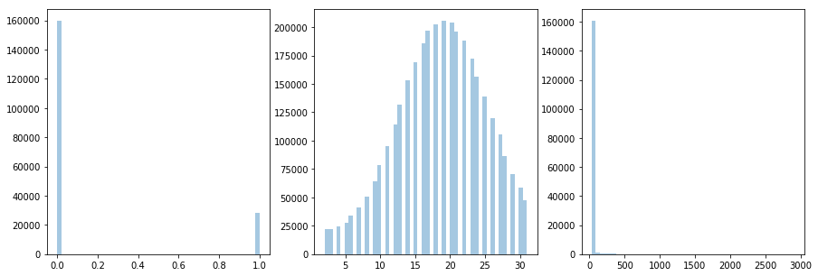
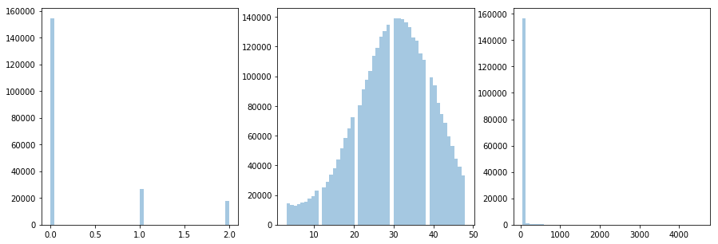
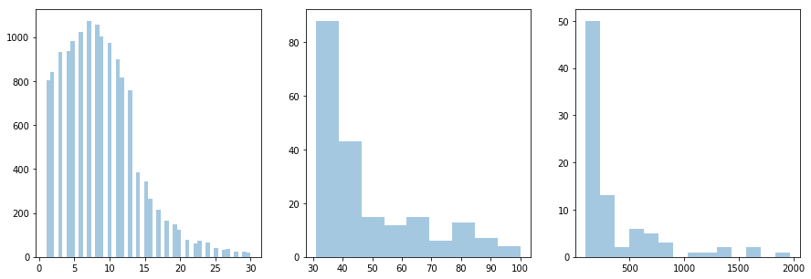

Want to extract short regions 

__<clarification: regions of what? truth? mosaic? graph? >__


of low coverage to allow de-novo assembly. The question is, what counts as low coverage and how long to regions of low coverage tend to be?

```
import glob
import seaborn as sns
import matplotlib.pyplot as plt

def get_covgs(covg_files):
    covgs = []
    for covg_file in covg_files:
        with open(covg_file) as f:
            f.readline()
            c = f.readline().split(' ')[:-1]
            covgs.extend(int(i) for i in c)
    return covgs

def find_x(covgs):
    covgs.sort() 
    low_percentile = covgs[int(len(covgs)/20)]
    high_percentile = covgs[len(covgs) - int(len(covgs)/20)]
    print low_percentile, high_percentile
    fig, ax = plt.subplots(figsize=(15,5), ncols=3, nrows=1)
    sns.distplot([i for i in covgs if i<=low_percentile], kde=False, ax=ax[0])
    sns.distplot([i for i in covgs if low_percentile<i<=high_percentile], kde=False, ax=ax[1])
    sns.distplot([i for i in covgs if high_percentile<i], kde=False, ax=ax[2])
    return

def get_lengths(covg_thresh, covg_files):
    lengths = []
    for covg_file in covg_files:
        with open(covg_file) as f:
            f.readline()
            c = f.readline().split(' ')[:-1]
            c = [int(i) for i in c]
            length_low_covg = 0
            for i in c:
                if i < covg_thresh:
                    length_low_covg += 1
                elif length_low_covg > 0:
                    lengths.append(length_low_covg)
                    length_low_covg = 0  
    return lengths
```

```
dir = "/nfs/research1/zi/rmcolq/projects/pandora_variation/analysis/loman_k12_by_covg/"
for c in range(50,960,10):
    print c
    covg_files = glob.glob(dir + str(c) + '/*/*.kmlp.covgs')
    covgs = get_covgs(covg_files)
    if len(covgs) > 0:
        find_x(covgs)   
```

Some example outputs:

In the following plots, the x-axis has coverages, 


__<coverages of what? what have you done? mini kmer covg counts? remapped reads to truth and got depth?>__


and the y-axis the frequency at which that coverage was seen in the data. I have split the data into 3 windows because I want to see the left hand peak, and the long right tail otherwise dominates.

50X: 5th percentile at 1X coverage, 95th at 31X



80X: 5th percentile at 2X coverage, 95th at 48X



300X: 5th percentile at 2X coverage, 95th at 167X


Full 960X: 5th percentile at 9X coverage, 95th at 526X


Eyeballing suggests that any base with less than 5% the global coverage is might want to be mistrusted.

Length distributions for full dataset:

```
lengths = get_lengths(50,covg_files)
fig, ax = plt.subplots(figsize=(15,5), ncols=3, nrows=1)
sns.distplot([i for i in lengths if i <= 30], kde=False, ax=ax[0])
sns.distplot([i for i in lengths if 30 < i <= 100], kde=False, ax=ax[1])
sns.distplot([i for i in lengths if 100 < i], kde=False, ax=ax[2])
```



It looks like there is a sharp threshold at around 15 bases long, and that most gaps are of less than this length.

