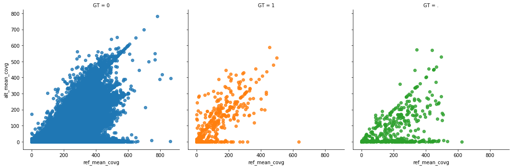
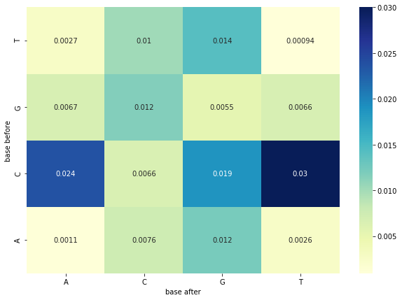

__Aim: evaluate accuracy calling SNPs with pandora when we know the truth__

Pandora outputs two things per gene
1. A mosaic of the gene inferred by dynamic programming
2. A VCF, currently directly implied by the above

We used K12 as a positive control, in the knowledge (I, Rachel have checked) that it lies in the PRG,
and that we have a reference-quality assembly of another K12 strain (which may differ by some amount of evolution).

Therefore I ran pandora, asking it to output a VCF with respect to the "truth" (K12 assembly), so that
all non-0 genotypes would be errors (except those that are not, caused by evolution).

The goal of this was to see whether coverage alone was enough to guarantee correct calls.
We also tested whether a negative binomial model improved results over Poisson


__1. Create fasta of a reference sequence for each gene, corresponding to the gene sequences annotated in the reference genome__

The reference genome I am using is NC_000913.3. 

For this reference, I subset the gene entries from the .gff file and pulled out the sequence corresponding to the gene coordinates from the .fasta file. 

```
grep $'\tgene\t' NC_000913.3.gff3 &> NC_000913.3.genes.gff3
bedtools getfasta -s -fi NC_000913.3.fasta -bed NC_000913.3.genes.gff3 -fo NC_000913.3.gene_fasta.fa
```

Next I used pandora (commit `f1975e11990bfb95610325a1133c8971e315441d`) to loop through the `pangenome_PRG.fa` file (`/nfs/research1/zi/rmcolq/well/rachel/pangenome_PRG/pandora4/pangenome_PRG.fa`) and for each PRG:

- if there was a path through the graph corresponding to a reference gene sequence, output that path sequence
- otherwise, output the top path through the gene graph

This is my VCF reference fasta.

```
build/pandora get_vcf_ref pangenome_PRG.fa NC_000913.3.gene_fasta.fa > ref_vcf.fa
```

Also used `pandora walk` to find a list of gene ids for which exact matches in the pangenome PRG were found.

```
build/pandora walk pangenome_PRG.fa NC_000913.3.gene_fasta.fa &> walk_output3.txt
cat walk_output3.txt | grep "GC00" | cut -f2 > list_genes_found_in_prg_identical_to_ref.txt
```

__2. Ran pandora calling against these references__

For the full 960X Loman E. coli K12 whale dataset, I ran pandora both with the binomial and negative binomial probability model.

Submitted jobs using:

```
bsub.py 90.0 projects/pandora_variation/logs/loman_k12_vcfref bash scripts/run_pandora_vcfref.sh /nfs/research1/zi/mbhall/Projects/Pandora_variation/Data/Loman_K12/loman_k12_merged_pass.fastq projects/pandora_variation/analysis/loman_k12 projects/pandora_variation/data/NC_000913.3.vcf_ref.fa   ## /nfs/research1/zi/rmcolq

bsub.py 90.0 projects/pandora_variation/logs/loman_k12_nbin_vcfref bash scripts/run_pandora_nbin_vcfref.sh /nfs/research1/zi/mbhall/Projects/Pandora_variation/Data/Loman_K12/loman_k12_merged_pass.fastq projects/pandora_variation/analysis/loman_k12 projects/pandora_variation/data/NC_000913.3.vcf_ref.fa    ## /nfs/research1/zi/rmcolq
```

And these ran pandora commands with commit/parameters:

```
##############################################################
START: Tue 24 Apr 10:16:31 BST 2018
git branch: refs/heads/dev_detangle_pangraph
git commit: 91fb55957dfb5421a7e8a0fe74566c9269aa1f81
python running: /nfs/research1/zi/software/Python-2.7.14/bin/python
##############################################################
START: Tue Apr 24 10:16:32 2018 

Using parameters: 
        prgfile         /nfs/research1/zi/rmcolq/well/rachel/pangenome_PRG/pandora4/pangenome_PRG.fa
        readfile        /nfs/research1/zi/mbhall/Projects/Pandora_variation/Data/Loman_K12/loman_k12_merged_pass.fastq
        outdir  projects/pandora_variation/analysis/loman_k12/k15.w14.24042018
        w               14
        k               15
        max_diff        250
        error_rate      0.11
        output_kg       1
        output_vcf      1
        vcf_refs        projects/pandora_variation/data/NC_000913.3.vcf_ref.fa
        output_comparison_paths 0
        output_covgs    1
        output_mapped_read_fa   0
        illumina        0
        clean   0
        nbin    0
```

and

```
##############################################################
START: Tue 24 Apr 10:16:52 BST 2018
git branch: refs/heads/dev_detangle_pangraph
git commit: 91fb55957dfb5421a7e8a0fe74566c9269aa1f81
python running: /nfs/research1/zi/software/Python-2.7.14/bin/python
##############################################################
START: Tue Apr 24 10:16:52 2018 

Using parameters: 
        prgfile         /nfs/research1/zi/rmcolq/well/rachel/pangenome_PRG/pandora4/pangenome_PRG.fa
        readfile        /nfs/research1/zi/mbhall/Projects/Pandora_variation/Data/Loman_K12/loman_k12_merged_pass.fastq
        outdir  projects/pandora_variation/analysis/loman_k12/k15.w14.nbin.24042018
        w               14
        k               15
        max_diff        250
        error_rate      0.11
        output_kg       1
        output_vcf      1
        vcf_refs        projects/pandora_variation/data/NC_000913.3.vcf_ref.fa
        output_comparison_paths 0
        output_covgs    1
        output_mapped_read_fa   0
        illumina        0
        clean   0
        nbin    1
```

__3. Analyse results code__

The run_pandora script also used samtools to map the inferred gene sequences against the reference fasta.

The VCFs output from pandora, and this results samfile were examined using python in jupyter notebooks found at 

```
/nfs/research1/zi/rmcolq/projects/pandora_variation/notebooks/Investigate\ Pandora\ VCF.ipynb
/nfs/research1/zi/rmcolq/projects/pandora_variation/notebooks/Investigate\ Pandora\ VCF\ nbin.ipynb
```

In these notebooks I ran the following:

```python
import glob
import vcf
import pandas as pd

dir = "/nfs/research1/zi/rmcolq/projects/pandora_variation/analysis/loman_k12/k15.w14.nbin.24042018"
vcf_files = glob.glob(dir + '/*/*.kmlp.vcf')
rows_list = []

for vcf_file in vcf_files:
    vcf_reader = vcf.Reader(open(vcf_file, 'r'))
    for record in vcf_reader:
        if record.INFO['SVTYPE']=='SNP':
            row_dict = {}
            row_dict["chrom"] = record.CHROM
            row_dict["pos"] = int(record.POS)
            row_dict["ref"] = record.REF
            row_dict["alt"] = record.ALT[0]
            for sample in record.samples:
                row_dict["GT"] = sample['GT']
                try:
                    row_dict["ref_mean_covg"] = int(sample['REF_MEAN_FWD_COV']) + int(sample['REF_MEAN_REV_COVG'])
                    row_dict["alt_mean_covg"] = int(sample['ALT_MEAN_FWD_COV']) + int(sample['ALT_MEAN_REV_COVG'])
                except:
                    continue
            rows_list.append(row_dict)
        elif record.REF == None or record.ALT[0] == None or len(record.REF) != len(record.ALT[0]):
            break

snp_df = pd.DataFrame(rows_list, columns=["chrom", "pos", "ref", "alt", "GT", "ref_mean_covg", "alt_mean_covg"])      
snp_df.to_csv(dir + '/pandora_snps.csv', sep='\t')

# and subset to only the genes where we know the exact ref sequence is in the prg, in which case we should have called
# 0 GT everywhere
gene_ids = []
with open('/nfs/research1/zi/rmcolq/projects/pandora_variation/data/list_prg_genes_matching_NC_000913.3_annotation.txt','r') as f:
    for line in f:
        gene_ids.append(line.split("\n")[0])
snp_df = snp_df.loc[snp_df['chrom'].isin(gene_ids)]
snp_df.to_csv(dir + '/pandora_snps.csv', sep='\t')
```

```python
import pysam
import numpy as np

samfile = pysam.AlignmentFile(dir + "/pandora.results.sam", "r" )

snp_df["is_correct"] = None
snp_df["base_before"] = None
snp_df["base_after"] = None

count = 0
for read in samfile.fetch():
    if read.flag not in [0,16,"0","16"]:
        continue
    gene_df = snp_df.loc[snp_df['chrom'] == read.qname]
    
    for index, row in gene_df.iterrows():
        try:
            if read.is_reverse:
                if (row['GT']=='0'):
                    snp_df.at[index,'is_correct'] = reverse_complement(read.query_sequence)[row['pos']]==row['ref']
                elif (row['GT']=='1'):
                    snp_df.at[index,'is_correct'] = reverse_complement(read.query_sequence)[row['pos']]==row['alt']
        
                if 0 <= read.qlen - row['pos'] + 1 < read.qlen:
                    snp_df.at[index,'base_before'] = reverse_complement(read.get_aligned_pairs(with_seq=True)[read.qlen - row['pos'] + 1][2])
                if 0 <= read.qlen - row['pos'] - 1 < read.qlen:
                    snp_df.at[index,'base_after'] = reverse_complement(read.get_aligned_pairs(with_seq=True)[read.qlen - row['pos'] - 1][2])
            else:
                if (row['GT']=='0'):
                    snp_df.at[index,'is_correct'] = read.query_sequence[row['pos']]==row['ref']
                elif (row['GT']=='1'):
                    snp_df.at[index,'is_correct'] = read.query_sequence[row['pos']]==row['alt']

                if row['pos'] > 0:
                    snp_df.at[index,'base_before'] = read.get_aligned_pairs(with_seq=True)[row['pos']-1][2]
                if row['pos'] < read.qlen - 1:
                    snp_df.at[index,'base_after'] = read.get_aligned_pairs(with_seq=True)[row['pos']+1][2]
                
        except:
            print "Give up on " + row['chrom']
            print row
            print read.get_aligned_pairs(with_seq=True)
            gene_df = snp_df.loc[snp_df['chrom'] == read.qname]
            print gene_df
            break
    
    count = count + 1
    if count > 100:
        snp_df.to_csv(dir + '/pandora_snps.csv', sep='\t')
    
samfile.close()
```

```python
%matplotlib inline
import seaborn as sns

small_df = snp_df.loc[snp_df['ref_mean_covg'] < 1000]
sns.lmplot('ref_mean_covg', 'alt_mean_covg', data=small_df, hue="GT", col="GT", fit_reg=False)
```

```python
by_total_covg_df = pd.DataFrame()
by_total_covg_df["total_covg"] = range(0,7000,10)
by_total_covg_df["num_correct"] = 0
by_total_covg_df["num_wrong"] = 0

for index, row in snp_df.iterrows():
    try:
        if row['GT']=='0':
            by_total_covg_df.at[int((row['ref_mean_covg'] + row['alt_mean_covg'])/10),"num_correct"] += 1
        elif row['GT']=='1':
            by_total_covg_df.at[int((row['ref_mean_covg'] + row['alt_mean_covg'])/10),"num_wrong"] += 1
    except:
        print int((row['ref_mean_covg'] + row['alt_mean_covg'])/10)
        
by_total_covg_df["fraction"] = by_total_covg_df["num_correct"]/ (by_total_covg_df["num_correct"]+by_total_covg_df["num_wrong"])

plt.xticks(rotation=45)
sns.barplot(x="total_covg", y="fraction", data=by_total_covg_df.loc[by_total_covg_df['total_covg'] < 400])
```

```python
I = pd.Index(["A", "C", "G", "T"], "rows")
C = pd.Index(["A", "C", "G", "T"], "cols")
by_base_df = pd.DataFrame(data=0, index=I, columns=C)
by_base_df_correct = pd.DataFrame(data=0, index=I, columns=C)
by_base_df_wrong = pd.DataFrame(data=0, index=I, columns=C)

for index, row in snp_df.iterrows():
    if row['GT']=='0' and row['base_before']!=None and row['base_after']!=None:
        by_base_df_correct.at[row['base_before'].upper(),row['base_after'].upper()] += 1
    elif row['GT']=='1' and row['base_before']!=None and row['base_after']!=None:
        by_base_df_wrong.at[row['base_before'].upper(),row['base_after'].upper()] += 1


by_base_df = by_base_df_wrong / (by_base_df_correct + by_base_df_wrong)

ax = sns.heatmap(by_base_df, annot=True)
ax.invert_yaxis()
```

__4. Results summary__

For nbin:

```
print sum(snp_df['GT']=='0') #28087
print sum(snp_df['GT']=='1') #299
```

For bin:

```
print sum(snp_df['GT']=='0') #28461
print sum(snp_df['GT']=='1') #486
```

In both cases, one sample had odd coverage (GC00000211_4):

For nbin:


For bin:



For nbin:



For bin:


For nbin:


For bin:


```python
wrong_df = snp_df.loc[snp_df['GT'] == '1']
print wrong_df.shape

very_wrong_df = wrong_df.loc[wrong_df['ref_mean_covg'] > wrong_df['alt_mean_covg']]
print very_wrong_df.shape

very_very_wrong_df = very_wrong_df.loc[very_wrong_df['ref_mean_covg'] > 50]
print very_very_wrong_df.shape

very_very_wrong_df.to_csv(dir + '/pandora_wrong.csv', sep='\t')
```

For nbin:

```
(299, 7)
(139, 7)
(76, 7)
```

For bin:

```
(486, 7)
(251, 7)
(135, 7)
```

Of these very wrong, 57 SNP sites are incorrectly genotyped under both probability models.

